## Java SE 

###  一 、 面向对象 （ 上 ）

##### **1.方法**   

method

```java
package javaSe.oop.Method;

/**
 * @author Eddy
 */

public class Method {
    public static void main(String[] args) {
        MethodTest  m1 = new MethodTest();
        m1.test();
    }
}

class MethodTest{
    public void test(){
        System.out.println("helloWorld");
    }
}
```


##### 2.**方法传参机制**  

parameter

1. 值传递 ：传递的是值本身，对原来的值没有影响，所以的基本数据类型都是值传递，String虽然是引用类型，但是也属于值传递。
2. 引用传递 ：传递的是地址，改变传递之后的值对原来的值是有影响的，引用类型都是引用传递。

```java
package javaSe.oop.parameter;

/**
 * @author Eddy
 */
public class ParameterTest {
    public static void main(String[] args) {
        int [] arr = {1,2,3};
        System.out.println("传递之前的值为"+arr[0]);
        parameter01(arr);
        System.out.println("传递之后的值为："+arr[0]);

        int i=1;
        System.out.println("传递之前的值为"+i);
        parameter02(i);
        System.out.println("传递之后的值为："+i);

        String name = "rose";
        System.out.println("传递之前的值为"+name);
        parameter03(name);
        System.out.println("传递之后的值为："+name);

    }


    public  static  void parameter01(int arr []){
        arr [0] = 100;
    }
    
    public  static  void parameter02(int i){
        i=100;
    }
    
    public  static  void parameter03(String name){
        name="jack";
    }
}

传递之前的值为1
传递之后的值为：100
    
传递之前的值为1
传递之后的值为：1
    
传递之前的值为rose
传递之后的值为：rose
```

##### **3.重载**  

overload

==方法的签名：方法名+参数类型(不包括返回值)==

   方法名相同，参数的个数、类型、顺序不同。与返回值，访问修饰符无关。

- 屏蔽了调用方法的差异性
- 只需要关注不同参数来调用不同的方法即可

```java
public class AnimalTest {
    public static void main(String[] args) {
        Dog dog = new Dog();
        dog.name = "小花";
        System.out.println(dog.name);
        System.out.println(dog.name);
    }
}
```

​      ==System.out==  ->实质就是一个对象

​      ==println==   ->被对象调用的方法

#####  **4.作用域**（**成员变量、局部变量**）  

scope

*==**变量必须赋值才能使用**！==*

1. 成员变量：类的里面，方法的外面
2. 局部变量：方法的里面
3. 区别：

- 位置不同

- 初始值不同

  - 成员变量：系统会赋予初始值

  - 局部变量：必须自己赋值

- 作用域不同

  - 成员变量：在类中都可以使用
  - 局部变量：只能在作用域（代码块）中使用

- 重名问题：**成员变量**不能重名，而**局部变量**在不同的作用域可以重名，并且局部变量和成员变量重名的时候遵循==就近原则==

- 生命周期不同


#####  5.**构造器/构造方法**  

constructor

- 构造方法是一种特殊的方法，用于初始化对象。java构造函数在对象创建时被调用。
- 通过 **==< new >==**关键字调用

==public + 类名 (可以用参数：构造参数 ) + {  }==    --->不能有返回值

- **如果一个类没有编写构造方法，那么系统会默认设置一个无参构造方法**

- **如果自己编写了一个构造方法，那么就会覆盖掉系统默认设置的无参构造**
- **构造方法不能被继承**

==建议==：尽量保留类的无参构造--->创建对象其实就是调用无参构造将对象创建出来，并且根据对象属性的类型赋值默认值(null ,0)

```Java
package javaSe.oop.constructor;

public class constructorTest {
    public static void main(String[] args) {
        cons01 con = new cons01();
        
        cons01 con1 = new cons01("jack");
        
        con.cons01();
    }
}

public class cons01 {
    int age = 10;
    String name = "jack";
    int age01;                //默认属性
    String name01;
    
    public cons01(){
        System.out.println("这是一个无参构造方法");
        System.out.println(age+"\t"+name);
        System.out.println(age01+"\t"+name01);     //系统会赋值默认值
    }
    
    public cons01(String name){
        System.out.println("这是一个有参构造方法");
    }

    public void cons01(){
        System.out.println("这只是一个和类名相同的普通方法");
    }
}


这是一个无参构造方法
10	jack
0	null
这是一个有参构造方法
这只是一个和类名相同的普通方法
```


##### 6.**this** 关键字

含义：**表示当前类的对象**,在对象被创建的时候自动产生

作用： 可以调用本类的属性、方法、构造方法

- **属性** ：调用成员变量，一般会默认加this关键字，不需要创建对象。如果成员变量和局部变量重名，那么this.变量名指向成员属性，不加this就遵循就近原则，调用局部变量。
- **方法 **：因为方法不分成员方法和局部方法，故有没有this关键字都一样，可以直接调用。
- **构造方法** ：通过调用无参构造==间接==来使用有参构造，方便了参数的输入。

​         **注意**：1、调用构造方法的时候，this关键字必须写在第一行。

​              2、避免在构造方法中调用自身，防止无穷递归。

```java 
    public User(){
        this("jack");
        System.out.println("这是一个无参构造方法");
    }
    public User(String name){
        System.out.println("这个一个有参构造方法");
    }

```


```Java
package javaSe.oop.This;

public class UserTest {
    public static void main(String[] args) {
        User user = new User();
        user.m1();
    }
}

public class User {
    String name = "rose";
    int age;
    public User(){
        this("jack");
        System.out.println("这是一个无参构造方法");
    }
    public User(String name){
        System.out.println("这个一个有参构造方法");
    }
    public void m1(){
        this.m2();//等价于 m2();
        String name = "jack";
        System.out.println(name);
        System.out.println(this.name);
    }
    public void m2(){
        System.out.println("方法m2");
    }
}
```

- 为了避免在创建对象的时候给属性赋值太过于麻烦，**可以在创建对象的时候调用有参构造**，并且同时给属性赋值。

```java
package javaSe.oop.This;

public class StudentUser {
    public static void main(String[] args) {
        Student stu = new Student("jack",10);
        System.out.println(stu.name);
        System.out.println(stu.age);
    }
}

public class Student {
    String name;
    int age;
    public Student(){}
    public Student(String name,int age){
        this.name = name;
        this.age = age;
    }
}
```


### 二 、 面向对象 （ 下 ）

##### 1.**访问修饰符**

| 访问修饰符    | 同类 | 同包 | 不同包子类 | 其他 |
| ------------- | ---- | ---- | ---------- | ---- |
| **public**    | √    | √    | √          | √    |
| **protected** | √    | √    | √          | ×    |
| **默认**      | √    | √    | ×          | ×    |
| **private**   | √    | ×    | ×          | ×    |


#####  **2.封装**  

encapsulation

隐藏类的实现细节

```java
package javaSe.oop.encapsulation;

/**
 * @author Eddy
 */
public class encapsulationTest {
    public static void main(String[] args) {
        encapStudent User= new encapStudent();

        User.setAge(300);
        User.setSalary(4000);

        System.out.println(User.getAge());
        System.out.println(User.getSalary());
    }
}


package javaSe.oop.encapsulation;


public class encapStudent {
    private int age;
    String name;
    private double salary;

    public int getAge() {
        return age;
    }

    public  void setAge(int age) {
        if(age>150||age<0)
        {
            this.age=18;

        }
        else {
            this.age = age;
        }
    }

    public double getSalary() {
        return salary;
    }

    public void setSalary(double salary) {
        this.salary = salary;
    }
}

```

#####  **3.继承**  

extends

1. 子类可以继承父类的属性和方法
2. 子类继承了所有的属性和方法，非私有的属性和方法可以在子类直接访问, 但是==私有属性和方法不能在子类直接访问==，要通过父类提供公共的方法去访问 
3. 子类必须调用父类的构造器， 完成父类的初始化 
4. **当创建子类对象时，不管使用子类的哪个构造器，默认情况下总会去调用父类的无参构造器，==如果父类没有提供无参构造器，则必须在子类的构造器中用 super 去指定使用父类的哪个构造器完成对父类的初始化工作==，否则，编译不会通过**

```java
package javaSe.oop.Entends;

public class AnimalTest {
    public static void main(String[] args) {
        Dog dog = new Dog();
        /**当创建子类对象时，不管使用子类的哪个构造器，
        默认情况下总会去调用父类的无参构造器，如果父类没有提供无参构造器，
        则必须在子类的构造器中用 super 去指定使用父类的哪个构造器完成对父类的初始化工作，否则，编译不会通过*/
        dog.name = "小花";
        System.out.println(dog.name);
        dog.eat();      //继承了父类的eat方法
        dog.hobby="吃吃吃。。。";   //dog独有的属性
        System.out.println(dog.hobby);
    }
}

public class Animal {
    private int age;
    String name;
    public void eat(){
        System.out.println("吃薯片");
    }
    public int getAge() {   //通过公共访问方法来访问private age；
        return age;
    }
    //父类的无参构造被屏蔽
    //    public Animal(){
//        System.out.println("无参构造方法");
//    }
    
   //便去调用父类的有参构造
    public Animal(String name){
        System.out.println("有参构造方法");
    }
}

public class Dog extends Animal {
    String hobby ;
    public Dog(){
        super("jack");
    }
}
```


5.单独定义子类独有的属性和方法

```java 
public class Dog extends Animal {
    String hobby ;
}
```

#####  **4.方法重写**  

override

概念：子类出现和父类方法签名相同的方法时，称之为方法的重写

原因：父类的方法不能满足子类的要求的时候

要求：方法的名称、参数、返回值都一样，并且访问修饰符要比父类更**宽泛**。

​       ==注意：私有方法不能被重写！！！==**（父类的方法如果是private就不行）**

```java
package javaSe.oop.OverRide;

public class Test {
    public static void main(String[] args) {
        Dog dog = new Dog();
        dog.eat();
    }
}

public class Animal {
    String name;
    int age;
    protected void eat(){
        System.out.println("父类的方法");
    }
}

public class Dog extends Animal{
    @Override
    public void eat() {
        System.out.println("子类重写的方法");
    }
}
```


#####  **5.super 关键字**

含义：表示当前直接父类的对象

1. 访问父类的属性和方法，但不能访问父类的私有属性和方法。

super.属性名称

super.方法名(参数列表)

```java
package javaSe.oop.Super;

public class Test {
    public static void main(String[] args) {
        Dog dog = new Dog();
        dog.test();
    }
}

public class Animal {
    String name = "jack";
    int age = 5;
    private int weight = 10;
    
    public void eat(){
        System.out.println("sleep");
    }
    
    public Animal(){}
    
    public Animal(String name){}
}

public class Dog extends Animal {
    public void test() {
        super.eat();
        System.out.println(super.age);
        System.out.println(this.age);
        System.out.println(age);
    }
     public  Dog() {
        super();
    }
}
3

sleep
5
10
10
```

2. 访问父类的构造器，通过super(参数列表)来访问，并且只能放在子类构造器的第一行。
2. 在子类的无参构造方法中存在一个默认的super（参数）代码

注意：创建子类对象之前必须先创建父类对象

```java
public class Dog extends Animal {
   /** public void test() {
        super.eat();
        System.out.println(super.age);
    }*/
    public  Dog() {
        super();     //默认的super（参数）代码
    }
}
```

4. 如果父类没有无参构造，那么子类对象的创建时，会在子类的构造方法中调用父类的有参构造方法，并且是在第一行。

```java
public class Animal {
    String name = "jack";
    int age = 5;
    private int weight = 10;

    public void eat(){
        System.out.println("sleep");
    }

    //public Animal(){}

    public Animal(String name){}
}

public class Dog extends Animal {
    int age = 10;
    public void test() {
        super.eat();
        System.out.println(super.age);
        System.out.println(this.age);
        System.out.println(age);
    }
    public  Dog() {
        super("jack");
    }
}
```


##### **6.多态** 

多态的概念： 父类的引用指向子类的对象   Pet pet = new Dog( );

1. 如果发生多态，那么无法调用子类独有的方法，

   编译阶段，能调用哪些成员是由编译器（编译类型）决定的

   想调用子类独有的方法，必须发生向下转型，前提是先要发生向上转型

2. 如果发生多态，那么调用的一定是子类重写的方法

   最终的运行效果看子类的具体实现

   编译器会从子类开始找有没有调用的方法==（其实就是看子类有没有重写父类的方法）==，如果有则会直接调用子类的方法，如果没有，编译器会找它的直接父类，层层向上找。

3. 多态产生的条件：

- 一定要有继承
- 一定要有方法的重写
- 父类的引用指向子类的对象

```java
package javaSe.oop.polymorphic;

public class Test {
    public static void main(String[] args) {
        Master master = new Master();

        Dog dog = new Dog();
        dog.Health = 40;
        master.cure(dog);

        Cat cat = new Cat();
        cat.Health = 80;
        master.cure(cat);
    }
}

public class Master {
    public void cure(Pet pet){
        if(pet.Health<60){
            System.out.println("宠物需要看病");
            pet.toHealth();
            pet.Health=100;
            System.out.println("看病之后宠物的健康值为："+pet.Health);
        }
        else{
            System.out.println("宠物不需要看病");
        }
    }
}

public class Pet {
    int Health;
    public void toHealth() {

    }
}

public class Dog extends Pet{
    @Override
    public void toHealth() {
        System.out.println("恢复健康的方式是吃骨头");
        System.out.println("结果为狗狗恢复健康");
    }
}

public class Cat extends Pet{
    @Override
    public void toHealth() {
        System.out.println("恢复健康的方式是吃鱼");
        System.out.println("结果为猫咪恢复健康");
    }
}


宠物需要看病
恢复健康的方式是吃骨头
结果为狗狗恢复健康
看病之后宠物的健康值为：100
    
宠物不需要看病
```

4. 编译看左边，运行看右边

- 一个对象的编译类型和运行类型可以不一致
- 编译类型在定义的时候就确定了，无法改变
- 运行类型可以改变

```java
Animal animal = new Dog ();
    animal = new Cat();
```

5. 向上转型

父类引用指向子类对象，小转大(自动类型转换)

Animal animal = new Dog( );

6. 向下转型  **(必须先要有向上转型)**

大转小（强制类型转换）

Dog dog = (Dog) animal;  

- 他们的编译类型和运行类型相同

7. 属性不能被重写，因此属性的值看编译类型

8. **==instanceOf 比较操作符==**，用于判断对象的运行类型是否为 XX 类型或 XX 类型的子类型

```java
package javaSe.oop.polymorphic;

public class IntenceOf {
    public static void main(String[] args) {
        BB bb = new BB();
        System.out.println(bb instanceof AA);
        System.out.println(bb instanceof BB);

        AA aa = new BB();
        System.out.println(aa instanceof AA);
        System.out.println(aa instanceof BB);
        System.out.println(bb instanceof Object);

        Object obj = new Object();
        System.out.println(obj instanceof AA);


    }
}

class AA{}
class BB extends AA{}

true
true
true
true
true
false
```


#####  **6.abstract  关键字**

1. **抽象类**！

- 抽象类不能被实例化
   -  也就是不能被 new 关键字调用构造方法去创建对象
- 抽象类是用来当父类使用的
   - 抽象类使用的比较少，一般都是使用接口
- 抽象类可以有普通方法

```java
package javaSe.oop.abstract_class;

public class abs {
    public static void main(String[] args) {
        Dog dog = new Dog();
        dog.eat();
    }
}

public abstract class Animal {
    public abstract void eat();
}

public class Dog extends Animal{
    @Override
    public void eat() {
        System.out.println("吃东西");
    }
}

吃东西
```

2. **抽象方法！**

- 抽象方法必须在抽象类中
- 抽象方法不能有方法体
- 抽象方法必须在非抽象子类中重写，如果子类为抽象类，那么必须有下一个非抽象子类把抽象方法实现掉
   - 抽象方法就是为了让子类重写的
   - 在接口中全部都是使用的抽象方法


##### **7.static  关键字**

1. 静态属性

静态变量：通过类名.属性名调用

- 在类的对象之间是共享的
- ==**关键理解：静态字段是属于类的字段，他不属于任何一个对象**==

应用场景：在多个对象之间共享变量的时候，应该使用静态变量

2. 静态方法

- 静态方法的调用和静态属性一样，不需要创建对象，可以通过**类名 . 方法名 **->例如： **staDemo.aa( );**

- 静态方法不能调用成员方法和非静态属性（加载时机不一样），但是可以调用静态属性

- 静态方法可以直接被main方法调用(加载时机一致)

- ==静态方法使用的场景：==

    1、不需要对象的状态，他需要的参数都是显示的由外部提供

    2、方法只会调用类的静态字段，而不会去使用到非静态字段

```java
package javaSe.oop.static_keyWord;

public class sta {
    public static void main(String[] args) {
        //staDemo.bb();   报错
        staDemo.aa();
    }
}

public class staDemo {
    static int num1= 10;
    int num2 = 20;
    
    public static void aa(){
        System.out.println("这是一个静态方法");
        //bb();  报错
    }
    
    public void bb(){
        System.out.println("这是一个普通方法");
        aa();
    }
}
```


- 静态方法中不能使用this和super关键字（加载时机不一样）
- 静态方法不能被abstract修饰（抽象方法是一个不完整的方法，不能被直接调用）
- 静态方法可以被继承，但是不能被重写（静态方法在方法区中一直存在，如果重写静态方法。那么在方法体中会出现一个静态方法和一个重写的方法，并且不是重载，造成报错）

```java
public class staDemo02 extends staDemo{
    //@Override
   //public static void aa(){
   //    System.out.println("这是一个静态方法");
   //}
    
    @Override
    public void bb() {
        super.bb();
        System.out.println("这是一个普通方法");
    }
    
}
```

3. 静态代码块

- 代码块会在创建对象的时候自动调用，并且依次按照顺序执行
- 静态代码块会在类加载的时候执行，并且只会执行一次
- 静态代码块优先于代码块先执行，代码块优先于构造方法先执行

```java
package javaSe.oop.static_keyWord;

public class staTest {
    public static void main(String[] args) {
        StaDog staDog = new StaDog();
        StaDog staDog2 = new StaDog();
    }
}

public class StaDog extends StaAnimal{
    {
        System.out.println("子类的代码块1");
    }
    {
        System.out.println("子类的代码块2");
    }
    static{
        System.out.println("子类的静态代码块");
    }
    public StaDog() {
        System.out.println("这是子类的构造方法");
    }
}

子类的静态代码块
子类的代码块1
子类的代码块2
这是子类的构造方法
子类的代码块1
子类的代码块2
这是子类的构造方法
```

4. 类加载的触发时机：

- 创建对象的时候(new)
- 创建子类对象的时候
- 调用类中的静态属性和静态方法的时候

```java
public class staTest {
    public static void main(String[] args) {

        StaDog staDog = new StaDog();
父类的静态代码块
子类的静态代码块
父类的代码块1
父类的代码块2
这是父类的构造方法
子类的代码块1
子类的代码块2
这是子类的构造方法
        StaDog staDog2 = new StaDog();
父类的静态代码块
子类的静态代码块
父类的代码块1
父类的代码块2
这是父类的构造方法
子类的代码块1
子类的代码块2
这是子类的构造方法
父类的代码块1
父类的代码块2
这是父类的构造方法
子类的代码块1
子类的代码块2
这是子类的构造方法
        StaDog.ff();
        StaAnimal.ff();
父类的静态代码块
子类的静态代码块
父类的代码块1
父类的代码块2
这是父类的构造方法
子类的代码块1
子类的代码块2
这是子类的构造方法
父类的代码块1
父类的代码块2
这是父类的构造方法
子类的代码块1
子类的代码块2
这是子类的构造方法
这是子类的静态方法ff
这是父类的静态方法ff
    }
}

public class StaAnimal {
    {
        System.out.println("父类的代码块1");
    }
    {
        System.out.println("父类的代码块2");
    }
    static{
        System.out.println("父类的静态代码块");
    }
    public StaAnimal() {
        System.out.println("这是父类的构造方法");
    }
    public static void ff(){
        System.out.println("这是父类的静态方法ff");
    }
}


public class StaDog extends StaAnimal{
    {
        System.out.println("子类的代码块1");
    }
    {
        System.out.println("子类的代码块2");
    }
    static{
        System.out.println("子类的静态代码块");
    }
    public StaDog() {
        System.out.println("这是子类的构造方法");
    }

    public static void ff(){
        System.out.println("这是子类的静态方法ff");
    }
}
```


#####  **8.final  关键字**

1. 修饰类：不能被继承，他的对象引用不会更改，可以理解为名称不会更改，但是对象本身是可以更改的

- 语法： public final class aa{ }

2. 修饰方法：非final修饰的父类中的被final修饰的方法不能被重写，但是可以被子类继承

- 语法： public final void aa ( ){ }

```java 
package javaSe.oop.Final;

public class FinalTest {
    public static void main(String[] args) {
        Son son = new Son();
        son.aa();
    }
}

public class Father {
    public final void aa(){
        System.out.println("这是一个在父类中被final修饰的普通方法");
    }
}

public class Son extends Father{
    //@Override   不能被子类重写
//    public final void aa(){
//        System.out.println("这是一个在子类中被final修饰的普通方法");
//    }
}

这是一个在父类中被final修饰的普通方法
```


3. 修饰属性：被称之为 **常量**

- ==必须要在构造方法调用的时候将其初始化赋值==
   - 非静态常量(没有static修饰)
      1. 直接赋值
      2. 在代码块中赋值
      3. 在构造方法中赋值，如果有多个构造方法，必须在每一个构造方法中都赋值


```java 
public class Son extends Father{
    final int a = 10;
    final int b;
    {
        b = 20;
    }
    final int c;
    public Son(){
        c= 30;
    }
    public Son(String name){
        c = 30;
    }
    
}
```

- 静态常量(同时被static和finally修饰)
   1. 直接赋值
   2. 在静态代码块中赋值，普通代码块中是不行的，因为加载时机不一样
- ==不能被修改==

   - 基本数据类型：值不能被改变
   - 引用数据类型：地址不能被改变
   
   >   常见的静态常量有一个：
   
   ```java
   System.out.println();
   //他在System类中有一个静态常量
   public final static PrintStream out = null;
   ```
   
   

#####  **9.接口**  

interface

1. 接口的语法：

- 只能包含公开的静态常量  （**public static final** int aa = 10;)  

   和公开的抽象方法（**public abstract** void ff( );)

- 不能有普通属性和方法，构造方法，代码块和静态代码块
- 接口不能被实例化
- 接口的抽象方法必须被**==非抽象类==**重写
   - 语法：**public class 非抽象类 implements 接口{   }**

```java
package javaSe.oop.InterFace;

public interface InterFaceTest {
    public static final int a= 10;
   public abstract void ff();
}

public class aa implements InterFaceTest{
    @Override
    public void ff() {
        System.out.println("重写了接口的抽象方法ff");
    }
}
```

2. 接口的作用：

**微观上：**

- 一个类只能继承一个父类，当父类的方法不能满足子类的需求的时候，子类可以实现多个接口去实现自己的需求

```java
package javaSe.oop.InterFace;

public class test {
    public static void main(String[] args) {
        Dog dog = new Dog();
        dog.run();
        dog.swim();
        dog.eat();
    }
}

public class Animal {
    
    public void eat(){
        System.out.println("吃东西");
    }
}

public class Dog extends Animal implements Runnable,Swimming{
    @Override
    public void run() {
        System.out.println("重写Runnable接口的方法");
        System.out.println("跑");
    }
    @Override
    public void swim() {
        System.out.println("重写Swimming接口的方法");
        System.out.println("游泳");
    }
}

public interface  Runnable {
    void run();
}

public interface Swimming {
    void swim();
}

重写Runnable接口的方法
跑
重写Swimming接口的方法
游泳
吃东西
```

**宏观上：**

- 是一种约束，一种标准

- 只需要关心接口能干嘛就行，不需要关心接口的具体实现。
   - sum公司定义一套接口标准，我们只需要知道这个接口能链接数据库等等一系列操作，但是我们不需要知道MySQL、Oracle等公司是怎么实现的。

3. 接口的关系：

- 类与类是单继承关系    extends
- 类与接口是多实现关系   implements
- 接口与接口是多基础关系   extends

##### **10.接口回调**

1. 概念：先有接口的使用者，后有接口的实现者

2. 理解：

   - 在Arrays类中调用sort方法，该方法的实现是调用了一个接口Comparable来实现排序功能的。

   - 而在数组中，我们无法确定使用什么方法来进行排序，因此要对接口中的抽象方法comparaTo进行重写，以达到我们想要的功能。

**别人早就使用了Comparable接口来实现所需的功能，而当我们需要使用接口的时候，我们就需要重写Comparable接口。**

```java
package javaSe.oop.InterFace;

import java.util.Arrays;

public class UserTest {
    public static void main(String[] args) {
        Users[] users = new Users[3];
        users[0] = new Users(10,"jack");
        users[1] = new Users(15,"rose");
        users[2] = new Users(20,"tom");
        Arrays.sort(users);
        for (int i = 0; i < users.length; i++) {
            System.out.println(users[i].getAge()+"--------"+users[i].getName());
        }
    }
}

public class Users implements Comparable<Users> {
    private int age;
    private String name;

    public Users(int age, String name) {
        this.age = age;
        this.name = name;
    }

    public Users() {
    }

    public int getAge() {
        return age;
    }

    public void setAge(int age) {
        this.age = age;
    }

    public String getName() {
        return name;
    }

    public void setName(String name) {
        this.name = name;
    }

    @Override
    public int compareTo(Users o) {
        return this.getAge()-o.getAge();
    }
}
```


#####  **11.内部类**  

InnerClass

==注意：外部类不能被private、protected、static修饰，而内部类可以，因为内部类实质是外部类的成员==

概念：定义在一个类的里面的类称之为内部类

可以把内部类隐藏在外部类之内，不允许同一个包的其他类访问

内部类是外部类的一个成员，他可以访问外部类的所有属性和方法，包括私有的

**分类：**

- 成员内部类

1. **不能定义静态属性和静态方法**
2. 可以调用外部类的普通、私有和静态的属性和方法
3. **创建内部类之前必须先创建外部类**

```java
public class Test {
    public static void main(String[] args) {
        aa aa= new aa();
        aa.age = 10;
        aa.setName("jack");
        aa.bb bb = new aa().new bb();
        
    }
}

public class aa {
    int age;
    private String name;
    static int id ;

    public String getName() {
        return name;
    }
    public void setName(String name) {
        this.name = name;
    }

    public void dd(){
        System.out.println("这是外部类的普通方法");
    }

    public class bb{
        public void ff(){
            System.out.println(age);
            System.out.println(name);
            System.out.println(id);
            dd();
        }
    }
}
```


- 静态内部类

1. 可以定义静态和非静态的属性和方法
2. 可以调用外部类的静态属性和方法，但是不能调用外部类的非静态属性和方法

- 局部内部类

1. **不能定义静态属性和静态方法**
2. 可以调用外部类的普通、私有和静态的属性和方法
3. 作用域在方法内部，故不能用访问修饰符
4. 局部内部类只能访问局部**常量**，而不能访问局部**变量**

解析：当方法m执行完毕的时候，age如果作为一个变量它的生命周期就结束了，但是m方 法里面的CC类如果被创建了对象，那么他是不会被销毁的，只能由垃圾回收器来进行回收。但他调用了一个已经被销毁的age变量，这是不可能的！！！故age只能是常量。

```java 
public class scopeInnerclass {
    //int age;
    private String name;
    static int id;

    public void m(){
        int age = 10;
        class CC{
            public void show(){
                System.out.println(age);
            }
        }
    }
}
```


- ==匿名内部类==

1. 它本身就是一个对象，它的父类通常是接口或者抽象类
2. 他一般不会定义自己的属性和方法
3. 一般都会去把抽象类和接口来当成匿名内部类创建成对象，这样就可以重写他们的抽象方法

```java 
package javaSe.oop.InnerClass;

public class anonymous {
    public static void m(){
         new demo(){    //父类的引用指向子类的对象(多态)
            int a;
            public void m2(){
                System.out.println("这是匿名内部类的方法1");
            }
        }.m2();

        demo d = new demo(){    //父类的引用指向子类的对象(多态)
            int a;
            public void m2(){
                System.out.println("这是匿名内部类的方法1");
            }
        };
        //d.m2();             无法调用子类独有的方法

        user users = new user(){
            @Override
            public void ff() {
                System.out.println("重写接口的抽象方法ff");
            }
        };
        users.ff();

        demo2 d2 = new demo2(){
            @Override
            void kk() {
                System.out.println("重写抽象类的抽象方法kk");
            }
        };
        d2.kk();
    }

    public static void main(String[] args) {
        m();
    }
}


class demo{
}

abstract class demo2{
    abstract void kk();
}

interface user{
    abstract void ff();
}

这是匿名内部类的方法1
重写接口的抽象方法ff
重写抽象类的抽象方法kk
```


### 三 、 常用工具类

##### **1.String 类**

1. 创建方式：

   直接赋值

   调用有参构造

2. ==常见方法==

```java
package javaSe.Utility.str;

import java.util.Arrays;

public class strMethod {
    public static void main(String[] args) {
        String str = "abcdecdfg";

        //方法1. 获取指定下标对应的字符，返回char类型
        System.out.println(str.charAt(3));

        //方法2. 获取指定字符串在原字符串中的下标,如果不包含该字符串则返回-1
        System.out.println(str.indexOf("cd"));
        System.out.println(str.indexOf("dc"));

        //方法3. 返回指定子字符串在此字符串中最右边出现处的索引。
        System.out.println(str.lastIndexOf("cd"));

        //方法4. length()  获取字符串的长度
        System.out.println(str.length());

        //方法5. 判断两个字符串是否相等
        String str2 = "abcdecdfg";
        System.out.println(str2.equals(str));
        System.out.println(str2.equals("abcdecdfg"));
        System.out.println("abcdecdfg".equals(str));

        //方法6. 判断两个字符串是否相等，忽略大小写
        String str3 = "ABCdecdfg";
        System.out.println(str3.equalsIgnoreCase(str));

        //方法7. 判断字符串是否为空
        System.out.println(str.isEmpty());

        //方法8. 判断字符串是否以指定的字符开头
        System.out.println(str.startsWith("ab"));
        //并且规定其开始位置
        System.out.println(str.startsWith("cd",2));

        //方法9. 判断字符串是否以指定的字符结尾
        System.out.println(str.endsWith("ab"));

        //方法10. 判断字符串是否包含指定的字符
        System.out.println(str.contains("bc"));

        //方法11. 将字符串变成字节数组
        byte[] b = str.getBytes();
        System.out.println(Arrays.toString(b));
        for (int i = 0; i < b.length; i++) {
            System.out.println(b[i]);
        }

        //方法12. 将字符串变成字符数组
        char[] ch = str.toCharArray();
        System.out.println(Arrays.toString(ch));
        for (int i = 0; i < ch.length; i++) {
            System.out.println(ch[i]);
        }

        //方法13. 字符串截取
        //注意：字符串是一个常量，是不能改变的，因此必须截取后要重新赋值
        String s1 = str.substring(2);
        String s2 = str.substring(2,5);
        System.out.println(s1);
        System.out.println(s2);
        //不赋值不改变
        System.out.println(str);

        //方法14. 将字符串中指定的内容进行替换
        String s3 = str.replace("ab","AB");
        System.out.println(s3);

        //方法15. 按照指定的字符串对原字符串进行切割
        String str4 = "abcdabcdabcdabcd";
        String[] ds = str4.split("d");
        for (int i = 0; i < ds.length; i++) {
            System.out.println(ds[i]);
        }

        //方法16. 将字符串变成大写
        String str5 = "abCDEfg";
        String s4 = str5.toUpperCase();
        System.out.println(s4);

        //方法17. 将字符串变成小写
        String s5 = str5.toLowerCase();
        System.out.println(s5);

        //方法18. 去掉字符串前后的空格
        String str6 = "  abCDEfg！！！  ";
        String trim = str6.trim();
        System.out.println(trim);

        //方法19. 将其他类型转换成string类型
        int i = 10;
        double d = 3.0;
        String s6 = i+"a";
        String s7 = d+"a";
        String s8 = String.valueOf(i);
        System.out.println(s6);
        System.out.println(s7);
        System.out.println(s8);
    }
}

```


- String类的内存分配机制

1. ==new一个字符串==String s1 = "abc"代码首先会在常量池中找，如果有直接让s1指向"abc"
2. 如果没有，就会在常量池中创建一个对象，然后再在堆中new一个s1对象，并且会创建"abc" , 相当于创建了两个对象
3. 如果再次出现一个s2也是"abc"，那么就会直接指向常量池中的"abc",这个时候，s1和s2 指向的地址是不同的，
4. **因此使用"=="比较是不行的，因为他比较的是地址，而不是内容**

​      Scanners输入的字符串存储在堆中，而创建的"abc"在常量池中，地址不同！！！

```java
public class str2 {
    public static void main(String[] args) {
        Scanner sca = new Scanner(System.in);
        String s = sca.next();
        if("eddy"==s){
            System.out.println("用户名正确");
        }else{
            System.out.println("用户名不正确");
        }

        System.out.println("====================");
        if("eddy".equals(s)){
            System.out.println("用户名正确");
        }else{
            System.out.println("用户名不正确");
        }
    }
}
```


- 内存分配

- ```java
   public static void main(String[] args) {
   
       //虽然abc是常量，但ABC并不是改变了s1的值，而是在常量池中创建了一个新的字符串ABC，让s1指向了ABC
       String s1 = "abc";
       s1 = "ABC";
       System.out.println(s1);
   }
   ```

- 面试题

```java 
package javaSe.Utility.str;

public class str3 {
    public static void main(String[] args) {
        String s1 = "ab";
        String s2 = "c";
        String s3 = new String("abc");

        String str1 = "abc";
        String str2 = "abc";
        String str3 = "ab"+"c";
        String str4 = s1+s2;
        String str5 = new String("abc");
        String str6 = new String("ab")+"c";
        String str7 = s3.intern();
    //s1,s2和s3都是直接赋值的，他们都在常量池中，因此他们说互相相等的
        System.out.println(str1==str2);//T
        System.out.println(str1==str3);//T
    //str4是由两个字符串变量拼接来的，而变量的字符串拼接调用了StringBuilder类，因此他在堆中
        System.out.println(str1==str4);//F
    //凡是new创建的对象都在堆内存中
        System.out.println(str1==str5);//F
        System.out.println(str1==str6);//F
    //本来s3指向堆内存中对象，而intern方法会让s3指向常量池中的abc    
        System.out.println(str1==str7);//T
    }
}

```


#####  **2.StringBuffer \ StringBuilder**

1. 他们的方法一致
2. StringBuffer是线程安全的，它的效率没有StringBuilder高

```java 
package javaSe.Utility.str;

public class strBuffer {
    public static void main(String[] args) {

        StringBuffer buffer = new StringBuffer("abc");//相当于定义了一个"abc"字符串
        StringBuffer buf = new StringBuffer();   //相当于定义了一个空字符串
        //方法1.他是在原有的基础上进行追加，而不是创建一个新的字符串
        buf.append("abc");
        System.out.println(buf);

        //方法2. 在特定的位置插入字符串
        buf.insert(3,"de");
        System.out.println(buf);

        //方法3. 删除特定的字符串
        buf.delete(3,5);
        System.out.println(buf);

        //方法4. 翻转字符串
        buf.reverse();
        System.out.println(buf);

        //方法5. 将StringBuffer转化成String字符串类型
        String s = buf.toString();
        System.out.println(s);

        //创建一个一亿个a的字符串，StringBuffer是线程安全的
        StringBuffer buf2 = new StringBuffer();
        for (int i = 0; i <100000000 ; i++) {
            buf.append("a");
        }

    }
}
```


#####  **3.Object 类**

1. 常见方法：

- getClass方法

​      获取对象的真实类型

- toString方法

​      他只有重写才有实际意义，不然返回的就是：**类名+符号@+对象的哈希码值**

​      返回对象的属性信息，而不是地址

​      **要在类中重写object的toString方法**

- hashCode方法

​      返回对象的十进制的hash值，它唯一代表了对象的地址，可以用来区分对象的不同，

​      但是不排除hash冲突的可能。       

- equals方法
   - 他默认比较的是对象的地址，如果不想比较地址，那就只能重写equals方法**（String类就是重写了equals方法）**
   - 如果在开发中只需要比较对象的属性，那就必须重写equals方法，同时必须重写hashCode方法
   - 在java中协定，如果他们的equals相等，那么默认他们的hash值相等
   - 相反，hash值相等不一定对象相等，还要比较equals方法

```java
package javaSe.Utility.Object;

public class obj {
    public static void main(String[] args) {
        Person stu = new Student();
    //方法1. 获取对象的真实类型
        System.out.println(stu.getClass());
    //对比两个对象的类型是否相等
        Person stu2 = new Teacher();
        System.out.println(stu.getClass()==stu2.getClass());
    //方法2. 返回对象的属性，而不是地址
        Person stu3 = new Student("jack",20);
        System.out.println(stu3.toString());
    //方法3. hashCode用来表示对象的地址的唯一标识，但是有可能会有hash冲突
        Person stu4 = new Student("rose",18);

        System.out.println(stu3.hashCode());
        System.out.println(stu4.hashCode());
    //方法4. equals用来比较对象是否相等的最强方法，因为他是用来比较地址的

        Person th1 = new Teacher("jack",20);
        Person th2 = new Teacher("jack",20);
        System.out.println(th1.equals(th2));
    }
}

package javaSe.Utility.Object;

import java.util.Objects;

public class Teacher extends Person{
    String name;
    int age;

    public Teacher(String name, int age) {
        this.name = name;
        this.age = age;
    }

    public Teacher() {
    }

    @Override
    public boolean equals(Object o) {
        if (this == o) return true;
        if (!(o instanceof Teacher)) return false;
        Teacher teacher = (Teacher) o;
        return age == teacher.age && Objects.equals(name, teacher.name);
    }

    @Override
    public int hashCode() {
        return Objects.hash(name, age);
    }
}

package javaSe.Utility.Object;

public class Student extends Person{
    String name;
    int age;

    public Student(String name, int age) {
        this.name = name;
        this.age = age;
    }

    public Student() {
    }


    @Override    //重写了object类的toString方法，返回对象的属性信息，而不是地址
    public String toString() {
        return "Student{" +
                "name='" + name + '\'' +
                ", age=" + age +
                '}';
    }
}

```


##### **4.包装类**

1. 基本数据类型不具备方法和属性，而包装类具备丰富的方法和属性
2. 集合中只能使用引用数据类型

- 拆箱和装箱

```java
package javaSe.Utility.Package;

public class pac {
    public static void main(String[] args) {
        int i = 10;
        Integer ii = Integer.valueOf(i);
        System.out.println(ii);

        Double dd = new Double(20);
        double d = dd.doubleValue();
        System.out.println(d);
 
    //自动拆装箱    
        Integer ii2 = 10;
        System.out.println(ii2);
        double d2 = new Double(20);
        System.out.println(d2);
    }
}
```


- **Number 类**
   - 他是Byte  Short  Integer  Long  Float  Double这六个包装类的父类

他提供了一组方法，（==intValue/doubleValue/byteValue等==）可以将这个类拆箱成其他的五个基本数据类型

  ```java 
      Integer ii3 = 30;          //这是一个包装类
          double s = ii3.doubleValue();    //通过doubleValue方法将其转化成double类型
          System.out.println(s);
          byte s2 = ii3.byteValue();
          System.out.println(s2);
  ```


- Integer/Double 类的常见属性和方法

   - 属性：**最大值和最小**
   - 方法：parseInt/parseDouble等方法,将**字符串**转换成Integer等类型

   注意：**他们是不能识别字母等其他非数字的字符**

```java
        System.out.println(Integer.MIN_VALUE);
        System.out.println(Integer.MAX_VALUE);
        System.out.println(Double.MIN_VALUE);
        System.out.println(Double.MAX_VALUE);

        int t = Integer.parseInt("12");
        System.out.println(t);
        double v = Double.parseDouble("13.4");
        System.out.println(v);
```

- 面试题

```java
        /**
         * 面试题：整数型包装类缓冲区
         * 整数型的包装类定义缓冲区(-128~127)，如果定义的数在这个范围你之内，那么直接从缓存数组中获取，
         * 否则，重新new新的对象
         */
        Integer i1 = new Integer(100);
        Integer i2 = new Integer(100);
        System.out.println(i1 == i2); //false
        System.out.println(i1.equals(i2));//true

        Integer i3 = 1000; //Integer i3 = new  Integer(1000);
        Integer i4 = 1000; //Integer i3 = new  Integer(1000);
        System.out.println(i3 == i4); //false
        System.out.println(i3.equals(i4));//true

        Integer i5 = 100; //IntegerCache.cache[i + (-IntegerCache.low)]
        Integer i6 = 100; //IntegerCache.cache[i + (-IntegerCache.low)]
        System.out.println(i5 == i6);//true
        System.out.println(i5.equals(i6));//true

```


##### **5.Date 类**

就是几个常见方法！！！

它也重写了toString方法，不然输出的也是对象的内存地址

```java
package javaSe.Utility.Date;

import java.util.Date;

public class date {
    public static void main(String[] args) {
        //获取当前时间
        Date da = new Date();
        System.out.println(da);

        //获取特定时间，并且他是从1900年开始的，月份是从0~11
        Date da2 = new Date(2022-1900,4-1,23);
        System.out.println(da2);

        //他是从1970年开始计算的  获取的是当前时间的时间戳，可以作为文件标识
        Date da3 = new Date();
        long time = da3.getTime();
        System.out.println(time);
    }
}

Sat Apr 23 16:16:12 CST 2022
Sat Apr 23 00:00:00 CST 2022
1650701772971
```


#####  **6.SimpleDateForamt 类**

- 方法1. 将当前Date日期格式转换成指定的SimpleDateFormat类型
- 方法2. 将给定是包含时间信息的字符串转化成Date日期格式

```java
package javaSe.Utility.Date;

import java.text.ParseException;
import java.text.SimpleDateFormat;
import java.util.Date;

public class simpleDate {
    public static void main(String[] args) throws ParseException {

        //将当前Date日期格式转换成指定的SimpleDateFormat类型
        Date date = new Date();
        SimpleDateFormat sim = new SimpleDateFormat("yyyy-MM-dd HH:mm:ss");
        String format = sim.format(date);
        System.out.println(format);

        //将给定是包含时间信息的字符串转化成Date日期格式
        String s = "2022-4-24";
        SimpleDateFormat sim2 = new SimpleDateFormat("yyyy-MM-dd");
        Date date2 = sim2.parse(s);
        System.out.println(date2);
    }
}
```

##### **7.System 类**

- 方法1. 获取系统当前时间，得到一个时间戳
- 方法2. 将time这个时间戳利用format方法转化成指定的SimpleDateFormat类型
- 方法3. 退出java虚拟机

```java 
package javaSe.Utility.System;

import java.text.SimpleDateFormat;

public class sys {
    public static void main(String[] args) {

        //获取系统当前时间，得到一个时间戳
        long time = System.currentTimeMillis();
        System.out.println(System.currentTimeMillis());

        //将time这个时间戳利用format方法转化成指定的SimpleDateFormat类型
        SimpleDateFormat sdf = new SimpleDateFormat("yyyy-MM-dd HH:mm:ss");
        String format = sdf.format(time);
        System.out.println(format);

        //退出java虚拟机
        System.exit(0);
    }
}
```


#####  **8.Math 类**

1. 普通数学计算方法

```java 
package javaSe.Utility.Math;

public class math {
    public static void main(String[] args) {
        double pow = Math.pow(2, 10);//指数计算
        System.out.println(pow);

        double sqrt = Math.sqrt(100);//开平方
        System.out.println(sqrt);

        double cbrt = Math.cbrt(1000); //开立方
        System.out.println(cbrt);

        System.out.println(Math.ceil(13.4)); //向上取整
        System.out.println(Math.floor(13.4));//向下取整
        System.out.println(Math.round(12.3));//四舍五入

        double random = Math.random(); //随机数[0,1)范围
        System.out.println(random);

        int i = (int)(Math.random()*10+10);//可以得到[10,100)的整数
        System.out.println(i);
    }
}

```

2. Random类：随机数中使用的一个类

- 他是一个类，因此必须创建对象才能使用
- 他包含了一个方法：nextInt/nextDouble等方法

```java
import java.util.Random;

public class random {
    public static void main(String[] args) {
        Random r = new Random();
        int i = r.nextInt(100);
        System.out.println(i);

        System.out.println(random());//输出调用下面的random方法
        System.out.println(random2());
    }

    public static String random(){
        StringBuffer bu = new StringBuffer();
        String s = "0123456789";
        Random ra = new Random();
        for (int i = 0; i < 4; i++) {
            int index = ra.nextInt(s.length()); 
            //随机产生一个[0,s.length())长度的下标数
            bu.append(s.charAt(index)); 
            //调用字符串的charAt方法取出该下标数对应的字符,
            //再通过StringBuffer的append方法，将其赋值给bu
        }
        return bu.toString(); 
        //bu是StringBuffer类型的对象，必须通过toString方法将其变成String类型才能返回
    }

    public static String random2(){
        StringBuffer bu2 = new StringBuffer();
        String s2 = "0123456789";
        char[] ch = s2.toCharArray();//将字符串变成字符数组
        Random ra2 = new Random();
        for (int i = 0; i < 4; i++) {
            int index2 = ra2.nextInt(s2.length()); 
            //随机产生一个[0,s.length())长度的下标数
            bu2.append(ch[index2]);
        }
        return bu2.toString();
    }
}
```


#####  **9.BigDecimal 类**

在java中底层是利用二进制来进行计算的，但在小数中，二进制很容易掉失精度

注意：**除法的计算方法！！！**

```java
package javaSe.Utility.BigDecimal;

import java.math.BigDecimal;

public class BigD {
    public static void main(String[] args) {
        double d1 = 1;
        double d2 = 0.9;
        double s = d1-d2;
        System.out.println(s);

        //引出这个类
        BigDecimal b1 = new BigDecimal("1.0");
        BigDecimal b2 = new BigDecimal("0.9");

        BigDecimal subtract = b1.subtract(b2); //减法
        System.out.println(subtract);

        BigDecimal add = b1.add(b2);   //加法
        System.out.println(add);

        BigDecimal multiply = b1.multiply(b2); //乘法
        System.out.println(multiply);

        BigDecimal divide = b1.divide(b2,4,BigDecimal.ROUND_CEILING);//除法   他必须指定小数位数和模式
        System.out.println(divide);
    }
}

```


### 四 、集合

#####  **1.集合框架**

1. 单列集合 **(Collection接口)**

- List接口  (插入有序、可重复、有下标)
   - ArrayList实现类
   - LinkedList实现类
- Set接口  (插入无序、不可重复、没有下标)
   - HashSet实现类
      - 子类：LinkedHashSet  (==插入有序==，不可重复、没有下标)
   - TreeSet实现类

##### **2.Collection 父接口**

方法如下：

- add  向集合中增加元素
- contains   查看集合中有没有需要的元素
- isEmpty  判空
- remove  移除某一个元素
- size 集合长度
- addAll 增加另一个集合
- removeAll  移除一个集合

```java
package javaSe.Collection.coll;

import java.util.ArrayList;
import java.util.Collection;

public class collection {
    public static void main(String[] args) {
        Collection coll = new ArrayList();
		//添加元素
        coll.add("jack");
        coll.add(10);
        coll.add(20.4);
        coll.add(true);
        System.out.println(coll);
		//比较
        System.out.println(coll.contains("jack"));
		//判空
        System.out.println(coll.isEmpty());
		//移除元素
        coll.remove(10);
        System.out.println(coll);
		//查看集合长度
        System.out.println(coll.size());

        Collection coll2 = new ArrayList();
        coll2.add("rose");
        coll2.add(999);
		//添加一个集合到另一个集合中
        coll.addAll(coll2);
        System.out.println(coll);
		//移除一个集合
        coll.removeAll(coll2);
        System.out.println(coll);
		//清空集合
        coll.clear();
        System.out.println(coll);
    }
}
```


##### **3.迭代器**  

iterator

>   1、当一个集合实现了iterable接口的时候，他就可以调用iterator方法获取迭代器，而==刚好Collection接口实现了iterable接口==
>
>   2、iterator方法是用来获取迭代器的，它本身并不是迭代器,当获取的是最后一个元素时，hasNext方法会返回一个false
>
>   3、Java迭代器和C++等迭代器不同的是Java迭代器的查找操作和位移是紧密耦合的，查找一个元素唯一的方法就是调用next方法，而调用next方法只能通过hasNext方法去调用

- 一次循环最好调用一次next方法
- 迭代器不能多次使用，因为游标已经到达了最后的位置
- 在循环遍历的时候，不要使用add方法和remove方法

迭代器接口：它里面有四个方法

-   1、通过先调用==hasNext==去确定有没有下一个元素，再决定是否调用==next==方法
-   2、==remove==:删除上次调用next方法返回的元素的值
-   3、==forEachRemaing==:这个方法只需要提供一个lambda表达式，就可以不需要循环，而是通过迭代器去调用lambda表达式

```java
public interface Iterator<E>{
    E next();
    boolean hasNext();//返回的是一个布尔值
    void remove();
    default void forEachRemaing(Consumer<? super E> action);
}
```

具体代码：

```java
public class iterator {
    public static void main(String[] args) {
        Collection coll = new ArrayList();
        coll.add("jack");
        coll.add("rose");
        coll.add("tom");
        coll.add("jerry");
        Iterator it = coll.iterator();
        while (it.hasNext()) {
            System.out.println(it.next());
        }
    }
}

```

#####  **4.泛型** 

- 在不使用泛型的时候，一旦把元素放进集合中，集合就会忘记元素的类型，统一将其当成Object类型进行处理，当我们需要取出集合中的元素时，就需要进行强制类型转换

- 集合设计的时候，设计者不知道我们会在集合中放置什么类型的对象，因此统一规定成Object类型

```java
package javaSe.Collection.genericity;

import java.util.ArrayList;
import java.util.Collection;
import java.util.Iterator;

public class Gener {
    public static void main(String[] args) {

        /**
         *
         *      集合Collection储存的对象类型由Object类型强制成了Student类型(避免了向上转型)
         *      然后在调用集合元素的时候，由于元素都是Object类型，如果想调用Student的方法，就必须向下转型，
         *      此时极有可能发生类型转换异常
         */
        Collection coll = new ArrayList();
        coll.add(new Student(18,"jack"));
        coll.add(new Student(15,"rose"));
        coll.add(new Person(20,"tom"));

        Iterator it = coll.iterator();
        while(it.hasNext()) {
            Object obj = it.next();
            Student stu = (Student) obj;
            stu.play();
        }
        /**
         * 泛型：
         *      将类型转换的问题提前到了编译期，省略了强制类型转换
         *      规定了必须输出元素的类型
         */

        Collection<Student> coll2 = new ArrayList<>();
        coll.add(new Student(18,"jack"));
        coll.add(new Student(15,"rose"));
        coll.add(new Student(20,"tom"));

        Iterator<Student> it2 = coll.iterator();
        while(it.hasNext()) {
            Student stu2 = it2.next();
            stu2.play();
        }

        /**
         * 泛型还支持多态,但是定义的时候不存在多态，并且他还不支持基本数据类型，只能使用他们的包装类
         *              当泛型定义为输入类型的父类时，就可以将他的子类的对象储存在集合中
         *              此时发生了向上转型
         *              但是这样到了要调用子类对象的方法的时候，还是要向下转型
         *              这样做完全没有必要！！！
         */
    }
}

```


#####  **5.List 集合**

######  1.ArrayList

- 常见方法

```java
package javaSe.Collection.List;

import java.util.ArrayList;

public class ArrayListDemo {
    public static void main(String[] args) {
        ArrayList<String> arr = new ArrayList <> ();
        arr.add("jack");
        arr.add("rose");
        arr.add("tom");
        arr.add("jerry");
        System.out.println(arr);

        arr.add(2,"eddy");
        System.out.println(arr);

        arr.remove(3);
        System.out.println(arr);

        arr.set(2,"luna");
        System.out.println(arr);

        String s = arr.get(3);
        System.out.println(s);
    }
}

```

- 3种循环方式

重点：forEach循环 （增强for循环）

```java
package javaSe.Collection.List;

import java.util.ArrayList;
import java.util.Iterator;

public class arraylistDemo2 {
    public static void main(String[] args) {
        ArrayList<String> arr = new ArrayList <> ();
        arr.add("jack");
        arr.add("rose");
        arr.add("tom");
        arr.add("jerry");

        //循环方法1. 迭代器
        Iterator<String> it = arr.iterator();
        while (it.hasNext()) {
            System.out.println(it.next());
        }

        //方法2. for循环
        for (int i = 0; i < arr.size(); i++) {
            System.out.println(arr.get(i));
        }

        //方法3. 增强for循环
        for (String s : arr) {
            System.out.println(s);
        }
    }
}
```

- 底层实现原理

```java
ArrayList<String> arr = new ArrayList <> ();
        /**
         * public ArrayList() {
         *         this.elementData = DEFAULT CAPACITY_EMPTY_ELEMENTARY;
         *     }
         *------------------------------------------------------------------
         *     private static final Object[] DEFAULT CAPACITY_EMPTY_ELEMENTARY = {};
         *     transient Object[] elementData;
         *------------------------------------------------------------------
         * 初始化一个DEFAULT CAPACITY_EMPTY_ELEMENTARY数组将其赋值给elementData
         */
        arr.add("jack");
        arr.add("rose");
        arr.add("tom");
        arr.add("jerry");
        /**
         * public boolean add(E e) {
         *         ensureCapacityInternal(size + 1);  // Increments modCount!!
         *         elementData[size++] = e;
         *         return true;
         *     }
         *     -------------------------------------------------------------
         *         private void ensureCapacityInternal(int minCapacity) {
         *         ensureExplicitCapacity(calculateCapacity(elementData, minCapacity));
         *     }
         *------------------------------------------------------------------
         *     private void ensureExplicitCapacity(int minCapacity) {
         *         modCount++;
         *
         *       if (minCapacity - elementData.length > 0)
         *                       grow(minCapacity);
         *              }
         *------------------------------------------------------------------
         *     private void grow(int minCapacity) {
         *         // overflow-conscious code
         *         int oldCapacity = elementData.length;
         *         int newCapacity = oldCapacity + (oldCapacity >> 1);
         *         if (newCapacity - minCapacity < 0)
         *             newCapacity = minCapacity;
         *         if (newCapacity - MAX_ARRAY_SIZE > 0)
         *             newCapacity = hugeCapacity(minCapacity);
         *         // minCapacity is usually close to size, so this is a win:
         *         elementData = Arrays.copyOf(elementData, newCapacity);
         *     }
         */
```


###### 2.LinkedLis

- 常见方法

```java
package javaSe.Collection.List;

import java.util.Iterator;
import java.util.LinkedList;

public class LinkedListDemo {
    public static void main(String[] args) {
        LinkedList<String> li = new LinkedList<>();
        //他和ArrayList一样，具有链表结构的操作
        li.add("jack");
        li.add("rose");
        System.out.println(li);
        li.addFirst("tom");//向链表头部插入数据
        li.addLast("jerry");
        System.out.println(li);

        Iterator<String> iterator = li.iterator();
        while(iterator.hasNext()) {
            System.out.println(iterator.next());
        }

        //LinkedList同时也具备队列相关的数据结构的操作
        li.offer("eddy");//向队尾添加元素
        System.out.println(li);
        System.out.println(li.peek());//获取队头元素但不删除
        System.out.println(li.poll());//获取队头元素并且删除
        System.out.println(li);

        //堆栈相关的操作
        li.push("asta");//压栈
        System.out.println(li);
        System.out.println(li.remove());//获取并移除第一个元素
        System.out.println(li);
        System.out.println(li.remove(2));//获取并移除特点位置的元素
        System.out.println(li);
        System.out.println(li.pop());//弹栈
        System.out.println(li);
    }
}

```

- 底层实现原理

######  3.Vector 类

不是很重要!

```java
package javaSe.Collection.Vector;

import java.util.Vector;

public class VectorDemo {
    public static void main(String[] args) {
        Vector<String> ve = new Vector<>();
        ve.add("jack");
        ve.add("rose");
        //他与ArrayList相同,底层实现原理都是数组
        //区别:
        //     ArrayList是当添加元素的时候，才会扩容数组，默认长度为10
        //	   Vector是当创建对象的是，就创建长度为10的数组
        //     ArrayList线程不安全，效率高
        //     Vector是线程安全的，效率低
    }
}
```

##### **6.Set 集合**

######  1.HashSet 

- 他与Collection一样,没有特殊的方法
- 遍历方式:
   - 1. 迭代器
      2. forEach循环

```Java
package javaSe.Collection.Set;

import java.util.HashSet;
import java.util.Iterator;

public class HashSetDemo {
    public static void main(String[] args) {
        HashSet<Integer> set = new HashSet<>();
        set.add(1);
        set.add(4);
        set.add(3);
        set.add(1);
        set.add(2);
        System.out.println(set);
        //1. 去重
        //2. 没有下标
        //3. 没有插入顺序
        Iterator<Integer> iterator = set.iterator();
        while (iterator.hasNext()) {
            System.out.println(iterator.next());
        }

        for (Integer integer : set) {
            System.out.println(integer);
        }
    }
}

```

- ==去重原理==

```java
package javaSe.Collection.Set;

import java.util.HashSet;
import java.util.Objects;

public class HashSetDemo2 {
    public static void main(String[] args) {
        HashSet<Person> ha = new HashSet<>();
        ha.add(new Person("jack",20));
        ha.add(new Person("rose",18));
        ha.add(new Person("tom",25));
        ha.add(new Person("jerry",19));
        ha.add(new Person("jack",20));
        //他们五个因为是new创建的,因此他们是不同的五个对象,他们的地址不一样
        System.out.println(new Person("jack", 20).hashCode());
        System.out.println(new Person("rose",18).hashCode());
        System.out.println(new Person("tom",25).hashCode());
        System.out.println(new Person("jerry",19).hashCode());
        System.out.println(new Person("jack",20).hashCode());
        //只有第一个和第五个Jack的hash值一样的 ---> 100882390
        //因此只会比较一次equals方法
        //比较的结果就是两个Jack的信息是一样的
        //这样就去掉了一个Jack
        
        /**
         * 所有的类中的hashCode方法都是继承自Object类,而Object类里面的hashCode方法只是针对于对象地址来进行返回值
         * 因此就算是对象所有的信息都一致,但是由于他们不是同一个对象,导致他们的hash值大概率是不相同的,因此不会对他们进行"去重"处理
         * 但是在业务开发中,我们一般会关注对象的属性信息来进行判断他们是不是同一个事物,并不需要关心他们是不是同一个对象
         * 这个时候我们就需要对继承自Object类的hashCode方法和equals方法来进行重写
         * 重写之后的hashCode方法对于对象的信息进行生成hash值,只要是不同的事物,无论对象是否相同,他们的hash值就大概率不一样
         * 而对象信息相同就会生产相同的hash值,但是可能会有hash冲突的产生,这个时候就会就会去比较equals方法
         */

        for (Person person : ha) {
            System.out.println(person);
        }
    }
}

class Person {
    private String name;
    private Integer age;

    public Person(String name, Integer age) {
        this.name = name;
        this.age = age;
    }

    public Person() {
    }

    public String getName() {
        return name;
    }

    public void setName(String name) {
        this.name = name;
    }

    public Integer getAge() {
        return age;
    }

    public void setAge(Integer age) {
        this.age = age;
    }

    @Override
    public String toString() {
        return "Person{" +
                "name='" + name + '\'' +
                ", age=" + age +
                '}';
    }

    @Override
    public boolean equals(Object o) {
        System.out.println("equals方法执行了!!!");
        if (this == o) return true;
        if (!(o instanceof Person)) return false;
        Person person = (Person) o;
        return Objects.equals(name, person.name) && Objects.equals(age, person.age);
    }

    @Override
    public int hashCode() {
        return Objects.hash(name, age);
    }
}

equals方法执行了!!!
100882390
108702820
3566792
-1163491210
100882390
Person{name='jerry', age=19}
Person{name='jack', age=20}
Person{name='rose', age=18}
Person{name='tom', age=25}
```


######  2.LinkedHashSet

了解即可

```java
package javaSe.Collection.Set;

import java.util.LinkedHashSet;

public class LinkedHashSetDemo {
    /**
     * LinkedHashSet 的特点:
     * 1、有序(和Set接口唯一的不一样)
     * 2、不可重复
     * 3、没有下标
     */
    public static void main(String[] args) {
        LinkedHashSet<String> se = new LinkedHashSet<>();
        se.add("jack");
        se.add("rose");
        se.add("tom");
        se.add("jerry");
        se.add("jack");
        System.out.println(se);

    }
}

```


#####  **7.双列集合** 

Map

1. 双列集合由两部分组成：键(key) - 值(value)组成 **(键值对)**

- key：不能重复，没有下标，无序
- value：可以重复，没有下标，无序

###### 1.HashMap

```java
package javaSe.Collection.Map;

import java.util.Collection;
import java.util.HashMap;
import java.util.Map;
import java.util.Set;

public class hashMapDemo2 {
    public static void main(String[] args) {
        HashMap<String, Object> map = new HashMap<>();
        map.put("china","中国");
        map.put("cn","中国");
        map.put("USA","美国");
        map.put("USA","漂亮国");
        map.put("kr","韩国棒子");
        
        //输出Map集合
        System.out.println(map);
        
        //根据key找到value
        System.out.println(map.get("USA"));
        
        //比较有没有key对应的value
        System.out.println(map.containsKey("cn"));
        
        //比较有没有value对应的key
        System.out.println(map.containsValue("美国"));
        
        //输出所有的key
        Set<String> str = map.keySet();
        System.out.println(str);
        
        //输出所有的value
        Collection<Object> val = map.values();
        System.out.println(val);
        
        //Map.Entry<String, Object>是Map集合的一个内部类，一个Entry就是表示一个键值对
        Set<Map.Entry<String, Object>> entries = map.entrySet();
        System.out.println(entries);

        for (Map.Entry<String, Object> entry : entries) {
            System.out.println(entry.getKey());
            System.out.println(entry.getValue());
        }
    }
}

{USA=漂亮国, china=中国, kr=韩国棒子, cn=中国}
漂亮国
true
false
[USA, china, kr, cn]
[漂亮国, 中国, 韩国棒子, 中国]
[USA=漂亮国, china=中国, kr=韩国棒子, cn=中国]
USA
漂亮国
china
中国
kr
韩国棒子
cn
中国
```


### 五 、异常

#####  **1.异常的分类**

- Throwable (异常的父类)
   + Error(错误)    内存溢出、硬件等等(程序员无法通过程序解决)
   + Exception(异常)
      + 运行期异常 **RuntimeException** (未检查)    程序运行期间出现的异常     		 RuntimeException
         + 举例：空指针异常、类转换异常、数组下标越界异常、输入异常、下标越界异常等
      + 编译期异常  **Exception** (受检)     程序在编译期间出现的异常   		 
         + 举例：ParseException   InterruptedException等

##### **2.异常的处理**

- 捕获异常

    try{

    ==可能出现异常的代码==

    }catch(异常类型：必须和捕获的异常一致){

    ==出现异常怎么处理==

    }finally{

    ==一定会执行的代码：一般用于释放资源==

    }

- try\catch\finally的组合(不能单独使用)

    try、catch

    try、catch、catch

    try、catch、finally

    try、多个catch、finally

    try、finally

- 抛出异常

    throw

##### **3.自定义异常**

```java
package javaSe.Exception;

import java.text.ParseException;
import java.text.SimpleDateFormat;


public class exceptionDemo3 {
    public static void main(String[] args) throws ParseException {
        try {
            user("admin",12345);
            System.out.println("登陆成功");
        } catch (Exception e) {
            e.printStackTrace();
            System.out.println("用户名或者密码错误，返回到登录页面");
        }
    }

    public static void user(String username,int password) throws Exception {
        if(!username.equals("admin")||!(password==123456)){
            throw new usernameAndPasswordException("用户名或者密码错误");
        }
    }
}

public class usernameAndPasswordException extends Exception{
    public usernameAndPasswordException() {
        super();
    }

    public usernameAndPasswordException(String message) {
        super(message);
    }
}

javaSe.Exception.usernameAndPasswordException: 用户名或者密码错误
	at javaSe.Exception.exceptionDemo3.user(exceptionDemo3.java:28)
	at javaSe.Exception.exceptionDemo3.main(exceptionDemo3.java:18)
用户名或者密码错误，返回到登录页面
```


### 六 、IO 流

#####  **1.File 类对象的创建**

- 文件夹的创建

```java
package javaSe.IOStream.File;

import java.io.File;
import java.io.IOException;

public class FileDemo {
    public static void main(String[] args) {
        File file1 = new File("d:\\a.txt");
        File file2 = new File("d:\\bb");
        File file3 = new File("d:","c");
        File file4 = new File(file2,"d");
        File file5 = new File("d:\\ee\\ff\\gg");
        File file6 = new File("kk");
        //创建一个文件
        try {
            file1.createNewFile();
        } catch (IOException e) {
            e.printStackTrace();
        }
        try {
            file2.createNewFile();
        } catch (IOException e) {
            e.printStackTrace();
        }
        //创建一个文件夹。mkdirs是可以创建两级目录
        file5.mkdirs();
        //mkdir只能创建一级目录，如果没有父目录，他是不能创建子目录的
        file2.mkdir();
        file4.mkdir();
        //判断文件夹或者文件是否存在
        System.out.println(file2.exists());
        //判断文件是否存在
        System.out.println(file2.isFile());
        //判断文件夹是否存在
        System.out.println(file2.isDirectory());

        //创建相对路径的文件或者文件夹
        try {
            file6.createNewFile();
        } catch (IOException e) {
            e.printStackTrace();
        }
        //输出文件或者文件夹的绝对路径
        System.out.println(file6.getAbsoluteFile());//返回值是File
        System.out.println(file6.getAbsolutePath());//返回值是String
        //获取当前文件夹或者文件的名称
        System.out.println(file1.getName());
        //删除
        file6.delete();
    }
}


```

1. mkdirs方法：他可以创建包含父目录在内的多重子目录

​		file5.mkdirs();-------------->d:-ee-ff-kk

2. mkdir方法：只能创建一级目录，如果父目录不存在，就不能创建子目录

- 文件的创建

1. createNewFile方法

##### **2.File 对象的基本操作**

- exists
- isFile
- isDirectory
- getAbsoluteFile
- getAbsolutePath
- getName
- delete

```java
//判断文件夹或者文件是否存在
        System.out.println(file2.exists());
        //判断是否是文件
        System.out.println(file2.isFile());
        //判断是否是文件夹
        System.out.println(file2.isDirectory());

        //创建相对路径的文件或者文件夹
        try {
            file6.createNewFile();
        } catch (IOException e) {
            e.printStackTrace();
        }
        //输出文件或者文件夹的绝对路径
        System.out.println(file6.getAbsoluteFile());//返回值是File
        System.out.println(file6.getAbsolutePath());//返回值是String
        //获取当前文件夹或者文件的名称
        System.out.println(file1.getName());
        //删除
        file6.delete();
```


##### **3.IO 流的分类**

###### 1.字节流

- **InputStream**                            字节输入流类**==（他是下面输入流的父类）==**
   - FileInputStream                 
   - BufferInputStream             
   - ObjectInputStream            
- **OutputStream**                          字节输出流类==**（同理）**==
   - FileOutputStream               
   - BufferOutputStream           
   - ObjectOutputStream          

######  2.字符流

- **Reader**                                        字符输入流类
   - FileReader
   - BufferedReader
- **Writer**                                          字符输出流
   - FileWriter
   - BufferWriter

######  3.转换流   

 ==**字节流和字符流的相互转换**==

- InputStreamReader 　 字节输入流转换成字符输入流　                
- OutputStreamWriter   字符输出流转换成字节输出流

```java
```


######  4.打印流   

 **==(他只有输出流，没有输入流)==**

- printStream
- printWriter

#####  **4.字节流**

######  1.写入方法

```java
package javaSe.IOStream.ByteStream;

import java.io.File;
import java.io.FileOutputStream;
import java.io.IOException;

public class IODemo1 {
    public static void main(String[] args) throws IOException {
        //创建一个相对路径的文件
        File file = new File("a.txt");
        try {
            file.createNewFile();
        } catch (IOException e) {
            e.printStackTrace();
        }
        //创建一个字节流输出对象
        FileOutputStream fs = new FileOutputStream("a.txt");
        //写入一个ASCII码为97的字符
        fs.write(97);
        //1.写入字符数组
        byte[] bytes = {97,98,99};
        fs.write(bytes);
        //2.将字符串转换为字符数组
        byte[] bytes1 = "Java,你好!!".getBytes();
        fs.write(bytes1);
        //3.将字符串转换为字符数组
        byte[] bytes2 = "hello,java!!".getBytes();
        fs.write(bytes2,0,bytes.length);
        //4.设置字符数组的偏移量和长度
        byte[] bytes3 = {97,98,99,100,101};
        fs.write(bytes3,2,3);
        //关闭IO流
        fs.close();
    }
}

```

######  2.写入标准方法

1. 将输出流对象初始化为null
2. 在try中创建对象和写入内容
3. 在finally中如果fil不等于null，再关闭流

```java
public static void main(String[] args) {
        FileOutputStream fil = null;
        try {
            //如果文件不存在的时候，就会帮助创建一个文件，但是要保证其父目录存在
            fil = new FileOutputStream("b.txt");
            fil.write("hello".getBytes());
        } catch (Exception e) {
            e.printStackTrace();
        }finally {
            try {
                if(fil != null){
                    fil.close();
                }
            } catch (IOException e) {
                e.printStackTrace();
            }
        }

    }
```

###### 3.读取方法

1. ==read==方法一次只能读取一个字符，并返回这个字符的ASCII码,当读取到最后的字符之后，就会返回-1
2. 如果read方法中传入数组作为参数，那么它的返回值就是数组读取到的==字符长度len==

```java
package javaSe.IOStream.ByteStream;

import java.io.FileInputStream;
import java.io.IOException;

public class IODemo2 {
    public static void main(String[] args) throws IOException {
        FileInputStream fil = new FileInputStream("a.txt");
        //方式1、一次只能读取一个字符，并返回这个字符的ASCII码,当读取到最后的字符之后，就会返回-1
        int read = fil.read();
        System.out.println(read);
        int read2 = fil.read();
        System.out.println(read2);
        int read3 = fil.read();
        System.out.println(read3);

        //方式2、指定一个缓冲数组，将读取的内容存放在数组中，read方法返回的是字符个数len，而不是ASCII码
        //然后通过String方法将字符数组转换成字符串
        byte[] buf = new byte[1024];
        int len = fil.read(buf);
        String str = new String(buf,0,len);
        System.out.println(str);

        //方式3、指定一个缓冲数组，当读取的内容大于缓冲数组的大小时，我们可以先读取1024个
        byte[] buf2 = new byte[1024];
        int len2;
        while ((len2 = fil.read(buf2)) != -1){
            String str2 = new String(buf2,0,len2);
            System.out.println(str2);
        }
    }
}

```

###### 4.案例

将一个文件复制到另一个地方

```java
package javaSe.IOStream.ByteStream;

import java.io.FileInputStream;
import java.io.FileOutputStream;

public class IODemo4 {
    public static void main(String[] args) {
        copy("源文件的路径","源文件要复制到的哪里的路径");
    }
    
    public static  void copy(String file1,String file2){
        FileOutputStream fo = null;
        FileInputStream fi = null;
        try {
            fi = new FileInputStream(file1);
            fo = new FileOutputStream(file2);
            byte[] bytes = new byte[1024];
            int len;
            while ((len = fi.read(bytes))!=-1){
                fo.write(bytes,0,len);
            }
        } catch (Exception e) {
            e.printStackTrace();
        }finally {
            try {
                if(fi!=null)
                    fi.close();
                if(fo!=null)
                    fo.close();
            }catch (Exception e) {
                e.printStackTrace();
            }
        }
    }
}

```


##### **5.字符流**

 

##### **6.转换流**


##### **7.打印流**


### 七 、多线程

#####  **1.创建多线程**

- 继承Thread类  **（Thread类其实质也是实现了Runnable接口）**

继承Thread之后，必须实现它里面的run方法，run方法代码块中写多线程的具体逻辑代码

```java
package javaSe.Thread.createThread;

public class ThreadDemo {
    public static void main(String[] args) {
        MyThread mt = new MyThread();
        mt.start();
    }
}

class MyThread extends Thread {
    @Override
    public void run() {
        for (int i = 0; i < 10; i++) {
            System.out.println(getName()+"======"+i);
        }
    }
}
```

- 实现Runnable接口

实现Runnable接口不代表这个类就是一个线程类，他只是具备了线程类的能力，因此他无法调用Thread类的方法

启动多线程的时候，由于MyRunnable类不是一个线程类，因此我们必须创建一个MyRunnable对象==mr==，将他作为线程任务派给Thread类实现的对象 ==th== 去启动多线程

 ```java
 package javaSe.Thread.createThread;
 
 public class ThreadDemo2 {
     public static void main(String[] args) {
         MyRunnable mr = new MyRunnable();
         Thread th = new Thread(mr);
         th.start();
     }
 }
 class MyRunnable implements Runnable{
 
     @Override
     public void run() {
         for (int i = 0; i < 10; i++){
             System.out.println(Thread.currentThread().getName()+"====="+i);
         }
     }
 }
 ```

##### **2.两种多线程的区别和注意点**

1. 继承Thread类会导致线程类无法继承其他的类，限制了线程类的拓展
2. 实现Runnable接口，线程类可以实现其他的接口，并且他还可以继承有特殊需求的类来拓展自己的能力
3. 继承Thread类，线程类可以直接启动多线程
4. 实现Runnable接口，线程类无法直接启动多线程，他需要创建线程对象来帮助他启动线程
5. 启动多线程必须调用start方法，而不是run方法
6. 一个线程只能调用一次start方法

### 八 、反射

#### 1.1 什么是类对象

> 类的对象：基于某个类 new 出来的对象，也称为实例对象。
>
> 类对象：类加载的产物，封装了一个类的所有信息（类名、父类、接口、属性、方法、构造方法） 。
>
> 注意：每个类加载到内存都会生成一个唯一的类对象。

#### 1.2 获取类对象

> + 如何获取Class对象,一共有三种方式获取类对象
>     + 1、通过对象的getClass方法
>         + 应用场景：必须有类的对象
>     + 2、通过类的class属性
>         + 应用场景：一般多用于方法传参
>     + 3、通过Class类的forName方法
>         + 应用场景：一般在运行期获取类对象(使用较多)

```java
public static  void test01(){
    //1、通过对象的getClass方法
    //Student stu = new Student();
    //Class c = stu.getClass();
    //class com.qf.reflect.Student  全的限定名(包名+类名)
    //System.out.println(c);

    //2、通过类的class属性
    //Class c = Student.class;
    //class com.qf.reflect.Student
    //System.out.println(c);

    //3、通过Class类的forName方法  参数：全限定名  (此方法的作用：1、触发类加载 2、获取类对象)
    try {
        Class c = Class.forName("com.qf.reflect.Student");
        System.out.println(c);
    } catch (ClassNotFoundException e) {
        e.printStackTrace();
    }
}
```

#### 1.3 类对象常用的方法

> + Class对象的常用方法
>     + c.getSimpleName()  获取类名
>     + c.getName() 获取类的全限定名
>     + c.getSuperclass(); 获取父类的类对象
>     + c.getInterfaces(); 获取父接口的类对象，返回的是一个数组
>     + newInstance();  通过类对象创建的类的对象
> + 调用newInstance方法需要注意： 
>     + 1、这个了类必须有一个无参构造方法            InstantiationException
>     + 2、这个类的构造方法必须是public修饰         IllegalAccessException

```java
public static void test02(){
    try {
        //1、获取类对象
        Class c = Class.forName("com.qf.reflect.Student");
        //获取类的名称(全限定名)
        System.out.println(c.getName());
        //获取类的名称
        System.out.println(c.getSimpleName());
        //获取类加载器(我们可以使用它获取src下的资源配置文件)
        System.out.println(c.getClassLoader());
        //获取父类的类对象
        Class superclass = c.getSuperclass();
        System.out.println(superclass);
        //获取实现接口的类对象
        Class[] interfaces = c.getInterfaces();
        System.out.println(Arrays.toString(interfaces));
        //获取Package对象
        Package aPackage = c.getPackage();
        System.out.println(aPackage);
        //通过类对象获取类的对象（注意：1、必须要保留无参构造2、构造方法必须使用public修饰）
        Object o = c.newInstance();
        System.out.println(o);
    } catch (Exception e) {
        e.printStackTrace();
    } 
}
```

#### 1.4 Filed类

> Field类表示类对象中的属性
>
> 获取它的目的：赋值和取值

**方法汇总：**

- getField(String name)    获取指定的Field对象
- getFileds() 获取所有公开的Field，==包括父类的==
- getDeclaredField(String name)   获取指定的私有属性

获取私有的属性的时候，他会抛出异常，这个时候，我们必须使用暴力反射：

**field.setAcessible(boolean flag)**

- getDeclaredFields   获取所有的属性(包括私有的)

```java
public static void test04(){
    try {
        //1、获取类对象
        Class c = Class.forName("com.qf.reflect.Student");
        Object o = c.newInstance();//确保1、无参构造2、public修饰
        //获取指定公开的属性
        //Field field = c.getField("money");        
        //对属性进行赋值
        //field.set(o,200.55);
        //获取属性中的值
        //System.out.println(field.get(o));
        
        //获取所有公开的属性（包括父类的）
        //Field[] fields = c.getFields();
        //System.out.println(Arrays.toString(fields));

        //获取执行的私有属性
        //Field field = c.getDeclaredField("name");
        //暴力反射
        //field.setAccessible(true);
        //field.set(o,"张三");
        //System.out.println(field.get(o));
        
        //获取所有的属性(包括私有的)
        Field[] fields = c.getDeclaredFields();
        System.out.println(Arrays.toString(fields));
    } catch (Exception e) {
        e.printStackTrace();
    }
}
```

#### 1.5 Constructor类

> Constructor类表示类对象中的方法
>
> 获取它的目的，创建对象

```java
public static void test03(){
    try {
        //1、获取类对象
        Class c = Class.forName("com.qf.reflect.Student");
        //获取这个类的指定的构造方法
        //Constructor constructor = c.getConstructor(String.class, int.class);
        //通过构造方法new对象
        //Object stu = constructor.newInstance("张三",30);
        //System.out.println(stu);
        
        //获取所有公开的构造方法
        // onstructor[] constructors = c.getConstructors();
        //System.out.println(Arrays.toString(constructors));
        
        //获取所有的构造方法(包括私有的)
        //Constructor[] constructors = c.getDeclaredConstructors();
        //System.out.println(Arrays.toString(constructors));
        
        //获取指定私有的无参构造方法
        Constructor constructor = c.getDeclaredConstructor();
        //设置私有可以访问(暴力反射)
        constructor.setAccessible(true);
        Object o = constructor.newInstance();
        System.out.println(o);
    } catch (Exception e) {
        e.printStackTrace();
    }
}
```

#### 1.6 Method类

> Method类表示类对象的方法
>
> 获取它的目的，调用它并获取方法的返回值(如果方法没有返回值则返回null)

```java
public static void test05(){
    try {
        //1、获取类对象
        Class c = Class.forName("com.qf.reflect.Student");
        Object o = c.newInstance();
        //获取指定公开的方法
        //Method method = c.getMethod("show", String.class);       
        //利用反射调用方法,并接收返回值
        //Object result = method.invoke(o, "wuwu，网比较卡");
        //System.out.println(result);


        //获取所有的公开的方法(包括父类的公开的方法)
        //Method[] methods = c.getMethods();
        //System.out.println(Arrays.toString(methods));
        
        //获取指定的私有方法
        //Method method = c.getDeclaredMethod("print");
        //method.setAccessible(true);
        //利用反射调用方法,并接收返回值(如果方法没有返回值。那么invoke方法就返回null)
        //Object result = method.invoke(o);
        //System.out.println(result);

        //获取本类中所有的方法(包括私有的)
        Method[] methods = c.getDeclaredMethods();
        System.out.println(Arrays.toString(methods));
    } catch (Exception e) {
        e.printStackTrace();
    }
}
```


### 九、 JDK8新特性

#### 1.lambda表达式

##### lambda表达式的含义以及使用场景：

Lambda是一个**匿名函数**，可以理解为一段可以传递的代码。以后我们调用方法时,看到参数是接口就可以考虑使用Lambda表达式,Lambda表达式相当于是对接口中抽象方法的重写

##### lambda表达式的底层原理：

当我们使用一个匿名内部类的时候，会在编译文件中生成一个类名（className+\$+number）.class  例如 **[userService$1.class]** 的文件，

```shell
userService 表示在这个类中使用了lambda表达式
1 表示是第一个表达式
```

而lambda表达式在编译的时候并没有产生一个新的类，我们通过DOS命令将代码进行反汇编可以知道

在DOS命令行输入：

```shell
javap -c -p 文件名.class
-c：表示对代码进行反汇编
-p：显示所有类和成员
```

lambda表达式在程序运行的时候，会在lambda表达式使用的主类中生成一个静态方法：lambda\$main\$ 0  ，这个静态方法的方法体中就是lambda表达式需要执行的代码

> main 表示在main方法中使用lambda表达式
>
> 0 表示 是第一个lambda表达式

正因为这样，那么一定会有==一个类==去调用这个静态方法，进而执行代码，所以lambda表达式在执行的时候，会生成一个匿名内部类：（className+\$\$+Lambda+\$+number）.class   例如：**[userService$$Lamber$1.class]** 

这个类实现了接口 interface，并且重写了接口中的抽象方法，然后这个重写的抽象方法会去调用 ***lambda\$main\$ 0*** 这个静态方法，进而执行了我们需要的代码！！！

##### lambda表达式使用的条件：

> 当一个接口只有一个抽象方法的时候，他就是一个函数式接口，我们可以通过 **@FunctionalInterface** 这个注解检查接口是不是函数式接口

- 方法的参数必须是接口
- 接口必须是函数式接口

##### lambda表达式的省略格式：

1. 小括号内参数的类型可以省略

2. 如果小括号内**有且仅有一个参数**，则小括号可以省略

3. 如果大括号内**有且仅有一个语句**，可以同时省略大括号、return关键字及语句分号

##### 接口的两种新增方法：

1. 默认方法：

>以前，当一些类继承了某个接口，然后这个接口补充了一个抽象方法，就会导致所有的类必须修改去实现这个抽象方法。
>
>==在jdk8之后，添加了默认方法，他可以直接使用，也可以根据需要进行重写==

```java
interface 接口名{
    修饰符 default 返回值类型 方法名(){
    };
}
```

**使用方法：**

- 实现类直接调用接口默认方法

- 实现类重写接口默认方法

2. 静态方法

> 静态方法不能被继承，实现类不能重写接口的静态方法，他只能使用接口名调用

```java
interface 接口名{
    修饰符 static 返回值类型 方法名(){
    };
}
```

**使用方法**：

- 直接使用接口名调用即可

##### 常用的内置函数式接口

###### 1.Supplier 

-- 供给型接口


这个接口内部只有一个get方法，他不需要参数，但是会返回一个泛型\<T>数据，这意味着他是一个”供给型“接口

> **Supplier 接口就是提供 get 方法，然后通过 get 方法生成一个我们需要的类型的数据 ，因此我们需要做的就是重写 get 方法，让它能够按照我们的意愿得到需要的类型的数据**

```java
@Test
    public void test02(){
        getMax(new Supplier<Integer>() {
            @Override
            public Integer get() {
                int[] arr = {11,22,33,44,55};
                Arrays.sort(arr);
                return arr[arr.length-1];
            }
        });
        //lambda表达式
        getMax(() -> {
            int[] arr = {11,22,33,44,55};
            Arrays.sort(arr);
            return arr[arr.length-1];
        });
    }
    public static void getMax(Supplier<Integer> sup){
        Integer number = sup.get();
        System.out.println("number = " + number);
    }
```

###### 2.consumer 

-- 消费型接口


这个接口是一个有参无返回值的“消费型”接口，因此lambda表达式需要传递一个参数，并且没有返回值，lambda表达式内部可以对参数进行处理，但是不会返回一个结果。

```java
@Test
    public void test01(){
        //如何消费这个数据？？  我们将这个数据转换大小写
        changeOne(s ->System.out.println(s.toUpperCase()));
        changeTwo(s ->System.out.println(s.toUpperCase()), s -> System.out.println(s.toLowerCase()));
        changeTwo2(s ->System.out.println(s.toUpperCase()), s -> System.out.println(s.toLowerCase()));
    }
    public static void changeOne(Consumer<String> consumer){
        consumer.accept("hello");
    }
    public static void changeTwo(Consumer<String> consumer1,Consumer<String> consumer2){
        String s = "Hello World";
        consumer1.accept(s);
        consumer2.accept(s);
    }
    public static void changeTwo2(Consumer<String> consumer1,Consumer<String> consumer2){
        String s = "Hello World";
        consumer1.andThen(consumer2).accept(s);
    }
```

###### 3.Function

 --数据类型转换接口


我们通过给apply方法传递一个T类型的数据，然后返回一个R类型的结果，lambda表达式就是对apply方法的重写，他决定了我们对于输入数据和输出数据进行怎样的转换

```java
@Test
    public void test03(){
        functionChange(s -> Integer.parseInt(s));
    }

    public static void functionChange(Function<String,Integer> function ){
        Integer apply = function.apply("123");
        System.out.println(apply);
    }
```

###### 4.Predicate

--判断接口（他输出的是一个Boolean值）


## Java Web

#### 1.Request&Response

**Request** 是**获取**请求数据

**Response** 是**设置**响应数据

request将数据进行切割了，然后利用一个Map进行存储

**username=zhngsan&hobby=1&hobby=2**


**请求转发：request**

1. 地址不变
2. 资料共享
3. 方法：
   1. setAttribute
   2. getAttribute
   3. removeAttribute

**重定向：response** 

浏览器发送第一次 *U1* 请求服务器处理数据

服务器返回一个响应数据表示，该资源无法处理，并且返回一个 *U2* 重定向地址

浏览器此时再次发送一次请求 *U2* 到服务器请求处理数据

- 浏览器一共发送了两次请求，所以地址发生变化
- 无法共享数据


#### 2. 会话跟踪技术


  **Cookie和Session小结**

* Cookie 和 Session 都是来完成一次会话内多次请求间==数据共享==的。

所需两个对象放在一块，就需要思考:

Cookie和Session的区别是什么?

Cookie和Session的应用场景分别是什么?

* 区别:
  * 存储位置：Cookie 是将数据存储在客户端，Session 将数据存储在服务端
  * 安全性：Cookie不安全，Session安全
  * 数据大小：Cookie最大3KB，Session无大小限制
  * 存储时间：Cookie可以通过setMaxAge()长期存储，Session默认30分钟
  * 服务器性能：Cookie不占服务器资源，Session占用服务器资源
* 应用场景:
  * 购物车:使用Cookie来存储
  * 以登录用户的名称展示:使用Session来存储
  * 记住我功能:使用Cookie来存储
  * 验证码:使用session来存储
* 结论
  * Cookie是用来保证用户在未登录情况下的身份识别
  * Session是用来保存用户登录后的数据


## Java SSM框架

### 1.MyBatis

#### 1.连接流程： 

- SqlSessionFactory 的实例可以通过 SqlSessionFactoryBuilder 调用***build 方法***获得。
- SqlSessionFactoryBuilder 可以从 ==XML 配置文件==或一个预先配置的 ==Configuration 实例==来构建出 SqlSessionFactory 实例。

```java
SqlSessionFactoryBuilder sqlSessionFactoryBuilder = new SqlSessionFactoryBuilder();
        
SqlSessionFactory sqlSessionFactory = sqlSessionFactoryBuilder.build(Resources.getResourceAsStream("mybatis-config.xml"));
```

- 通过SqlSessionFactory 里面的***openSession方法*** ，我们可以获取SqlSession 。
- SqlSession 提供了在数据库执行 SQL 命令所需的所有方法。你可以通过 SqlSession 实例来直接执行已映射的 SQL 语句。

```java
SqlSession sqlSession = sqlSessionFactory.openSession();
selectUser selUser = sqlSession.getMapper(selectUser.class);
	/**
	* 此处使用了动态代理技术，mybatis动态的创建了接口的实现类
	*/
List<User> userList = selUser.selectAll();
```


#### 2.执行流程：


##### 1.sqlSessionFactoryBuilder 加载了一个 mybatis-config.xml 文件


##### 2.mybatis-config.xml文件 在mappers里面关联了一个userMapper.xml文件


##### 3.userMapper.xml 文件关联了 com.DAO.selectUser 接口


##### 4.selectUser 接口里面使用了泛型User


#### 3.配置文件详解：

1. **连接池**

> 当使用阿里巴巴的数据源连接池的时候，我们就需要设置连接池的各种条件

```properties
eddy.driverClass = com.mysql.jdbc.Driver
eddy.url = jdbc:mysql:///javaweb?useSSL=false
eddy.username = root
eddy.password = 123456
#初始化连接   （初始化连接池的，里面默认就已经存在了20个Connection连接）
initialSize=20
#最大连接数量  （当初始的20个连接不够的时候，最大会创建到50个）
maxActive=50
#最小空闲连接  (当连接池中的连接，没有被使用，就会减少到5个)
minIdle=5
#超时等待时间  (当连接数超过最大连接数，会等待5秒，如果5秒后还没有空闲连接，就会抛出异常)
maxWait=5000
```

2. **mybatis-config.xml** 

```xml
<?xml version="1.0" encoding="UTF-8" ?>
<!DOCTYPE configuration
        PUBLIC "-//mybatis.org//DTD Config 3.0//EN"
        "http://mybatis.org/dtd/mybatis-3-config.dtd">
<configuration>
    <!--引入eddy.properties配置文件-->
    <properties resource="eddy.properties"></properties>

    <!--全局设置-->
    <settings>
        <!--开启日志-->
        <setting name="logImpl" value="STDOUT_LOGGING"/>
        <!--开启全局懒加载-->
        <setting name="lazyLoadingEnabled" value="true"/>
    </settings>

    <!--别名配置：xxxmapper.xml 映射文件里面的resultType的返回值类型别名的设置-->
    <typeAliases>
        <!--这种直接对包下的所有类进行别名配置，什么类就是什么别名，并且不区分大小写
            所使用的所有类对应的包名-->
        <package name="com.POJO"/>
    </typeAliases>
	
    <plugins>
        <!-- 添加分页插件   -->
        <plugin interceptor="com.github.pagehelper.PageInterceptor"></plugin>
    </plugins>

    <environments default="development">
        <environment id="development">
            <transactionManager type="JDBC"/>
            <dataSource type="POOLED">
                <property name="driver" value="${driver}"/>
                <property name="url" value="${url}"/>
                <property name="username" value="${username}"/>
                <property name="password" value="${password}"/>
            </dataSource>
        </environment>
    </environments>
    <mappers>
        <!--加载映射文件 接口对应的映射文件-->
        <mapper resource="com/Mapper/productMapper.xml"></mapper>
        <!--加载注解： class = 有注解的接口所在的全限定名-->
		<mapper class="com.DAO.userMapper2"></mapper>
    </mappers>
</configuration>
```

3. **mapper映射文件**

```xml
<?xml version="1.0" encoding="UTF-8" ?>
<!DOCTYPE mapper
        PUBLIC "-//mybatis.org//DTD Mapper 3.0//EN"
        "http://mybatis.org/dtd/mybatis-3-mapper.dtd">

<mapper namespace="com.DAO.deptMapper">
    <select id="selectDept" resultType="dept">
        select * from dept
    </select>
</mapper>
```

> - 命名空间的作用有两个，一个是利用更长的全限定名来将不同的语句隔离开来，同时也实现了你上面见到的接口绑定。就算你觉得暂时用不到接口绑定，你也应该遵循这里的规定，以防哪天你改变了主意。长远来看，只要将命名空间置于合适的 Java 包命名空间之中，你的代码会变得更加整洁 。 
> - id的作用类似于java类中对应的方法，你可以在session中非常方便在映射器接口中调用方法
>
> UserMapper userMapper = sqlSession.getMapper(==*namespace.id*==)
>
> **==namespace== = userMapper**
>
> **==id== = selectUser**

#### 4.开发方式：

注解开发：

```java
public interface EmpMapper {
    @Select("select * from emp")
    List<Emp> findAll();
}
```

- 在配置文件mybatis-config.xml里面关联接口的注解
- ==不用写mapper文件==


### 2.MyBatis-Plus


### 3.Spring


### 4.Spring-MVC

#### SpringMVC的原理分析

#### 异常的处理


### 5.Spring-Boot


## 前端三件套

#### 1.HTML

*超文本标记语言*


#### 2.CSS

*层叠样式表*


#### 3.JavaScript

*Web脚本语言*


## Vue相关

#### 1.Vue语法


#### 2.Element


#### 3.Vant


## Linux指令


## Docker

#### 1.1  Docker 安装

CentOS 8 安装docker：

```sh
yum install -y docker-ce --nobest
yum install -y docker-ce --allowerasing
```

>Docker依赖的环境：
>
>1、 yum -y install yum-utils device-mapper-persistent-data lvm2
>
>Docker镜像指定
>
>2、 yum-config-manager --add-repo http://mirrors.aliyun.com/docker-ce/linux/centos/docker-ce.repo
>
>更新缓存
>
>3、 yum makecache fast
>
>安装
>
>4、 yum -y install docker-ce
>
>启动
>
>5、 systemctl start docker
>
>设置为开机启动
>
>6、 systemctl enable docker
>
>查看版本
>
>7、 docker version

##### 1.2  当测试的时候，我们需要关闭防火墙

>systemctl stop firewalld
>systemctl disable firewalld

#### 2.1  设置私服 

 ==vi /etc/docker/daemon.json==

```json
{
	"registry-mirrors": ["https://w6vrjqu4.mirror.aliyuncs.com"],
	"insecure-registries": ["10.9.12.200:60001","baseservice.chenjunbo.xin:60001"]   
}
```

##### 2.2  重启 docker

> systemctl restart docker 

#### 3. 镜像操作

```sh
# 下载
docker pull 镜像名称[:tag]
# 查看
docker images
# 删除
docker rmi 镜像的标识
# 将本地的镜像导出
docker save -o 导出的路径 镜像id
# 加载本地的镜像文件
docker load -i 镜像文件
# 修改镜像名称
docker tag 镜像id 新镜像名称:版本
```

#### 4. 容器操作 

- ==运行容器需要指定具体镜像，如果镜像不存在，会直接下载==

```sh
# 简单操作
docker run 镜像的标识|镜像名称[:tag]

# 常用的参数
docker run -d -p 宿主机端口:容器端口 --name 容器名称 镜像的标识|镜像名称[:tag]
# -d：代表后台运行容器
# -p 宿主机端口:容器端口：为了映射当前Linux的端口和容器的端口
# --name 容器名称：指定容器的名称

# 查看运行的容器
docker ps [-qa]
#docker ps :只查看运行的
# -a：查看全部的容器，包括没有运行
# -q：只查看容器的标识(ID)

# 查看日志
docker logs -f 容器id
# -f：可以滚动查看日志的最后几行

#进入容器
docker exec -it 容器id bash

# 复制文件到容器内部指定的位置
docker cp 文件名称(目标文件) 容器id:容器内部路径

# 重新启动容器
docker restart 容器id

# 启动停止运行的容器
docker start 容器id

# 停止指定的容器（删除容器前，需要先停止容器）
docker stop 容器id
# 停止全部容器
docker stop $(docker ps -q)

# 删除指定容器
docker rm 容器id
# 删除全部容器
docker rm $(docker ps -qa)
```

#### 5. 数据卷

```sh
docker volume create 数据卷名称
docker volume inspect 数据卷名称
docker volume ls
docker volume rm 数据卷名称
```

#### 6. docker-compose

###### **1、安装**

- 将docker-compose文件推送到服务器上
- 改名、改权限

```sh
mv docker-compose-linux-x86_64 docker-compose
chmod 777 docker-compose
```


- 将文件复制到环境变量中

```sh
mv docker-compose /usr/local/bin
```

- 测试
    - ==在任意目录下输入docker-compose==

###### **2、创建docker-compose.yml文件**

```yml
version: '3.1'
services:
  mysql:           # 服务的名称
    restart: always   # 代表只要docker启动，那么这个容器就跟着一起启动
    image: mysql:5.7.39  # 指定镜像名字
    container_name: mysql  # 指定容器名称 代替了--name
    ports: #代替了-p
      - 3306:3306  #  指定端口号的映射
    environment: #  -e
      MYSQL_ROOT_PASSWORD: 1123hy   # 指定MySQL的ROOT用户登录密码
      TZ: Asia/Shanghai        # 指定时区
    volumes: # -v
     - /usr/local/docker/mysql/data:/var/lib/mysql # 映射数据卷
     - /usr/local/docker/mysql/conf:/etc/mysql/conf.d 
	   - /usr/local/docker/mysql/logs:/var/log/mysql 
  tomcat:
    restart: always
    image: tomcat:jdk8
    container_name: tomcat
    ports:
      - 8080:8080
    environment:
      TZ: Asia/Shanghai
    volumes:
      - /usr/local/docker/tomcat/tomcat_webapps:/usr/local/tomcat/webapps
      - /usr/local/docker/tomcat/tomcat_logs:/usr/local/tomcat/logs
  redis:
    image: redis:6.2.7
    restart: always
    container_name: redis
    environment:
      - TZ=Asia/Shanghai
    ports:
      - 6379:6379
  elasticsearch:
    image: baseservice.chenjunbo.xin:60001/elasticsearch:7.17.2
    restart: always
    container_name: elasticsearch
    environment:
      - node.name=elasticsearch
      - cluster.name=es-docker-cluster
      - discovery.seed_hosts=es01
      - cluster.initial_master_nodes=elasticsearch
      - "ES_JAVA_OPTS=-Xms512m -Xmx512m"
    ports:
      - 9200:9200
  kibana:
    image: baseservice.chenjunbo.xin:60001/kibana:7.17.2
    restart: always
    container_name: kibana
    ports:
      - 5601:5601
    environment:
      - elasticsearch_url=http://43.142.165.139:9200
    depends_on:
      - elasticsearch
  gitlab:
    image: 'baseservice.chenjunbo.xin:60001/gitlab-ce-zh:10.5'
    container_name: "gitlab"
    restart: always
    privileged: true
    hostname: 'gitlab'
    environment:
      TZ: 'Asia/Shanghai'
      GITLAB_OMNIBUS_CONFIG: |
        external_url 'http://192.168.1.102'
        gitlab_rails['time_zone'] = 'Asia/Shanghai'
        gitlab_rails['smtp_enable'] = true
        gitlab_rails['gitlab_shell_ssh_port'] = 22
    ports:
      - '80:80'
      - '443:443'
      - '22:22'
    volumes:
      - ./config:/etc/gitlab
      - ./data:/var/opt/gitlab
      - ./logs:/var/log/gitlab
  gitlab-runner:
    image: baseservice.chenjunbo.xin:60001/gitlab-runner:bleeding
    restart: always
    container_name: gitlab-runner
    privileged: true
    networks:
      suibian: #使用当前网卡
    volumes:
      - ./config:/etc/gitlab-runner
      - /var/run/docker.sock:/var/run/docker.sock
networks: #需要定义一个网卡,不要使用默认的,防止内部的程序停止的时候无法移除网卡
  suibian: #声明的网卡的名字需要和上面保存一致
    driver: bridge 
```


## Redis

### 1.Redis常见指令

#### 1.Key命令

>- KEYS pattern[通配符] 查询需要的key
>- DEL [key...] 删除指定的key
>- EXISTS [key...] 他的返回值是正确的个数
>- EXPIRE key time  只能设置一个
>- TTL key 查看剩余时间

#### 2.String

**SET** key value [参数] [参数值] ==|== [参数] [参数值] 

- NX  当key不存在时，就添加一个键值对，如果key存在，则不执行(实际上的增加功能，他不会覆盖)

`他可以用来设置互斥锁`

- EX  添加过期时间 单位：秒
- PX  添加过期时间 单位：毫秒
- EXAT  添加过期时间 单位：时间戳(秒)
- PXAT  添加过期时间 单位：时间戳(毫秒)

**INCR**：让一个整型的key自增1

**INCRBY**:让一个整型的key自增并指定步长，例如：incrby num 2 让num值自增2

**INCRBYFLOAT**：让一个浮点类型的数字自增并指定步长

2.2 数据结构

1、String里面的value可以容纳的最大字符串是512M

2、String的内部实现：int 和 ==SDS(简单动态字符串)==

>SDS：
>
>- 他可以保存文本和==二进制格式的数据==
>
>SDS的API是利用len来判断数据是否结束，而不是null，因此他可以存储视频、音频等二进制数据
>
>- SDS获取字符串长度的方式是 len ，因此他的时间复杂度是o(1)
>
>- SDS字符串的拼接不会造成缓冲器的溢出，因为他可以==自动扩容==


当数据value是一个整数值，那么就会使用int来存储

当一个字符串的大小在44字节左右的时候，就会分为两种情况：

1、短字符串使用embstr编码方式来进行存储

2、长字符串就会使用raw编码方式

> 由于embstr是采用一次性扩容内存的方式，因此当他内存不足的时候，他就得给整个数据重新分配空间，因此他对数据来说是一种==*只读的*==，他没有字符串修改相关的API方法。
>
> 当我们对这种字符串进行修改的时候，它会自动将数据使用raw方法进行重新编码！！！


#### 3.Hash

基本命令


HSET key field value：添加或者修改hash类型key的field的值

HGET key field：获取一个hash类型key的field的值

HMSET key field value ==|== field value ...

HMGET key field ==|== field ...  获取多个filed的值

==HGETALL key== ：获取一个hash类型的key中的所有的field和value

==HKEYS key==：获取一个hash类型的key中的所有的field

HINCRBY:让一个hash类型key的字段值自增并指定步长

3.2 数据结构

**Hash 类型的底层数据结构是由压缩列表或哈希表实现的**


#### 4.List

4.1 基本命令

特征也与LinkedList类似：

* 有序
* 元素可以重复
* 插入和删除快
* 查询速度一般

常用来存储一个有序数据，例如：朋友圈点赞列表，评论列表等。

**List的常见命令有：**

- LPUSH key element ==|== element... ：向列表左侧插入一个或多个元素
- LPOP key：**移除**并返回列表左侧的第一个元素，没有则返回nil
- RPUSH key element ==|== element... ：向列表右侧插入一个或多个元素
- RPOP key：**移除**并返回列表右侧的第一个元素
- ==LRANGE key star end==：返回一段角标范围内的所有元素
- ==BLPOP和BRPOP==：与LPOP和RPOP类似，只不过在没有元素时等待指定时间，而不是直接返回nil

**BLPOP和BRPOP 可以用来设置阻塞队列**

>如何使用list 模拟 **==栈==** 和 **==队列==**
>
>- 当push和pop是不同边的时候，就是队列
>- 当push和pop在一边的时候，就是栈
>- 当使用BRPOP和BLPOP的时候，就是阻塞队列

#### 


#### 5.Set

基本命令

* 无序
* 元素不可重复
* ==查找快==
* 支持交集.并集.差集等功能

**Set类型的常见命令**

* SADD key member ... ：向set中添加一个或多个元素
* SREM key member ... : 移除set中的指定元素
* SCARD key： 返回set中元素的个数
* SISMEMBER key member：判断一个元素是否存在于set中
* SMEMBERS：获取set中的所有元素
* ==*SINTER*== key1 key2 ... ：求key1与key2的交集
* ==*SDIFF*== key1 key2 ... ：求key1与key2的差集
* ==*SUNION*== key1 key2 ..：求key1和key2的并集


#### 6.ZSet

6.1 基本命令

ZADD key score member：添加一个或多个元素到sorted set ，如果已经存在则更新其score值

ZREM key member：删除sorted set中的一个指定元素

ZSCORE key member : 获取sorted set中的**指定元素的score值**

ZRANK key member：获取sorted set 中的**指定元素的排名**

ZCARD key：获取sorted set中的**元素个数**

ZCOUNT key min max：统计score值在给定范围内的所有元素的个数

ZINCRBY key increment member：让sorted set中的指定元素自增，步长为指定的increment值(加分、减分)

ZRANGE key min max：按照score排序后，获取指定==排名范围==内的元素

ZRANGEBYSCORE key min max：按照score排序后，获取指定==score范围==内的元素

ZDIFF.ZINTER.ZUNION：求差集.交集.并集

注意：**所有的排名默认都是升序，如果要降序则在命令的Z后面添加REV即可，例如：**

- **升序**获取sorted set 中的指定元素的排名：ZRANK key member
- **降序**获取sorted set 中的指定元素的排名：ZREVRANK key memeber


### 2.Redis实战

#### 1、登录

##### 基于Session实现登录流程

**发送验证码：**

用户在提交手机号后，会校验手机号是否合法，如果不合法，则要求用户重新输入手机号

如果手机号合法，后台此时生成对应的验证码，同时将验证码进行保存，然后再通过短信的方式将验证码发送给用户

**短信验证码登录、注册：**

用户将验证码和手机号进行输入，后台从session中拿到当前验证码，然后和用户输入的验证码进行校验，如果不一致，则无法通过校验，如果一致，则后台根据手机号查询用户，如果用户不存在，则为用户创建账号信息，保存到数据库，无论是否存在，都会将用户信息保存到session中，方便后续获得当前登录信息

**校验登录状态:**

用户在请求时候，会从cookie中携带者JsessionId到后台，后台通过JsessionId从session中拿到用户信息，如果没有session信息，则进行拦截，如果有session信息，则将用户信息保存到threadLocal中，并且放行


##### 实现发送短信验证码功能

* 发送验证码

```java
    @Override
    public Result sendCode(String phone, HttpSession session) {
        // 1.校验手机号
        if (RegexUtils.isPhoneInvalid(phone)) {
            // 2.如果不符合，返回错误信息
            return Result.fail("手机号格式错误！");
        }
        // 3.符合，生成验证码
        String code = RandomUtil.randomNumbers(6);

        // 4.保存验证码到 session
        session.setAttribute("code",code);
        // 5.发送验证码
        log.debug("发送短信验证码成功，验证码：{}", code);
        // 返回ok
        return Result.ok();
    }
```

* 登录

```java
    @Override
    public Result login(LoginFormDTO loginForm, HttpSession session) {
        // 1.校验手机号
        String phone = loginForm.getPhone();
        if (RegexUtils.isPhoneInvalid(phone)) {
            // 2.如果不符合，返回错误信息
            return Result.fail("手机号格式错误！");
        }
        // 3.校验验证码
        Object cacheCode = session.getAttribute("code");
        String code = loginForm.getCode();
        if(cacheCode == null || !cacheCode.toString().equals(code)){
             //3.不一致，报错
            return Result.fail("验证码错误");
        }
        //一致，根据手机号查询用户
        User user = query().eq("phone", phone).one();

        //5.判断用户是否存在
        if(user == null){
            //不存在，则创建
            user =  createUserWithPhone(phone);
        }
        //7.保存用户信息到session中
        session.setAttribute("user",user);

        return Result.ok();
    }
```

##### 实现登录拦截功能

**温馨小贴士：tomcat的运行原理**


当用户发起请求时，会访问我们像tomcat注册的端口，任何程序想要运行，都需要有一个线程对当前端口号进行监听，tomcat也不例外，当监听线程知道用户想要和tomcat连接连接时，那会由监听线程创建socket连接，socket都是成对出现的，用户通过socket像互相传递数据，当tomcat端的socket接受到数据后，此时监听线程会从tomcat的线程池中取出一个线程执行用户请求，在我们的服务部署到tomcat后，线程会找到用户想要访问的工程，然后用这个线程转发到工程中的controller，service，dao中，并且访问对应的DB，在用户执行完请求后，再统一返回，再找到tomcat端的socket，再将数据写回到用户端的socket，完成请求和响应

通过以上讲解，我们可以得知 每个用户其实对应都是去找tomcat线程池中的一个线程来完成工作的， 使用完成后再进行回收，既然每个请求都是独立的，所以在每个用户去访问我们的工程时，我们可以使用threadlocal来做到线程隔离，每个线程操作自己的一份数据

**温馨小贴士：关于threadlocal**

如果小伙伴们看过threadLocal的源码，你会发现在threadLocal中，无论是他的put方法和他的get方法， 都是先从获得当前用户的线程，然后从线程中取出线程的成员变量map，只要线程不一样，map就不一样，所以可以通过这种方式来做到线程隔离


拦截器代码

```Java
public class LoginInterceptor implements HandlerInterceptor {

    @Override
    public boolean preHandle(HttpServletRequest request, HttpServletResponse response, Object handler) throws Exception {
       //1.获取session
        HttpSession session = request.getSession();
        //2.获取session中的用户
        Object user = session.getAttribute("user");
        //3.判断用户是否存在
        if(user == null){
              //4.不存在，拦截，返回401状态码
              response.setStatus(401);
              return false;
        }
        //5.存在，保存用户信息到Threadlocal
        UserHolder.saveUser((User)user);
        //6.放行
        return true;
    }
}
```

让拦截器生效

```java
@Configuration
public class MvcConfig implements WebMvcConfigurer {

    @Resource
    private StringRedisTemplate stringRedisTemplate;

    @Override
    public void addInterceptors(InterceptorRegistry registry) {
        // 登录拦截器
        registry.addInterceptor(new LoginInterceptor())
                .excludePathPatterns(
                        "/shop/**",
                        "/voucher/**",
                        "/shop-type/**",
                        "/upload/**",
                        "/blog/hot",
                        "/user/code",
                        "/user/login"
                ).order(1);
        // token刷新的拦截器
        registry.addInterceptor(new RefreshTokenInterceptor(stringRedisTemplate)).addPathPatterns("/**").order(0);
    }
}
```

##### 隐藏用户敏感信息

我们通过浏览器观察到此时用户的全部信息都在，这样极为不靠谱，所以我们应当在返回用户信息之前，将用户的敏感信息进行隐藏，采用的核心思路就是书写一个UserDto对象，这个UserDto对象就没有敏感信息了，我们在返回前，将有用户敏感信息的User对象转化成没有敏感信息的UserDto对象，那么就能够避免这个尴尬的问题了

**在登录方法处修改**

```java
//7.保存用户信息到session中
session.setAttribute("user", BeanUtils.copyProperties(user,UserDTO.class));
```

**在拦截器处：**

```java
//5.存在，保存用户信息到Threadlocal
UserHolder.saveUser((UserDTO) user);
```

**在UserHolder处：将user对象换成UserDTO**

```java
public class UserHolder {
    private static final ThreadLocal<UserDTO> tl = new ThreadLocal<>();

    public static void saveUser(UserDTO user){
        tl.set(user);
    }

    public static UserDTO getUser(){
        return tl.get();
    }
    
    public static void removeUser(){
        tl.remove();
    }
}
```

##### session共享问题

**核心思路分析：**

每个tomcat中都有一份属于自己的session,假设用户第一次访问第一台tomcat，并且把自己的信息存放到第一台服务器的session中，但是第二次这个用户访问到了第二台tomcat，那么在第二台服务器上，肯定没有第一台服务器存放的session，所以此时 整个登录拦截功能就会出现问题，我们能如何解决这个问题呢？早期的方案是session拷贝，就是说虽然每个tomcat上都有不同的session，但是每当任意一台服务器的session修改时，都会同步给其他的Tomcat服务器的session，这样的话，就可以实现session的共享了

但是这种方案具有两个大问题

1、每台服务器中都有完整的一份session数据，服务器压力过大。

2、session拷贝数据时，可能会出现延迟

所以咱们后来采用的方案都是基于redis来完成，我们把session换成redis，redis数据本身就是共享的，就可以避免session共享的问题了


##### Redis代替session的业务流程

1.设计key的结构

首先我们要思考一下利用redis来存储数据，那么到底使用哪种结构呢？由于存入的数据比较简单，我们可以考虑使用String，或者是使用哈希，如下图，如果使用String，同学们注意他的value，用多占用一点空间，如果使用哈希，则他的value中只会存储他数据本身，如果不是特别在意内存，其实使用String就可以啦。


2.设计key的具体细节

所以我们可以使用String结构，就是一个简单的key，value键值对的方式，但是关于key的处理，session他是每个用户都有自己的session，但是redis的key是共享的，咱们就不能使用code了

在设计这个key的时候，我们之前讲过需要满足两点

1、key要具有唯一性

2、key要方便携带

如果我们采用phone：手机号这个的数据来存储当然是可以的，但是如果把这样的敏感数据存储到redis中并且从页面中带过来毕竟不太合适，所以我们在后台生成一个随机串token，然后让前端带来这个token就能完成我们的整体逻辑了

整体访问流程

当注册完成后，用户去登录会去校验用户提交的手机号和验证码，是否一致，如果一致，则根据手机号查询用户信息，不存在则新建，最后将用户数据保存到redis，并且生成token作为redis的key，当我们校验用户是否登录时，会去携带着token进行访问，从redis中取出token对应的value，判断是否存在这个数据，如果没有则拦截，如果存在则将其保存到threadLocal中，并且放行。


##### 基于Redis实现短信登录

这里具体逻辑就不分析了，之前咱们已经重点分析过这个逻辑啦。

**UserServiceImpl代码**

```java
@Override
public Result login(LoginFormDTO loginForm, HttpSession session) {
    // 1.校验手机号
    String phone = loginForm.getPhone();
    if (RegexUtils.isPhoneInvalid(phone)) {
        // 2.如果不符合，返回错误信息
        return Result.fail("手机号格式错误！");
    }
    // 3.从redis获取验证码并校验
    String cacheCode = stringRedisTemplate.opsForValue().get(LOGIN_CODE_KEY + phone);
    String code = loginForm.getCode();
    if (cacheCode == null || !cacheCode.equals(code)) {
        // 不一致，报错
        return Result.fail("验证码错误");
    }

    // 4.一致，根据手机号查询用户 select * from tb_user where phone = ?
    User user = query().eq("phone", phone).one();

    // 5.判断用户是否存在
    if (user == null) {
        // 6.不存在，创建新用户并保存
        user = createUserWithPhone(phone);
    }

    // 7.保存用户信息到 redis中
    // 7.1.随机生成token，作为登录令牌
    String token = UUID.randomUUID().toString(true);
    // 7.2.将User对象转为HashMap存储
    UserDTO userDTO = BeanUtil.copyProperties(user, UserDTO.class);
    Map<String, Object> userMap = BeanUtil.beanToMap(userDTO, new HashMap<>(),
            CopyOptions.create()
                    .setIgnoreNullValue(true)
                    .setFieldValueEditor((fieldName, fieldValue) -> fieldValue.toString()));
    // 7.3.存储
    String tokenKey = LOGIN_USER_KEY + token;
    stringRedisTemplate.opsForHash().putAll(tokenKey, userMap);
    // 7.4.设置token有效期
    stringRedisTemplate.expire(tokenKey, LOGIN_USER_TTL, TimeUnit.MINUTES);

    // 8.返回token
    return Result.ok(token);
}
```

##### 解决状态登录刷新问题

初始方案思路总结：

在这个方案中，他确实可以使用对应路径的拦截，同时刷新登录token令牌的存活时间，但是现在这个拦截器他只是拦截需要被拦截的路径，假设当前用户访问了一些不需要拦截的路径，那么这个拦截器就不会生效，所以此时令牌刷新的动作实际上就不会执行，所以这个方案他是存在问题的


优化方案

既然之前的拦截器无法对不需要拦截的路径生效，那么我们可以添加一个拦截器，在第一个拦截器中拦截所有的路径，把第二个拦截器做的事情放入到第一个拦截器中，同时刷新令牌，因为第一个拦截器有了threadLocal的数据，所以此时第二个拦截器只需要判断拦截器中的user对象是否存在即可，完成整体刷新功能。


代码 

**RefreshTokenInterceptor**

```java
public class RefreshTokenInterceptor implements HandlerInterceptor {

    private StringRedisTemplate stringRedisTemplate;

    public RefreshTokenInterceptor(StringRedisTemplate stringRedisTemplate) {
        this.stringRedisTemplate = stringRedisTemplate;
    }

    @Override
    public boolean preHandle(HttpServletRequest request, HttpServletResponse response, Object handler) throws Exception {
        // 1.获取请求头中的token
        String token = request.getHeader("authorization");
        if (StrUtil.isBlank(token)) {
            return true;
        }
        // 2.基于TOKEN获取redis中的用户
        String key  = LOGIN_USER_KEY + token;
        Map<Object, Object> userMap = stringRedisTemplate.opsForHash().entries(key);
        // 3.判断用户是否存在
        if (userMap.isEmpty()) {
            return true;
        }
        // 5.将查询到的hash数据转为UserDTO
        UserDTO userDTO = BeanUtil.fillBeanWithMap(userMap, new UserDTO(), false);
        // 6.存在，保存用户信息到 ThreadLocal
        UserHolder.saveUser(userDTO);
        // 7.刷新token有效期
        stringRedisTemplate.expire(key, LOGIN_USER_TTL, TimeUnit.MINUTES);
        // 8.放行
        return true;
    }

    @Override
    public void afterCompletion(HttpServletRequest request, HttpServletResponse response, Object handler, Exception ex) throws Exception {
        // 移除用户
        UserHolder.removeUser();
    }
}
	
```

**LoginInterceptor**

```java
public class LoginInterceptor implements HandlerInterceptor {

    @Override
    public boolean preHandle(HttpServletRequest request, HttpServletResponse response, Object handler) throws Exception {
        // 1.判断是否需要拦截（ThreadLocal中是否有用户）
        if (UserHolder.getUser() == null) {
            // 没有，需要拦截，设置状态码
            response.setStatus(401);
            // 拦截
            return false;
        }
        // 有用户，则放行
        return true;
    }
}
```


#### 2、商户查询缓存

##### 什么是缓存?

**缓存(**Cache),就是数据交换的**缓冲区**,俗称的缓存就是**缓冲区内的数据**,一般从数据库中获取,存储于本地代码(例如:

```java
例1:Static final ConcurrentHashMap<K,V> map = new ConcurrentHashMap<>(); 本地用于高并发

例2:static final Cache<K,V> USER_CACHE = CacheBuilder.newBuilder().build(); 用于redis等缓存

例3:Static final Map<K,V> map =  new HashMap(); 本地缓存
```

由于其被**Static**修饰,所以随着类的加载而被加载到**内存之中**,作为本地缓存,由于其又被**final**修饰,所以其引用(例3:map)和对象(例3:new HashMap())之间的关系是固定的,不能改变,因此不用担心赋值(=)导致缓存失效;

#####  2.1.1 为什么要使用缓存

一句话:因为**速度快,好用**

缓存数据存储于代码中,而代码运行在内存中,内存的读写性能远高于磁盘,缓存可以大大降低**用户访问并发量带来的**服务器读写压力

实际开发过程中,企业的数据量,少则几十万,多则几千万,这么大数据量,如果没有缓存来作为"避震器",系统是几乎撑不住的,所以企业会大量运用到缓存技术;

但是缓存也会增加代码复杂度和运营的成本:


##### 2.1.2 如何使用缓存

实际开发中,会构筑多级缓存来使系统运行速度进一步提升,例如:本地缓存与redis中的缓存并发使用

**浏览器缓存**：主要是存在于浏览器端的缓存

**应用层缓存：**可以分为tomcat本地缓存，比如之前提到的map，或者是使用redis作为缓存

**数据库缓存：**在数据库中有一片空间是 buffer pool，增改查数据都会先加载到mysql的缓存中

**CPU缓存：**当代计算机最大的问题是 cpu性能提升了，但内存读写速度没有跟上，所以为了适应当下的情况，增加了cpu的L1，L2，L3级的缓存


##### 2.2 添加商户缓存

在我们查询商户信息时，我们是直接操作从数据库中去进行查询的，大致逻辑是这样，直接查询数据库那肯定慢咯，所以我们需要增加缓存

```
@GetMapping("/{id}")
public Result queryShopById(@PathVariable("id") Long id) {
    //这里是直接查询数据库
    return shopService.queryById(id);
}
```

**缓存模型和思路**

标准的操作方式就是查询数据库之前先查询缓存，如果缓存数据存在，则直接从缓存中返回，如果缓存数据不存在，再查询数据库，然后将数据存入redis。


##### 代码如下

代码思路：如果缓存有，则直接返回，如果缓存不存在，则查询数据库，然后存入redis。

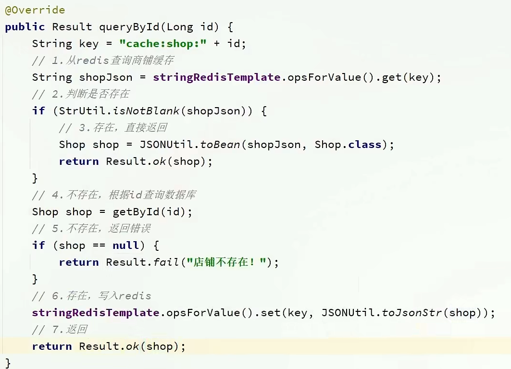


##### 2.3 缓存更新策略

缓存更新是redis为了节约内存而设计出来的一个东西，主要是因为内存数据宝贵，当我们向redis插入太多数据，此时就可能会导致缓存中的数据过多，所以redis会对部分数据进行更新，或者把他叫为淘汰更合适。

**内存淘汰：**redis自动进行，当redis内存达到咱们设定的max-memery的时候，会自动触发淘汰机制，淘汰掉一些不重要的数据(可以自己设置策略方式)

**超时剔除：**当我们给redis设置了过期时间ttl之后，redis会将超时的数据进行删除，方便咱们继续使用缓存

**主动更新：**我们可以手动调用方法把缓存删掉，通常用于解决缓存和数据库不一致问题


##### 2.3.1 、数据库缓存不一致解决方案：

由于我们的**缓存的数据源来自于数据库**,而数据库的**数据是会发生变化的**,因此,如果当数据库中**数据发生变化,而缓存却没有同步**,此时就会有**一致性问题存在**,其后果是:

用户使用缓存中的过时数据,就会产生类似多线程数据安全问题,从而影响业务,产品口碑等;怎么解决呢？有如下几种方案

Cache Aside Pattern 人工编码方式：缓存调用者在更新完数据库后再去更新缓存，也称之为双写方案

Read/Write Through Pattern : 由系统本身完成，数据库与缓存的问题交由系统本身去处理

Write Behind Caching Pattern ：调用者只操作缓存，其他线程去异步处理数据库，实现最终一致


##### 2.3.2 、数据库和缓存不一致采用什么方案

综合考虑使用方案一，但是方案一调用者如何处理呢？这里有几个问题

操作缓存和数据库时有三个问题需要考虑：

如果采用第一个方案，那么假设我们每次操作数据库后，都操作缓存，但是中间如果没有人查询，那么这个更新动作实际上只有最后一次生效，中间的更新动作意义并不大，我们可以把缓存删除，等待再次查询时，将缓存中的数据加载出来

* 删除缓存还是更新缓存？
  * 更新缓存：每次更新数据库都更新缓存，无效写操作较多
  * ==删除缓存：更新数据库时让缓存失效，查询时再更新缓存==

* 如何保证缓存与数据库的操作的同时成功或失败？
  * 单体系统，将缓存与数据库操作放在一个事务
  * 分布式系统，利用TCC等分布式事务方案

应该具体操作缓存还是操作数据库，我们应当是先操作数据库，再删除缓存，原因在于，如果你选择第一种方案，在两个线程并发来访问时，假设线程1先来，他先把缓存删了，此时线程2过来，他查询缓存数据并不存在，此时他写入缓存，当他写入缓存后，线程1再执行更新动作时，实际上写入的就是旧的数据，新的数据被旧数据覆盖了。

* 先操作缓存还是先操作数据库？
  * 先删除缓存，再操作数据库
  * ==先操作数据库，再删除缓存==


##### 2.4 实现商铺和缓存与数据库双写一致

核心思路如下：

修改ShopController中的业务逻辑，满足下面的需求：

根据id查询店铺时，如果缓存未命中，则查询数据库，将数据库结果写入缓存，并设置超时时间

根据id修改店铺时，先修改数据库，再删除缓存

**修改重点代码1**：修改**ShopServiceImpl**的queryById方法

**设置redis缓存时添加过期时间**


**修改重点代码2**

代码分析：通过之前的淘汰，我们确定了采用删除策略，来解决双写问题，当我们修改了数据之后，然后把缓存中的数据进行删除，查询时发现缓存中没有数据，则会从mysql中加载最新的数据，从而避免数据库和缓存不一致的问题

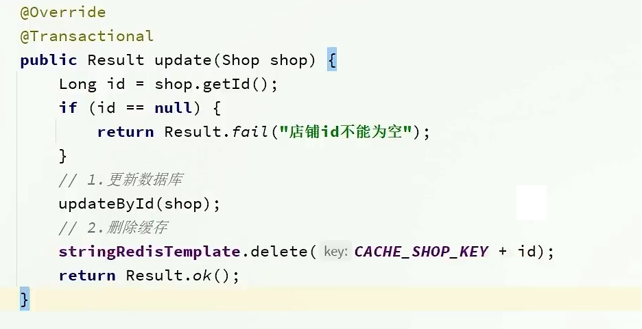

##### 2.5 缓存穿透问题的解决思路

缓存穿透 ：缓存穿透是指客户端请求的数据在缓存中和数据库中都不存在，这样缓存永远不会生效，这些请求都会打到数据库。

常见的解决方案有两种：

* 缓存空对象
  * 优点：实现简单，维护方便
  * 缺点：
    * 额外的内存消耗
    * 可能造成短期的不一致
* 布隆过滤
  * 优点：内存占用较少，没有多余key
  * 缺点：
    * 实现复杂
    * 存在误判可能


**缓存空对象思路分析：**当我们客户端访问不存在的数据时，先请求redis，但是此时redis中没有数据，此时会访问到数据库，但是数据库中也没有数据，这个数据穿透了缓存，直击数据库，我们都知道数据库能够承载的并发不如redis这么高，如果大量的请求同时过来访问这种不存在的数据，这些请求就都会访问到数据库，简单的解决方案就是哪怕这个数据在数据库中也不存在，我们也把这个数据存入到redis中去，这样，下次用户过来访问这个不存在的数据，那么在redis中也能找到这个数据就不会进入到缓存了


**布隆过滤：**布隆过滤器其实采用的是哈希思想来解决这个问题，通过一个庞大的二进制数组，走哈希思想去判断当前这个要查询的这个数据是否存在，如果布隆过滤器判断存在，则放行，这个请求会去访问redis，哪怕此时redis中的数据过期了，但是数据库中一定存在这个数据，在数据库中查询出来这个数据后，再将其放入到redis中，

假设布隆过滤器判断这个数据不存在，则直接返回

这种方式优点在于节约内存空间，存在误判，误判原因在于：布隆过滤器走的是哈希思想，只要哈希思想，就可能存在哈希冲突


##### 2.6 编码解决商品查询的缓存穿透问题：

核心思路如下：

在原来的逻辑中，我们如果发现这个数据在mysql中不存在，直接就返回404了，这样是会存在缓存穿透问题的

现在的逻辑中：如果这个数据不存在，我们不会返回404 ，还是会把这个数据写入到Redis中，并且将value设置为空，欧当再次发起查询时，我们如果发现命中之后，判断这个value是否是null，如果是null，则是之前写入的数据，证明是缓存穿透数据，如果不是，则直接返回数据。


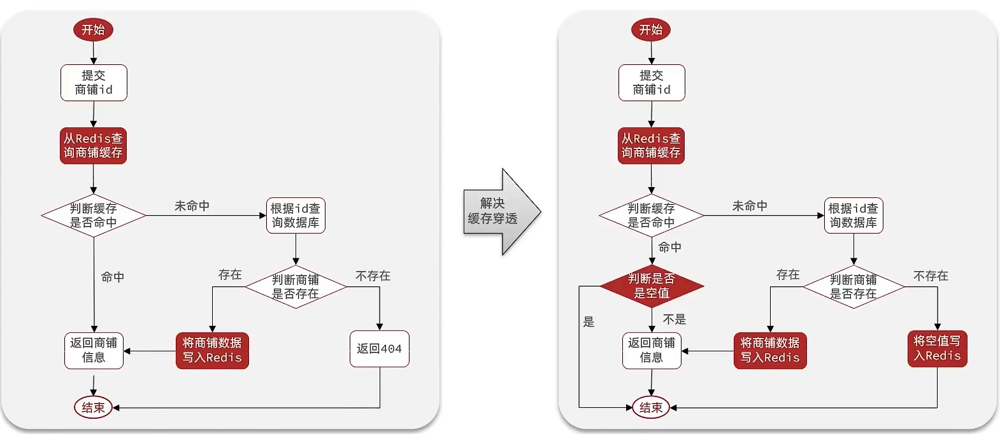

**小总结：**

缓存穿透产生的原因是什么？

* 用户请求的数据在缓存中和数据库中都不存在，不断发起这样的请求，给数据库带来巨大压力

缓存穿透的解决方案有哪些？

* 缓存null值
* 布隆过滤
* 增强id的复杂度，避免被猜测id规律
* 做好数据的基础格式校验
* 加强用户权限校验
* 做好热点参数的限流


##### 2.7 缓存雪崩问题及解决思路

缓存雪崩是指在同一时段大量的缓存key同时失效或者Redis服务宕机，导致大量请求到达数据库，带来巨大压力。

解决方案：

* 给不同的Key的TTL添加随机值
* 利用Redis集群提高服务的可用性
* 给缓存业务添加降级限流策略
* 给业务添加多级缓存


##### 2.8 缓存击穿问题及解决思路

缓存击穿问题也叫热点Key问题，就是一个被高并发访问并且缓存重建业务较复杂的key突然失效了，无数的请求访问会在瞬间给数据库带来巨大的冲击。

常见的解决方案有两种：

* 互斥锁
* 逻辑过期

逻辑分析：假设线程1在查询缓存之后，本来应该去查询数据库，然后把这个数据重新加载到缓存的，此时只要线程1走完这个逻辑，其他线程就都能从缓存中加载这些数据了，但是假设在线程1没有走完的时候，后续的线程2，线程3，线程4同时过来访问当前这个方法， 那么这些线程都不能从缓存中查询到数据，那么他们就会同一时刻来访问查询缓存，都没查到，接着同一时间去访问数据库，同时的去执行数据库代码，对数据库访问压力过大


解决方案一、使用锁来解决：

因为锁能实现互斥性。假设线程过来，只能一个人一个人的来访问数据库，从而避免对于数据库访问压力过大，但这也会影响查询的性能，因为此时会让查询的性能从并行变成了串行，我们可以采用tryLock方法 + double check来解决这样的问题。

假设现在线程1过来访问，他查询缓存没有命中，但是此时他获得到了锁的资源，那么线程1就会一个人去执行逻辑，假设现在线程2过来，线程2在执行过程中，并没有获得到锁，那么线程2就可以进行到休眠，直到线程1把锁释放后，线程2获得到锁，然后再来执行逻辑，此时就能够从缓存中拿到数据了。


解决方案二、逻辑过期方案

方案分析：我们之所以会出现这个缓存击穿问题，主要原因是在于我们对key设置了过期时间，假设我们不设置过期时间，其实就不会有缓存击穿的问题，但是不设置过期时间，这样数据不就一直占用我们内存了吗，我们可以采用逻辑过期方案。

我们把过期时间设置在 redis的value中，注意：这个过期时间并不会直接作用于redis，而是我们后续通过逻辑去处理。假设线程1去查询缓存，然后从value中判断出来当前的数据已经过期了，此时线程1去获得互斥锁，那么其他线程会进行阻塞，获得了锁的线程他会开启一个 线程去进行 以前的重构数据的逻辑，直到新开的线程完成这个逻辑后，才释放锁， 而线程1直接进行返回，假设现在线程3过来访问，由于线程线程2持有着锁，所以线程3无法获得锁，线程3也直接返回数据，只有等到新开的线程2把重建数据构建完后，其他线程才能走返回正确的数据。

这种方案巧妙在于，异步的构建缓存，缺点在于在构建完缓存之前，返回的都是脏数据。


进行对比

**互斥锁方案：**由于保证了互斥性，所以数据一致，且实现简单，因为仅仅只需要加一把锁而已，也没其他的事情需要操心，所以没有额外的内存消耗，缺点在于有锁就有死锁问题的发生，且只能串行执行性能肯定受到影响

**逻辑过期方案：** 线程读取过程中不需要等待，性能好，有一个额外的线程持有锁去进行重构数据，但是在重构数据完成前，其他的线程只能返回之前的数据，且实现起来麻烦


##### 2.9 利用互斥锁解决缓存击穿问题

核心思路：相较于原来从缓存中查询不到数据后直接查询数据库而言，现在的方案是 进行查询之后，如果从缓存没有查询到数据，则进行互斥锁的获取，获取互斥锁后，判断是否获得到了锁，如果没有获得到，则休眠，过一会再进行尝试，直到获取到锁为止，才能进行查询

如果获取到了锁的线程，再去进行查询，查询后将数据写入redis，再释放锁，返回数据，利用互斥锁就能保证只有一个线程去执行操作数据库的逻辑，防止缓存击穿


**操作锁的代码：**

核心思路就是利用redis的setnx方法来表示获取锁，该方法含义是redis中如果没有这个key，则插入成功，返回1，在stringRedisTemplate中返回true，  如果有这个key则插入失败，则返回0，在stringRedisTemplate返回false，我们可以通过true，或者是false，来表示是否有线程成功插入key，成功插入的key的线程我们认为他就是获得到锁的线程。

```java
private boolean tryLock(String key) {
    Boolean flag = stringRedisTemplate.opsForValue().setIfAbsent(key, "1", 10, TimeUnit.SECONDS);
    return BooleanUtil.isTrue(flag);
}

private void unlock(String key) {
    stringRedisTemplate.delete(key);
}
```

**操作代码：**

```java
 public Shop queryWithMutex(Long id)  {
        String key = CACHE_SHOP_KEY + id;
        // 1、从redis中查询商铺缓存
        String shopJson = stringRedisTemplate.opsForValue().get("key");
        // 2、判断是否存在
        if (StrUtil.isNotBlank(shopJson)) {
            // 存在,直接返回
            return JSONUtil.toBean(shopJson, Shop.class);
        }
        //判断命中的值是否是空值
        if (shopJson != null) {
            //返回一个错误信息
            return null;
        }
        // 4.实现缓存重构
        //4.1 获取互斥锁
        String lockKey = "lock:shop:" + id;
        Shop shop = null;
        try {
            boolean isLock = tryLock(lockKey);
            // 4.2 判断否获取成功
            if(!isLock){
                //4.3 失败，则休眠重试
                Thread.sleep(50);
                return queryWithMutex(id);
            }
            //4.4 成功，根据id查询数据库
             shop = getById(id);
            // 5.不存在，返回错误
            if(shop == null){
                 //将空值写入redis
                stringRedisTemplate.opsForValue().set(key,"",CACHE_NULL_TTL,TimeUnit.MINUTES);
                //返回错误信息
                return null;
            }
            //6.写入redis
            stringRedisTemplate.opsForValue().set(key,JSONUtil.toJsonStr(shop),CACHE_NULL_TTL,TimeUnit.MINUTES);

        }catch (Exception e){
            throw new RuntimeException(e);
        }
        finally {
            //7.释放互斥锁
            unlock(lockKey);
        }
        return shop;
    }
```

#####  3.0 、利用逻辑过期解决缓存击穿问题

**需求：修改根据id查询商铺的业务，基于逻辑过期方式来解决缓存击穿问题**

思路分析：当用户开始查询redis时，判断是否命中，如果没有命中则直接返回空数据，不查询数据库，而一旦命中后，将value取出，判断value中的过期时间是否满足，如果没有过期，则直接返回redis中的数据，如果过期，则在开启独立线程后直接返回之前的数据，独立线程去重构数据，重构完成后释放互斥锁。


如果封装数据：因为现在redis中存储的数据的value需要带上过期时间，此时要么你去修改原来的实体类，要么你

**步骤一、**

新建一个实体类，我们采用第二个方案，这个方案，对原来代码没有侵入性。

```
@Data
public class RedisData {
    private LocalDateTime expireTime;
    private Object data;
}
```

**步骤二、**

在**ShopServiceImpl** 新增此方法，利用单元测试进行缓存预热


**在测试类中**


步骤三：正式代码

**ShopServiceImpl**

```java
private static final ExecutorService CACHE_REBUILD_EXECUTOR = Executors.newFixedThreadPool(10);
public Shop queryWithLogicalExpire( Long id ) {
    String key = CACHE_SHOP_KEY + id;
    // 1.从redis查询商铺缓存
    String json = stringRedisTemplate.opsForValue().get(key);
    // 2.判断是否存在
    if (StrUtil.isBlank(json)) {
        // 3.存在，直接返回
        return null;
    }
    // 4.命中，需要先把json反序列化为对象
    RedisData redisData = JSONUtil.toBean(json, RedisData.class);
    Shop shop = JSONUtil.toBean((JSONObject) redisData.getData(), Shop.class);
    LocalDateTime expireTime = redisData.getExpireTime();
    // 5.判断是否过期
    if(expireTime.isAfter(LocalDateTime.now())) {
        // 5.1.未过期，直接返回店铺信息
        return shop;
    }
    // 5.2.已过期，需要缓存重建
    // 6.缓存重建
    // 6.1.获取互斥锁
    String lockKey = LOCK_SHOP_KEY + id;
    boolean isLock = tryLock(lockKey);
    // 6.2.判断是否获取锁成功
    if (isLock){
        CACHE_REBUILD_EXECUTOR.submit( ()->{

            try{
                //重建缓存
                this.saveShop2Redis(id,20L);
            }catch (Exception e){
                throw new RuntimeException(e);
            }finally {
                unlock(lockKey);
            }
        });
    }
    // 6.4.返回过期的商铺信息
    return shop;
}
```

##### 3.1、封装Redis工具类

基于StringRedisTemplate封装一个缓存工具类，满足下列需求：

* 方法1：将任意Java对象序列化为json并存储在string类型的key中，并且可以设置TTL过期时间
* 方法2：将任意Java对象序列化为json并存储在string类型的key中，并且可以设置逻辑过期时间，用于处理缓

存击穿问题

* 方法3：根据指定的key查询缓存，并反序列化为指定类型，利用缓存空值的方式解决缓存穿透问题
* 方法4：根据指定的key查询缓存，并反序列化为指定类型，需要利用逻辑过期解决缓存击穿问题

将逻辑进行封装

```java
@Slf4j
@Component
public class CacheClient {

    private final StringRedisTemplate stringRedisTemplate;

    private static final ExecutorService CACHE_REBUILD_EXECUTOR = Executors.newFixedThreadPool(10);

    public CacheClient(StringRedisTemplate stringRedisTemplate) {
        this.stringRedisTemplate = stringRedisTemplate;
    }

    public void set(String key, Object value, Long time, TimeUnit unit) {
        stringRedisTemplate.opsForValue().set(key, JSONUtil.toJsonStr(value), time, unit);
    }

    public void setWithLogicalExpire(String key, Object value, Long time, TimeUnit unit) {
        // 设置逻辑过期
        RedisData redisData = new RedisData();
        redisData.setData(value);
        redisData.setExpireTime(LocalDateTime.now().plusSeconds(unit.toSeconds(time)));
        // 写入Redis
        stringRedisTemplate.opsForValue().set(key, JSONUtil.toJsonStr(redisData));
    }

    public <R,ID> R queryWithPassThrough(
            String keyPrefix, ID id, Class<R> type, Function<ID, R> dbFallback, Long time,Long cacheNullTime, TimeUnit unit){
        String key = keyPrefix + id;
        // 1.从redis查询商铺缓存
        String json = stringRedisTemplate.opsForValue().get(key);
        // 2.判断是否存在
        if (StrUtil.isNotBlank(json)) {
            // 3.存在，直接返回
            return JSONUtil.toBean(json, type);
        }
        // 判断命中的是否是空值
        if (json != null) {
            // 返回一个错误信息
            return null;
        }

        // 4.不存在，根据id查询数据库
        R r = dbFallback.apply(id);
        // 5.不存在，返回错误
        if (r == null) {
            // 将空值写入redis
            stringRedisTemplate.opsForValue().set(key, "", cacheNullTime, TimeUnit.MINUTES);
            // 返回错误信息
            return null;
        }
        // 6.存在，写入redis
        this.set(key, r, time, unit);
        return r;
    }

    public <R, ID> R queryWithLogicalExpire(
            String keyPrefix, ID id, Class<R> type, Function<ID, R> dbFallback, Long time, TimeUnit unit) {
        String key = keyPrefix + id;
        // 1.从redis查询商铺缓存
        String json = stringRedisTemplate.opsForValue().get(key);
        // 2.判断是否存在
        if (StrUtil.isBlank(json)) {
            // 3.存在，直接返回
            return null;
        }
        // 4.命中，需要先把json反序列化为对象
        RedisData redisData = JSONUtil.toBean(json, RedisData.class);
        R r = JSONUtil.toBean((JSONObject) redisData.getData(), type);
        LocalDateTime expireTime = redisData.getExpireTime();
        // 5.判断是否过期
        if(expireTime.isAfter(LocalDateTime.now())) {
            // 5.1.未过期，直接返回店铺信息
            return r;
        }
        // 5.2.已过期，需要缓存重建
        // 6.缓存重建
        // 6.1.获取互斥锁
        String lockKey = LOCK_SHOP_KEY + id;
        boolean isLock = tryLock(lockKey);
        // 6.2.判断是否获取锁成功
        if (isLock){
            // 6.3.成功，开启独立线程，实现缓存重建
            CACHE_REBUILD_EXECUTOR.submit(() -> {
                try {
                    // 查询数据库
                    R newR = dbFallback.apply(id);
                    // 重建缓存
                    this.setWithLogicalExpire(key, newR, time, unit);
                } catch (Exception e) {
                    throw new RuntimeException(e);
                }finally {
                    // 释放锁
                    unlock(lockKey);
                }
            });
        }
        // 6.4.返回过期的商铺信息
        return r;
    }

    public <R, ID> R queryWithMutex(
            String keyPrefix, ID id, Class<R> type, Function<ID, R> dbFallback, Long time, TimeUnit unit) {
        String key = keyPrefix + id;
        // 1.从redis查询商铺缓存
        String shopJson = stringRedisTemplate.opsForValue().get(key);
        // 2.判断是否存在
        if (StrUtil.isNotBlank(shopJson)) {
            // 3.存在，直接返回
            return JSONUtil.toBean(shopJson, type);
        }
        // 判断命中的是否是空值
        if (shopJson != null) {
            // 返回一个错误信息
            return null;
        }

        // 4.实现缓存重建
        // 4.1.获取互斥锁
        String lockKey = LOCK_SHOP_KEY + id;
        R r = null;
        try {
            boolean isLock = tryLock(lockKey);
            // 4.2.判断是否获取成功
            if (!isLock) {
                // 4.3.获取锁失败，休眠并重试
                Thread.sleep(50);
                return queryWithMutex(keyPrefix, id, type, dbFallback, time, unit);
            }
            // 4.4.获取锁成功，根据id查询数据库
            r = dbFallback.apply(id);
            // 5.不存在，返回错误
            if (r == null) {
                // 将空值写入redis
                stringRedisTemplate.opsForValue().set(key, "", CACHE_NULL_TTL, TimeUnit.MINUTES);
                // 返回错误信息
                return null;
            }
            // 6.存在，写入redis
            this.set(key, r, time, unit);
        } catch (InterruptedException e) {
            throw new RuntimeException(e);
        }finally {
            // 7.释放锁
            unlock(lockKey);
        }
        // 8.返回
        return r;
    }

    private boolean tryLock(String key) {
        Boolean flag = stringRedisTemplate.opsForValue().setIfAbsent(key, "1", 10, TimeUnit.SECONDS);
        return BooleanUtil.isTrue(flag);
    }

    private void unlock(String key) {
        stringRedisTemplate.delete(key);
    }
}
```

在ShopServiceImpl 中

```java
@Resource
private CacheClient cacheClient;

 @Override
    public Result queryById(Long id) {
        // 解决缓存穿透
        Shop shop = cacheClient
                .queryWithPassThrough(CACHE_SHOP_KEY, id, Shop.class, this::getById, CACHE_SHOP_TTL, TimeUnit.MINUTES);

        // 互斥锁解决缓存击穿
        // Shop shop = cacheClient
        //         .queryWithMutex(CACHE_SHOP_KEY, id, Shop.class, this::getById, CACHE_SHOP_TTL, TimeUnit.MINUTES);

        // 逻辑过期解决缓存击穿
        // Shop shop = cacheClient
        //         .queryWithLogicalExpire(CACHE_SHOP_KEY, id, Shop.class, this::getById, 20L, TimeUnit.SECONDS);

        if (shop == null) {
            return Result.fail("店铺不存在！");
        }
        // 7.返回
        return Result.ok(shop);
    }
```

#### 3、优惠卷秒杀

##### 3.1 -全局唯一ID

每个店铺都可以发布优惠券：


当用户抢购时，就会生成订单并保存到tb_voucher_order这张表中，而订单表如果使用数据库自增ID就存在一些问题：

* id的规律性太明显
* 受单表数据量的限制

场景分析：如果我们的id具有太明显的规则，用户或者说商业对手很容易猜测出来我们的一些敏感信息，比如商城在一天时间内，卖出了多少单，这明显不合适。

场景分析二：随着我们商城规模越来越大，mysql的单表的容量不宜超过500W，数据量过大之后，我们要进行拆库拆表，但拆分表了之后，他们从逻辑上讲他们是同一张表，所以他们的id是不能一样的， 于是乎我们需要保证id的唯一性。

**全局ID生成器**，是一种在分布式系统下用来生成全局唯一ID的工具，一般要满足下列特性：


为了增加ID的安全性，我们可以不直接使用Redis自增的数值，而是拼接一些其它信息：

ID的组成部分：符号位：1bit，永远为0

时间戳：31bit，以秒为单位，可以使用69年

序列号：32bit，秒内的计数器，支持每秒产生2^32个不同ID

##### 3.2 -Redis实现全局唯一Id

```java
@Component
public class RedisIdWorker {
    /**
     * 开始时间戳
     */
    private static final long BEGIN_TIMESTAMP = 1640995200L;
    /**
     * 序列号的位数
     */
    private static final int COUNT_BITS = 32;

    private StringRedisTemplate stringRedisTemplate;

    public RedisIdWorker(StringRedisTemplate stringRedisTemplate) {
        this.stringRedisTemplate = stringRedisTemplate;
    }

    public long nextId(String keyPrefix) {
        // 1.生成时间戳
        LocalDateTime now = LocalDateTime.now();
        long nowSecond = now.toEpochSecond(ZoneOffset.UTC);
        long timestamp = nowSecond - BEGIN_TIMESTAMP;

        // 2.生成序列号
        // 2.1.获取当前日期，精确到天
        String date = now.format(DateTimeFormatter.ofPattern("yyyy:MM:dd"));
        // 2.2.自增长
        long count = stringRedisTemplate.opsForValue().increment("icr:" + keyPrefix + ":" + date);

        // 3.拼接并返回
        return timestamp << COUNT_BITS | count;
    }
}
```

测试类

知识小贴士：关于countdownlatch

countdownlatch名为信号枪：主要的作用是同步协调在多线程的等待于唤醒问题

我们如果没有CountDownLatch ，那么由于程序是异步的，当异步程序没有执行完时，主线程就已经执行完了，然后我们期望的是分线程全部走完之后，主线程再走，所以我们此时需要使用到CountDownLatch

CountDownLatch 中有两个最重要的方法

1、countDown

2、await

await 方法 是阻塞方法，我们担心分线程没有执行完时，main线程就先执行，所以使用await可以让main线程阻塞，那么什么时候main线程不再阻塞呢？当CountDownLatch  内部维护的 变量变为0时，就不再阻塞，直接放行，那么什么时候CountDownLatch   维护的变量变为0 呢，我们只需要调用一次countDown ，内部变量就减少1，我们让分线程和变量绑定， 执行完一个分线程就减少一个变量，当分线程全部走完，CountDownLatch 维护的变量就是0，此时await就不再阻塞，统计出来的时间也就是所有分线程执行完后的时间。

```java
@Test
void testIdWorker() throws InterruptedException {
    CountDownLatch latch = new CountDownLatch(300);

    Runnable task = () -> {
        for (int i = 0; i < 100; i++) {
            long id = redisIdWorker.nextId("order");
            System.out.println("id = " + id);
        }
        latch.countDown();
    };
    long begin = System.currentTimeMillis();
    for (int i = 0; i < 300; i++) {
        es.submit(task);
    }
    latch.await();
    long end = System.currentTimeMillis();
    System.out.println("time = " + (end - begin));
}
```

##### 3.3 添加优惠卷

每个店铺都可以发布优惠券，分为平价券和特价券。平价券可以任意购买，而特价券需要秒杀抢购：


tb_voucher：优惠券的基本信息，优惠金额、使用规则等
tb_seckill_voucher：优惠券的库存、开始抢购时间，结束抢购时间。特价优惠券才需要填写这些信息

平价卷由于优惠力度并不是很大，所以是可以任意领取

而代金券由于优惠力度大，所以像第二种卷，就得限制数量，从表结构上也能看出，特价卷除了具有优惠卷的基本信息以外，还具有库存，抢购时间，结束时间等等字段

**新增普通卷代码：  **VoucherController

```java
@PostMapping
public Result addVoucher(@RequestBody Voucher voucher) {
    voucherService.save(voucher);
    return Result.ok(voucher.getId());
}
```

**新增秒杀卷代码：**

**VoucherController**

```java
@PostMapping("seckill")
public Result addSeckillVoucher(@RequestBody Voucher voucher) {
    voucherService.addSeckillVoucher(voucher);
    return Result.ok(voucher.getId());
}
```

**VoucherServiceImpl**

```java
@Override
@Transactional
public void addSeckillVoucher(Voucher voucher) {
    // 保存优惠券
    save(voucher);
    // 保存秒杀信息
    SeckillVoucher seckillVoucher = new SeckillVoucher();
    seckillVoucher.setVoucherId(voucher.getId());
    seckillVoucher.setStock(voucher.getStock());
    seckillVoucher.setBeginTime(voucher.getBeginTime());
    seckillVoucher.setEndTime(voucher.getEndTime());
    seckillVoucherService.save(seckillVoucher);
    // 保存秒杀库存到Redis中
    stringRedisTemplate.opsForValue().set(SECKILL_STOCK_KEY + voucher.getId(), voucher.getStock().toString());
}
```

##### 3.4 实现秒杀下单

下单核心思路：当我们点击抢购时，会触发右侧的请求，我们只需要编写对应的controller即可


秒杀下单应该思考的内容：

下单时需要判断两点：

* 秒杀是否开始或结束，如果尚未开始或已经结束则无法下单
* 库存是否充足，不足则无法下单

下单核心逻辑分析：

当用户开始进行下单，我们应当去查询优惠卷信息，查询到优惠卷信息，判断是否满足秒杀条件

比如时间是否充足，如果时间充足，则进一步判断库存是否足够，如果两者都满足，则扣减库存，创建订单，然后返回订单id，如果有一个条件不满足则直接结束。


VoucherOrderServiceImpl

```java
@Override
public Result seckillVoucher(Long voucherId) {
    // 1.查询优惠券
    SeckillVoucher voucher = seckillVoucherService.getById(voucherId);
    // 2.判断秒杀是否开始
    if (voucher.getBeginTime().isAfter(LocalDateTime.now())) {
        // 尚未开始
        return Result.fail("秒杀尚未开始！");
    }
    // 3.判断秒杀是否已经结束
    if (voucher.getEndTime().isBefore(LocalDateTime.now())) {
        // 尚未开始
        return Result.fail("秒杀已经结束！");
    }
    // 4.判断库存是否充足
    if (voucher.getStock() < 1) {
        // 库存不足
        return Result.fail("库存不足！");
    }
    //5，扣减库存
    boolean success = seckillVoucherService.update()
            .setSql("stock= stock -1")
            .eq("voucher_id", voucherId).update();
    if (!success) {
        //扣减库存
        return Result.fail("库存不足！");
    }
    //6.创建订单
    VoucherOrder voucherOrder = new VoucherOrder();
    // 6.1.订单id
    long orderId = redisIdWorker.nextId("order");
    voucherOrder.setId(orderId);
    // 6.2.用户id
    Long userId = UserHolder.getUser().getId();
    voucherOrder.setUserId(userId);
    // 6.3.代金券id
    voucherOrder.setVoucherId(voucherId);
    save(voucherOrder);

    return Result.ok(orderId);

}
```

##### 3.5 库存超卖问题分析

有关超卖问题分析：在我们原有代码中是这么写的

```java
 if (voucher.getStock() < 1) {
        // 库存不足
        return Result.fail("库存不足！");
    }
    //5，扣减库存
    boolean success = seckillVoucherService.update()
            .setSql("stock= stock -1")
            .eq("voucher_id", voucherId).update();
    if (!success) {
        //扣减库存
        return Result.fail("库存不足！");
    }
```

假设线程1过来查询库存，判断出来库存大于1，正准备去扣减库存，但是还没有来得及去扣减，此时线程2过来，线程2也去查询库存，发现这个数量一定也大于1，那么这两个线程都会去扣减库存，最终多个线程相当于一起去扣减库存，此时就会出现库存的超卖问题。


超卖问题是典型的多线程安全问题，针对这一问题的常见解决方案就是加锁：而对于加锁，我们通常有两种解决方案：见下图：


**悲观锁：**

 悲观锁可以实现对于数据的串行化执行，比如syn，和lock都是悲观锁的代表，同时，悲观锁中又可以再细分为公平锁，非公平锁，可重入锁，等等

**乐观锁：**

  乐观锁：会有一个版本号，每次操作数据会对版本号+1，再提交回数据时，会去校验是否比之前的版本大1 ，如果大1 ，则进行操作成功，这套机制的核心逻辑在于，如果在操作过程中，版本号只比原来大1 ，那么就意味着操作过程中没有人对他进行过修改，他的操作就是安全的，如果不大1，则数据被修改过，当然乐观锁还有一些变种的处理方式比如cas

  乐观锁的典型代表：就是cas，利用cas进行无锁化机制加锁，var5 是操作前读取的内存值，while中的var1+var2 是预估值，如果预估值 == 内存值，则代表中间没有被人修改过，此时就将新值去替换 内存值

  其中do while 是为了在操作失败时，再次进行自旋操作，即把之前的逻辑再操作一次。

```java
int var5;
do {
    var5 = this.getIntVolatile(var1, var2);
} while(!this.compareAndSwapInt(var1, var2, var5, var5 + var4));

return var5;
```

**课程中的使用方式：**

课程中的使用方式是没有像cas一样带自旋的操作，也没有对version的版本号+1 ，他的操作逻辑是在操作时，对版本号进行+1 操作，然后要求version 如果是1 的情况下，才能操作，那么第一个线程在操作后，数据库中的version变成了2，但是他自己满足version=1 ，所以没有问题，此时线程2执行，线程2 最后也需要加上条件version =1 ，但是现在由于线程1已经操作过了，所以线程2，操作时就不满足version=1 的条件了，所以线程2无法执行成功


3.6 乐观锁解决超卖问题

**修改代码方案一、**

VoucherOrderServiceImpl 在扣减库存时，改为：

```java
boolean success = seckillVoucherService.update()
            .setSql("stock= stock -1") //set stock = stock -1
            .eq("voucher_id", voucherId).eq("stock",voucher.getStock()).update(); //where id = ？ and stock = ?
```

以上逻辑的核心含义是：只要我扣减库存时的库存和之前我查询到的库存是一样的，就意味着没有人在中间修改过库存，那么此时就是安全的，但是以上这种方式通过测试发现会有很多失败的情况，失败的原因在于：在使用乐观锁过程中假设100个线程同时都拿到了100的库存，然后大家一起去进行扣减，但是100个人中只有1个人能扣减成功，其他的人在处理时，他们在扣减时，库存已经被修改过了，所以此时其他线程都会失败

**修改代码方案二、**

之前的方式要修改前后都保持一致，但是这样我们分析过，成功的概率太低，所以我们的乐观锁需要变一下，改成stock大于0 即可

```java
boolean success = seckillVoucherService.update()
            .setSql("stock= stock -1")
            .eq("voucher_id", voucherId).update().gt("stock",0); //where id = ? and stock > 0
```

**知识小扩展：**

针对cas中的自旋压力过大，我们可以使用Longaddr这个类去解决

Java8 提供的一个对AtomicLong改进后的一个类，LongAdder

大量线程并发更新一个原子性的时候，天然的问题就是自旋，会导致并发性问题，当然这也比我们直接使用syn来的好

所以利用这么一个类，LongAdder来进行优化

如果获取某个值，则会对cell和base的值进行递增，最后返回一个完整的值


##### 3.6 优惠券秒杀-一人一单

需求：修改秒杀业务，要求同一个优惠券，一个用户只能下一单

**现在的问题在于：**

优惠卷是为了引流，但是目前的情况是，一个人可以无限制的抢这个优惠卷，所以我们应当增加一层逻辑，让一个用户只能下一个单，而不是让一个用户下多个单

具体操作逻辑如下：比如时间是否充足，如果时间充足，则进一步判断库存是否足够，然后再根据优惠卷id和用户id查询是否已经下过这个订单，如果下过这个订单，则不再下单，否则进行下单


VoucherOrderServiceImpl  

**初步代码：增加一人一单逻辑**

```java
@Override
public Result seckillVoucher(Long voucherId) {
    // 1.查询优惠券
    SeckillVoucher voucher = seckillVoucherService.getById(voucherId);
    // 2.判断秒杀是否开始
    if (voucher.getBeginTime().isAfter(LocalDateTime.now())) {
        // 尚未开始
        return Result.fail("秒杀尚未开始！");
    }
    // 3.判断秒杀是否已经结束
    if (voucher.getEndTime().isBefore(LocalDateTime.now())) {
        // 尚未开始
        return Result.fail("秒杀已经结束！");
    }
    // 4.判断库存是否充足
    if (voucher.getStock() < 1) {
        // 库存不足
        return Result.fail("库存不足！");
    }
    // 5.一人一单逻辑
    // 5.1.用户id
    Long userId = UserHolder.getUser().getId();
    int count = query().eq("user_id", userId).eq("voucher_id", voucherId).count();
    // 5.2.判断是否存在
    if (count > 0) {
        // 用户已经购买过了
        return Result.fail("用户已经购买过一次！");
    }

    //6，扣减库存
    boolean success = seckillVoucherService.update()
            .setSql("stock= stock -1")
            .eq("voucher_id", voucherId).update();
    if (!success) {
        //扣减库存
        return Result.fail("库存不足！");
    }
    //7.创建订单
    VoucherOrder voucherOrder = new VoucherOrder();
    // 7.1.订单id
    long orderId = redisIdWorker.nextId("order");
    voucherOrder.setId(orderId);

    voucherOrder.setUserId(userId);
    // 7.3.代金券id
    voucherOrder.setVoucherId(voucherId);
    save(voucherOrder);

    return Result.ok(orderId);

}
```

**存在问题：**现在的问题还是和之前一样，并发过来，查询数据库，都不存在订单，所以我们还是需要加锁，但是乐观锁比较适合更新数据，而现在是插入数据，所以我们需要使用悲观锁操作

**注意：**在这里提到了非常多的问题，我们需要慢慢的来思考，首先我们的初始方案是封装了一个createVoucherOrder方法，同时为了确保他线程安全，在方法上添加了一把synchronized 锁

```java
@Transactional
public synchronized Result createVoucherOrder(Long voucherId) {

	Long userId = UserHolder.getUser().getId();
         // 5.1.查询订单
        int count = query().eq("user_id", userId).eq("voucher_id", voucherId).count();
        // 5.2.判断是否存在
        if (count > 0) {
            // 用户已经购买过了
            return Result.fail("用户已经购买过一次！");
        }

        // 6.扣减库存
        boolean success = seckillVoucherService.update()
                .setSql("stock = stock - 1") // set stock = stock - 1
                .eq("voucher_id", voucherId).gt("stock", 0) // where id = ? and stock > 0
                .update();
        if (!success) {
            // 扣减失败
            return Result.fail("库存不足！");
        }

        // 7.创建订单
        VoucherOrder voucherOrder = new VoucherOrder();
        // 7.1.订单id
        long orderId = redisIdWorker.nextId("order");
        voucherOrder.setId(orderId);
        // 7.2.用户id
        voucherOrder.setUserId(userId);
        // 7.3.代金券id
        voucherOrder.setVoucherId(voucherId);
        save(voucherOrder);

        // 7.返回订单id
        return Result.ok(orderId);
}
```

，但是这样添加锁，锁的粒度太粗了，在使用锁过程中，控制**锁粒度** 是一个非常重要的事情，因为如果锁的粒度太大，会导致每个线程进来都会锁住，所以我们需要去控制锁的粒度，以下这段代码需要修改为：
intern() 这个方法是从常量池中拿到数据，如果我们直接使用userId.toString() 他拿到的对象实际上是不同的对象，new出来的对象，我们使用锁必须保证锁必须是同一把，所以我们需要使用intern()方法

```java
@Transactional
public  Result createVoucherOrder(Long voucherId) {
	Long userId = UserHolder.getUser().getId();
	synchronized(userId.toString().intern()){
         // 5.1.查询订单
        int count = query().eq("user_id", userId).eq("voucher_id", voucherId).count();
        // 5.2.判断是否存在
        if (count > 0) {
            // 用户已经购买过了
            return Result.fail("用户已经购买过一次！");
        }

        // 6.扣减库存
        boolean success = seckillVoucherService.update()
                .setSql("stock = stock - 1") // set stock = stock - 1
                .eq("voucher_id", voucherId).gt("stock", 0) // where id = ? and stock > 0
                .update();
        if (!success) {
            // 扣减失败
            return Result.fail("库存不足！");
        }

        // 7.创建订单
        VoucherOrder voucherOrder = new VoucherOrder();
        // 7.1.订单id
        long orderId = redisIdWorker.nextId("order");
        voucherOrder.setId(orderId);
        // 7.2.用户id
        voucherOrder.setUserId(userId);
        // 7.3.代金券id
        voucherOrder.setVoucherId(voucherId);
        save(voucherOrder);

        // 7.返回订单id
        return Result.ok(orderId);
    }
}
```

但是以上代码还是存在问题，问题的原因在于当前方法被spring的事务控制，如果你在方法内部加锁，可能会导致当前方法事务还没有提交，但是锁已经释放也会导致问题，所以我们选择将当前方法整体包裹起来，确保事务不会出现问题：如下：

在seckillVoucher 方法中，添加以下逻辑，这样就能保证事务的特性，同时也控制了锁的粒度

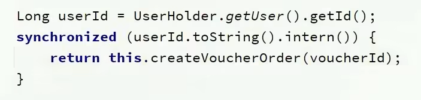

但是以上做法依然有问题，因为你调用的方法，其实是this.的方式调用的，事务想要生效，还得利用代理来生效，所以这个地方，我们需要获得原始的事务对象， 来操作事务


##### 3.7 集群环境下的并发问题

通过加锁可以解决在单机情况下的一人一单安全问题，但是在集群模式下就不行了。

1、我们将服务启动两份，端口分别为8081和8082：


2、然后修改nginx的conf目录下的nginx.conf文件，配置反向代理和负载均衡：

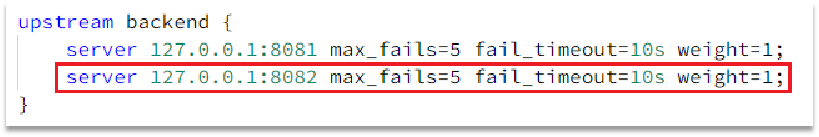

**具体操作(略)**

**有关锁失效原因分析**

由于现在我们部署了多个tomcat，每个tomcat都有一个属于自己的jvm，那么假设在服务器A的tomcat内部，有两个线程，这两个线程由于使用的是同一份代码，那么他们的锁对象是同一个，是可以实现互斥的，但是如果现在是服务器B的tomcat内部，又有两个线程，但是他们的锁对象写的虽然和服务器A一样，但是锁对象却不是同一个，所以线程3和线程4可以实现互斥，但是却无法和线程1和线程2实现互斥，这就是 集群环境下，syn锁失效的原因，在这种情况下，我们就需要使用分布式锁来解决这个问题。

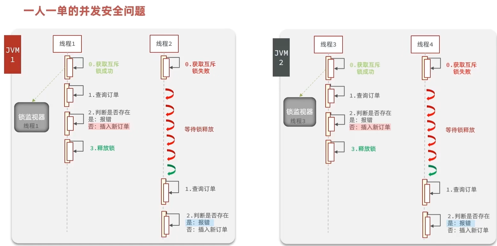

#### 4、分布式锁

##### 4.1 、基本原理和实现方式对比

分布式锁：满足分布式系统或集群模式下多进程可见并且互斥的锁。

分布式锁的核心思想就是让大家都使用同一把锁，只要大家使用的是同一把锁，那么我们就能锁住线程，不让线程进行，让程序串行执行，这就是分布式锁的核心思路


那么分布式锁他应该满足一些什么样的条件呢？

可见性：多个线程都能看到相同的结果，注意：这个地方说的可见性并不是并发编程中指的内存可见性，只是说多个进程之间都能感知到变化的意思

互斥：互斥是分布式锁的最基本的条件，使得程序串行执行

高可用：程序不易崩溃，时时刻刻都保证较高的可用性

高性能：由于加锁本身就让性能降低，所有对于分布式锁本身需要他就较高的加锁性能和释放锁性能

安全性：安全也是程序中必不可少的一环


常见的分布式锁有三种

Mysql：mysql本身就带有锁机制，但是由于mysql性能本身一般，所以采用分布式锁的情况下，其实使用mysql作为分布式锁比较少见

Redis：redis作为分布式锁是非常常见的一种使用方式，现在企业级开发中基本都使用redis或者zookeeper作为分布式锁，利用setnx这个方法，如果插入key成功，则表示获得到了锁，如果有人插入成功，其他人插入失败则表示无法获得到锁，利用这套逻辑来实现分布式锁

Zookeeper：zookeeper也是企业级开发中较好的一个实现分布式锁的方案，由于本套视频并不讲解zookeeper的原理和分布式锁的实现，所以不过多阐述


##### 4.2 、Redis分布式锁的实现核心思路

实现分布式锁时需要实现的两个基本方法：

* 获取锁：

  * 互斥：确保只能有一个线程获取锁
  * 非阻塞：尝试一次，成功返回true，失败返回false

* 释放锁：

  * 手动释放
  * 超时释放：获取锁时添加一个超时时间

  

核心思路：

我们利用redis 的setNx 方法，当有多个线程进入时，我们就利用该方法，第一个线程进入时，redis 中就有这个key 了，返回了1，如果结果是1，则表示他抢到了锁，那么他去执行业务，然后再删除锁，退出锁逻辑，没有抢到锁的哥们，等待一定时间后重试即可

 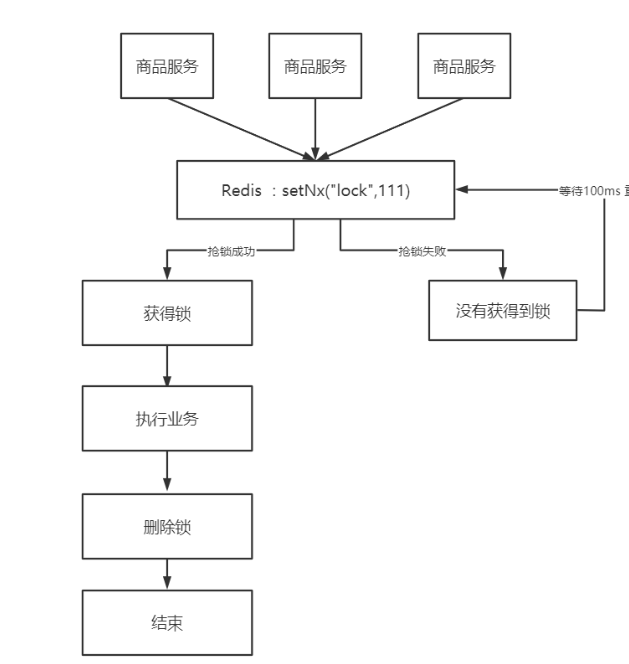

##### 4.3 实现分布式锁版本一

* 加锁逻辑

**锁的基本接口**


**SimpleRedisLock**

利用setnx方法进行加锁，同时增加过期时间，防止死锁，此方法可以保证加锁和增加过期时间具有原子性

```java
private static final String KEY_PREFIX="lock:"
@Override
public boolean tryLock(long timeoutSec) {
    // 获取线程标示
    String threadId = Thread.currentThread().getId()
    // 获取锁
    Boolean success = stringRedisTemplate.opsForValue()
            .setIfAbsent(KEY_PREFIX + name, threadId + "", timeoutSec, TimeUnit.SECONDS);
    return Boolean.TRUE.equals(success);
}
```

* 释放锁逻辑

SimpleRedisLock

释放锁，防止删除别人的锁

```java
public void unlock() {
    //通过del删除锁
    stringRedisTemplate.delete(KEY_PREFIX + name);
}
```

* 修改业务代码

```java
  @Override
    public Result seckillVoucher(Long voucherId) {
        // 1.查询优惠券
        SeckillVoucher voucher = seckillVoucherService.getById(voucherId);
        // 2.判断秒杀是否开始
        if (voucher.getBeginTime().isAfter(LocalDateTime.now())) {
            // 尚未开始
            return Result.fail("秒杀尚未开始！");
        }
        // 3.判断秒杀是否已经结束
        if (voucher.getEndTime().isBefore(LocalDateTime.now())) {
            // 尚未开始
            return Result.fail("秒杀已经结束！");
        }
        // 4.判断库存是否充足
        if (voucher.getStock() < 1) {
            // 库存不足
            return Result.fail("库存不足！");
        }
        Long userId = UserHolder.getUser().getId();
        //创建锁对象(新增代码)
        SimpleRedisLock lock = new SimpleRedisLock("order:" + userId, stringRedisTemplate);
        //获取锁对象
        boolean isLock = lock.tryLock(1200);
		//加锁失败
        if (!isLock) {
            return Result.fail("不允许重复下单");
        }
        try {
            //获取代理对象(事务)
            IVoucherOrderService proxy = (IVoucherOrderService) AopContext.currentProxy();
            return proxy.createVoucherOrder(voucherId);
        } finally {
            //释放锁
            lock.unlock();
        }
    }
```

##### 4.4 Redis分布式锁误删情况说明

逻辑说明：

持有锁的线程在锁的内部出现了阻塞，导致他的锁自动释放，这时其他线程，线程2来尝试获得锁，就拿到了这把锁，然后线程2在持有锁执行过程中，线程1反应过来，继续执行，而线程1执行过程中，走到了删除锁逻辑，此时就会把本应该属于线程2的锁进行删除，这就是误删别人锁的情况说明

解决方案：解决方案就是在每个线程释放锁的时候，去判断一下当前这把锁是否属于自己，如果属于自己，则不进行锁的删除，假设还是上边的情况，线程1卡顿，锁自动释放，线程2进入到锁的内部执行逻辑，此时线程1反应过来，然后删除锁，但是线程1，一看当前这把锁不是属于自己，于是不进行删除锁逻辑，当线程2走到删除锁逻辑时，如果没有卡过自动释放锁的时间点，则判断当前这把锁是属于自己的，于是删除这把锁。


##### 4.5 解决Redis分布式锁误删问题

需求：修改之前的分布式锁实现，满足：在获取锁时存入线程标示（可以用UUID表示）
在释放锁时先获取锁中的线程标示，判断是否与当前线程标示一致

* 如果一致则释放锁
* 如果不一致则不释放锁

核心逻辑：在存入锁时，放入自己线程的标识，在删除锁时，判断当前这把锁的标识是不是自己存入的，如果是，则进行删除，如果不是，则不进行删除。


具体代码如下：加锁

```java
private static final String ID_PREFIX = UUID.randomUUID().toString(true) + "-";
@Override
public boolean tryLock(long timeoutSec) {
   // 获取线程标示
   String threadId = ID_PREFIX + Thread.currentThread().getId();
   // 获取锁
   Boolean success = stringRedisTemplate.opsForValue()
                .setIfAbsent(KEY_PREFIX + name, threadId, timeoutSec, TimeUnit.SECONDS);
   return Boolean.TRUE.equals(success);
}
```

释放锁

```java
public void unlock() {
    // 获取线程标示
    String threadId = ID_PREFIX + Thread.currentThread().getId();
    // 获取锁中的标示
    String id = stringRedisTemplate.opsForValue().get(KEY_PREFIX + name);
    // 判断标示是否一致
    if(threadId.equals(id)) {
        // 释放锁
        stringRedisTemplate.delete(KEY_PREFIX + name);
    }
}
```

**有关代码实操说明：**

在我们修改完此处代码后，我们重启工程，然后启动两个线程，第一个线程持有锁后，手动释放锁，第二个线程 此时进入到锁内部，再放行第一个线程，此时第一个线程由于锁的value值并非是自己，所以不能释放锁，也就无法删除别人的锁，此时第二个线程能够正确释放锁，通过这个案例初步说明我们解决了锁误删的问题。

##### 4.6 分布式锁的原子性问题

更为极端的误删逻辑说明：

线程1现在持有锁之后，在执行业务逻辑过程中，他正准备删除锁，而且已经走到了条件判断的过程中，比如他已经拿到了当前这把锁确实是属于他自己的，正准备删除锁，但是此时他的锁到期了，那么此时线程2进来，但是线程1他会接着往后执行，当他卡顿结束后，他直接就会执行删除锁那行代码，相当于条件判断并没有起到作用，这就是删锁时的原子性问题，之所以有这个问题，是因为线程1的拿锁，比锁，删锁，实际上并不是原子性的，我们要防止刚才的情况发生，


##### 4.7 Lua脚本解决多条命令原子性问题

Redis提供了Lua脚本功能，在一个脚本中编写多条Redis命令，确保多条命令执行时的原子性。Lua是一种编程语言，它的基本语法大家可以参考网站：https://www.runoob.com/lua/lua-tutorial.html，这里重点介绍Redis提供的调用函数，我们可以使用lua去操作redis，又能保证他的原子性，这样就可以实现拿锁比锁删锁是一个原子性动作了，作为Java程序员这一块并不作一个简单要求，并不需要大家过于精通，只需要知道他有什么作用即可。

这里重点介绍Redis提供的调用函数，语法如下：

```lua
redis.call('命令名称', 'key', '其它参数', ...)
```

例如，我们要执行set name jack，则脚本是这样：

```lua
# 执行 set name jack
redis.call('set', 'name', 'jack')
```

例如，我们要先执行set name Rose，再执行get name，则脚本如下：

```lua
# 先执行 set name jack
redis.call('set', 'name', 'Rose')
# 再执行 get name
local name = redis.call('get', 'name')
# 返回
return name
```

写好脚本以后，需要用Redis命令来调用脚本，调用脚本的常见命令如下：


例如，我们要执行 redis.call('set', 'name', 'jack') 这个脚本，语法如下：


如果脚本中的key、value不想写死，可以作为参数传递。key类型参数会放入KEYS数组，其它参数会放入ARGV数组，在脚本中可以从KEYS和ARGV数组获取这些参数：


接下来我们来回一下我们释放锁的逻辑：

释放锁的业务流程是这样的

​	1、获取锁中的线程标示

​	2、判断是否与指定的标示（当前线程标示）一致

​	3、如果一致则释放锁（删除）

​	4、如果不一致则什么都不做

如果用Lua脚本来表示则是这样的：

最终我们操作redis的拿锁比锁删锁的lua脚本就会变成这样

```lua
-- 这里的 KEYS[1] 就是锁的key，这里的ARGV[1] 就是当前线程标示
-- 获取锁中的标示，判断是否与当前线程标示一致
if (redis.call('GET', KEYS[1]) == ARGV[1]) then
  -- 一致，则删除锁
  return redis.call('DEL', KEYS[1])
end
-- 不一致，则直接返回
return 0
```


##### 4.8 利用Java代码调用Lua脚本改造分布式锁

lua脚本本身并不需要大家花费太多时间去研究，只需要知道如何调用，大致是什么意思即可，所以在笔记中并不会详细的去解释这些lua表达式的含义。

我们的RedisTemplate中，可以利用execute方法去执行lua脚本，参数对应关系就如下图股


**Java代码**

```java
private static final DefaultRedisScript<Long> UNLOCK_SCRIPT;
    static {
        UNLOCK_SCRIPT = new DefaultRedisScript<>();
        UNLOCK_SCRIPT.setLocation(new ClassPathResource("unlock.lua"));
        UNLOCK_SCRIPT.setResultType(Long.class);
    }

public void unlock() {
    // 调用lua脚本
    stringRedisTemplate.execute(
            UNLOCK_SCRIPT,
            Collections.singletonList(KEY_PREFIX + name),
            ID_PREFIX + Thread.currentThread().getId());
}
经过以上代码改造后，我们就能够实现 拿锁比锁删锁的原子性动作了~
```

小总结：

基于Redis的分布式锁实现思路：

* 利用set nx ex获取锁，并设置过期时间，保存线程标示
* 释放锁时先判断线程标示是否与自己一致，一致则删除锁
  * 特性：
    * 利用set nx满足互斥性
    * 利用set ex保证故障时锁依然能释放，避免死锁，提高安全性
    * 利用Redis集群保证高可用和高并发特性

笔者总结：我们一路走来，利用添加过期时间，防止死锁问题的发生，但是有了过期时间之后，可能出现误删别人锁的问题，这个问题我们开始是利用删之前 通过拿锁，比锁，删锁这个逻辑来解决的，也就是删之前判断一下当前这把锁是否是属于自己的，但是现在还有原子性问题，也就是我们没法保证拿锁比锁删锁是一个原子性的动作，最后通过lua表达式来解决这个问题

但是目前还剩下一个问题锁不住，什么是锁不住呢，你想一想，如果当过期时间到了之后，我们可以给他续期一下，比如续个30s，就好像是网吧上网， 网费到了之后，然后说，来，网管，再给我来10块的，是不是后边的问题都不会发生了，那么续期问题怎么解决呢，可以依赖于我们接下来要学习redission啦

**测试逻辑：**

第一个线程进来，得到了锁，手动删除锁，模拟锁超时了，其他线程会执行lua来抢锁，当第一天线程利用lua删除锁时，lua能保证他不能删除他的锁，第二个线程删除锁时，利用lua同样可以保证不会删除别人的锁，同时还能保证原子性。

#### 5、分布式锁 redission

##### 5.1 分布式锁-redission功能介绍

基于setnx实现的分布式锁存在下面的问题：

**重入问题**：重入问题是指 获得锁的线程可以再次进入到相同的锁的代码块中，可重入锁的意义在于防止死锁，比如HashTable这样的代码中，他的方法都是使用synchronized修饰的，假如他在一个方法内，调用另一个方法，那么此时如果是不可重入的，不就死锁了吗？所以可重入锁他的主要意义是==防止死锁==，我们的synchronized和Lock锁都是可重入的。

**不可重试**：是指目前的分布式只能尝试一次，我们认为合理的情况是：当线程在获得锁失败后，他应该能再次尝试获得锁。

**超时释放：**我们在加锁时增加了过期时间，这样的我们可以防止死锁，但是如果卡顿的时间超长，虽然我们采用了lua表达式防止删锁的时候，误删别人的锁，但是毕竟没有锁住，有安全隐患

**主从一致性：** 如果Redis提供了主从集群，当我们向集群写数据时，主机需要异步的将数据同步给从机，而万一在同步过去之前，主机宕机了，就会出现死锁问题。


那么什么是Redission呢

Redisson是一个在Redis的基础上实现的Java驻内存数据网格（In-Memory Data Grid）。它不仅提供了一系列的分布式的Java常用对象，还提供了许多分布式服务，其中就包含了各种分布式锁的实现。

Redission提供了分布式锁的多种多样的功能


##### 5.2 分布式锁-Redission快速入门

引入依赖：

```java
<dependency>
	<groupId>org.redisson</groupId>
	<artifactId>redisson</artifactId>
	<version>3.13.6</version>
</dependency>
```

配置Redisson客户端：

```java
@Configuration
public class RedissonConfig {

    @Bean
    public RedissonClient redissonClient(){
        // 配置
        Config config = new Config();
        config.useSingleServer().setAddress("redis://192.168.150.101:6379")
            .setPassword("123321");
        // 创建RedissonClient对象
        return Redisson.create(config);
    }
}

```

如何使用Redission的分布式锁

```java
@Resource
private RedissionClient redissonClient;

@Test
void testRedisson() throws Exception{
    //获取锁(可重入)，指定锁的名称
    RLock lock = redissonClient.getLock("anyLock");
    //尝试获取锁，参数分别是：获取锁的最大等待时间(期间会重试)，锁自动释放时间，时间单位
    boolean isLock = lock.tryLock(1,10,TimeUnit.SECONDS);
    //判断获取锁成功
    if(isLock){
        try{
            System.out.println("执行业务");          
        }finally{
            //释放锁
            lock.unlock();
        }   
    }
}
```

在 VoucherOrderServiceImpl

注入RedissonClient

```java
@Resource
private RedissonClient redissonClient;

@Override
public Result seckillVoucher(Long voucherId) {
        // 1.查询优惠券
        SeckillVoucher voucher = seckillVoucherService.getById(voucherId);
        // 2.判断秒杀是否开始
        if (voucher.getBeginTime().isAfter(LocalDateTime.now())) {
            // 尚未开始
            return Result.fail("秒杀尚未开始！");
        }
        // 3.判断秒杀是否已经结束
        if (voucher.getEndTime().isBefore(LocalDateTime.now())) {
            // 尚未开始
            return Result.fail("秒杀已经结束！");
        }
        // 4.判断库存是否充足
        if (voucher.getStock() < 1) {
            // 库存不足
            return Result.fail("库存不足！");
        }
        Long userId = UserHolder.getUser().getId();
        //创建锁对象 这个代码不用了，因为我们现在要使用分布式锁
        //SimpleRedisLock lock = new SimpleRedisLock("order:" + userId, stringRedisTemplate);
        RLock lock = redissonClient.getLock("lock:order:" + userId);
        //获取锁对象
        boolean isLock = lock.tryLock();
       
		//加锁失败
        if (!isLock) {
            return Result.fail("不允许重复下单");
        }
        try {
            //获取代理对象(事务)
            IVoucherOrderService proxy = (IVoucherOrderService) AopContext.currentProxy();
            return proxy.createVoucherOrder(voucherId);
        } finally {
            //释放锁
            lock.unlock();
        }
 }
```

##### 5.3 分布式锁-redission==可重入==锁原理

在Lock锁中，他是借助于底层的一个voaltile的一个state变量来记录重入的状态的，比如当前没有人持有这把锁，那么state=0，假如有人持有这把锁，那么state=1，如果持有这把锁的人再次持有这把锁，那么state就会+1 ，如果是对于synchronized而言，他在c语言代码中会有一个count，原理和state类似，也是重入一次就加一，释放一次就-1 ，直到减少成0 时，表示当前这把锁没有被人持有。  

在redission中，我们的也支持支持可重入锁

在分布式锁中，他采用hash结构用来存储锁，其中大key表示表示这把锁是否存在，用小key表示当前这把锁被哪个线程持有，所以接下来我们一起分析一下当前的这个lua表达式

这个地方一共有3个参数

**KEYS[1] ： 锁名称**

**ARGV[1]：  锁失效时间**

**ARGV[2]：  id + ":" + threadId; 锁的小key**

exists: 判断数据是否存在  name：是lock是否存在,如果==0，就表示当前这把锁不存在

redis.call('hset', KEYS[1], ARGV[2], 1);此时他就开始往redis里边去写数据 ，写成一个hash结构

Lock{

​    id + **":"** + threadId :  1

}

如果当前这把锁存在，则第一个条件不满足，再判断

redis.call('hexists', KEYS[1], ARGV[2]) == 1

此时需要通过大key+小key判断当前这把锁是否是属于自己的，如果是自己的，则进行

redis.call('hincrby', KEYS[1], ARGV[2], 1)

将当前这个锁的value进行+1 ，redis.call('pexpire', KEYS[1], ARGV[1]); 然后再对其设置过期时间，如果以上两个条件都不满足，则表示当前这把锁抢锁失败，最后返回pttl，即为当前这把锁的失效时间

如果小伙帮们看了前边的源码， 你会发现他会去判断当前这个方法的返回值是否为null，如果是null，则对应则前两个if对应的条件，退出抢锁逻辑，如果返回的不是null，即走了第三个分支，在源码处会进行while(true)的自旋抢锁。

```lua
"if (redis.call('exists', KEYS[1]) == 0) then " +
                  "redis.call('hset', KEYS[1], ARGV[2], 1); " +
                  "redis.call('pexpire', KEYS[1], ARGV[1]); " +
                  "return nil; " +
              "end; " +
              "if (redis.call('hexists', KEYS[1], ARGV[2]) == 1) then " +
                  "redis.call('hincrby', KEYS[1], ARGV[2], 1); " +
                  "redis.call('pexpire', KEYS[1], ARGV[1]); " +
                  "return nil; " +
              "end; " +
              "return redis.call('pttl', KEYS[1]);"
```


##### 5.4 分布式锁-redission锁==重试==和WatchDog机制(可续约)

**说明**：由于课程中已经说明了有关tryLock的源码解析以及其看门狗原理，所以笔者在这里给大家分析lock()方法的源码解析，希望大家在学习过程中，能够掌握更多的知识

抢锁过程中，获得当前线程，通过tryAcquire进行抢锁，该抢锁逻辑和之前逻辑相同

1、先判断当前这把锁是否存在，如果不存在，插入一把锁，返回null

2、判断当前这把锁是否是属于当前线程，如果是，则返回null

所以如果返回是null，则代表着当前这哥们已经抢锁完毕，或者可重入完毕，但是如果以上两个条件都不满足，则进入到第三个条件，返回的是锁的失效时间，同学们可以自行往下翻一点点，你能发现有个while( true) 再次进行tryAcquire进行抢锁

```java
long threadId = Thread.currentThread().getId();
Long ttl = tryAcquire(-1, leaseTime, unit, threadId);
// lock acquired
if (ttl == null) {
    return;
}
```

接下来会有一个条件分支，因为lock方法有重载方法，一个是带参数，一个是不带参数，如果带带参数传入的值是-1，如果传入参数，则leaseTime是他本身，所以如果传入了参数，此时leaseTime != -1 则会进去抢锁，抢锁的逻辑就是之前说的那三个逻辑

```java
if (leaseTime != -1) {
    return tryLockInnerAsync(waitTime, leaseTime, unit, threadId, RedisCommands.EVAL_LONG);
}
```

如果是没有传入时间，则此时也会进行抢锁， 而且抢锁时间是默认看门狗时间 commandExecutor.getConnectionManager().getCfg().getLockWatchdogTimeout()

ttlRemainingFuture.onComplete((ttlRemaining, e) 这句话相当于对以上抢锁进行了监听，也就是说当上边抢锁完毕后，此方法会被调用，具体调用的逻辑就是去后台开启一个线程，进行续约逻辑，也就是看门狗线程

```java
RFuture<Long> ttlRemainingFuture = tryLockInnerAsync(waitTime,
                                        commandExecutor.getConnectionManager().getCfg().getLockWatchdogTimeout(),
                                        TimeUnit.MILLISECONDS, threadId, RedisCommands.EVAL_LONG);
ttlRemainingFuture.onComplete((ttlRemaining, e) -> {
    if (e != null) {
        return;
    }

    // lock acquired
    if (ttlRemaining == null) {
        scheduleExpirationRenewal(threadId);
    }
});
return ttlRemainingFuture;
```

此逻辑就是续约逻辑，注意看commandExecutor.getConnectionManager().newTimeout（） 此方法

Method(  **new** TimerTask() {},参数2 ，参数3  )

指的是：通过参数2，参数3 去描述什么时候去做参数1的事情，现在的情况是：10s之后去做参数一的事情

因为锁的失效时间是30s，当10s之后，此时这个timeTask 就触发了，他就去进行续约，把当前这把锁续约成30s，如果操作成功，那么此时就会递归调用自己，再重新设置一个timeTask()，于是再过10s后又再设置一个timerTask，完成不停的续约

那么大家可以想一想，假设我们的线程出现了宕机他还会续约吗？当然不会，因为没有人再去调用renewExpiration这个方法，所以等到时间之后自然就释放了。

```java
private void renewExpiration() {
    ExpirationEntry ee = EXPIRATION_RENEWAL_MAP.get(getEntryName());
    if (ee == null) {
        return;
    }
    
    Timeout task = commandExecutor.getConnectionManager().newTimeout(new TimerTask() {
        @Override
        public void run(Timeout timeout) throws Exception {
            ExpirationEntry ent = EXPIRATION_RENEWAL_MAP.get(getEntryName());
            if (ent == null) {
                return;
            }
            Long threadId = ent.getFirstThreadId();
            if (threadId == null) {
                return;
            }
            
            RFuture<Boolean> future = renewExpirationAsync(threadId);
            future.onComplete((res, e) -> {
                if (e != null) {
                    log.error("Can't update lock " + getName() + " expiration", e);
                    return;
                }
                
                if (res) {
                    // reschedule itself
                    renewExpiration();
                }
            });
        }
    }, internalLockLeaseTime / 3, TimeUnit.MILLISECONDS);
    
    ee.setTimeout(task);
}
```

##### 5.5 分布式锁-redission锁的==MutiLock原理(连接锁)==

为了提高redis的可用性，我们会搭建集群或者主从，现在以主从为例

此时我们去写命令，写在主机上， 主机会将数据同步给从机，但是假设在主机还没有来得及把数据写入到从机去的时候，此时主机宕机，哨兵会发现主机宕机，并且选举一个slave变成master，而此时新的master中实际上并没有锁信息，此时锁信息就已经丢掉了。


为了解决这个问题，redission提出来了MutiLock锁，使用这把锁咱们就不使用主从了，每个节点的地位都是一样的， 这把锁加锁的逻辑需要写入到每一个主丛节点上，只有所有的服务器都写入成功，此时才是加锁成功，假设现在某个节点挂了，那么他去获得锁的时候，只要有一个节点拿不到，都不能算是加锁成功，就保证了加锁的可靠性。


那么MutiLock 加锁原理是什么呢？笔者画了一幅图来说明

当我们去设置了多个锁时，redission会将多个锁添加到一个集合中，然后用while循环去不停去尝试拿锁，但是会有一个总共的加锁时间，这个时间是用需要加锁的个数 * 1500ms ，假设有3个锁，那么时间就是4500ms，假设在这4500ms内，所有的锁都加锁成功， 那么此时才算是加锁成功，如果在4500ms有线程加锁失败，则会再次去进行重试.


#### 6、秒杀优化

##### 6.1 秒杀优化-异步秒杀思路

我们来回顾一下下单流程

当用户发起请求，此时会请求nginx，nginx会访问到tomcat，而tomcat中的程序，会进行串行操作，分成如下几个步骤

1、查询优惠卷

2、判断秒杀库存是否足够

3、查询订单

4、校验是否是一人一单

5、扣减库存

6、创建订单

在这六步操作中，又有很多操作是要去操作数据库的，而且还是一个线程串行执行， 这样就会导致我们的程序执行的很慢，所以我们需要异步程序执行，那么如何加速呢？

在这里笔者想给大家分享一下课程内没有的思路，看看有没有小伙伴这么想，比如，我们可以不可以使用异步编排来做，或者说我开启N多线程，N多个线程，一个线程执行查询优惠卷，一个执行判断扣减库存，一个去创建订单等等，然后再统一做返回，这种做法和课程中有哪种好呢？答案是课程中的好，因为如果你采用我刚说的方式，如果访问的人很多，那么线程池中的线程可能一下子就被消耗完了，而且你使用上述方案，最大的特点在于，你觉得时效性会非常重要，但是你想想是吗？并不是，比如我只要确定他能做这件事，然后我后边慢慢做就可以了，我并不需要他一口气做完这件事，所以我们应当采用的是课程中，类似消息队列的方式来完成我们的需求，而不是使用线程池或者是异步编排的方式来完成这个需求


优化方案：我们将耗时比较短的逻辑判断放入到redis中，比如是否库存足够，比如是否一人一单，这样的操作，只要这种逻辑可以完成，就意味着我们是一定可以下单完成的，我们只需要进行快速的逻辑判断，根本就不用等下单逻辑走完，我们直接给用户返回成功， 再在后台开一个线程，后台线程慢慢的去执行queue里边的消息，这样程序不就超级快了吗？而且也不用担心线程池消耗殆尽的问题，因为这里我们的程序中并没有手动使用任何线程池，当然这里边有两个难点

第一个难点是我们怎么在redis中去快速校验一人一单，还有库存判断

第二个难点是由于我们校验和tomct下单是两个线程，那么我们如何知道到底哪个单他最后是否成功，或者是下单完成，为了完成这件事我们在redis操作完之后，我们会将一些信息返回给前端，同时也会把这些信息丢到异步queue中去，后续操作中，可以通过这个id来查询我们tomcat中的下单逻辑是否完成了。


我们现在来看看整体思路：当用户下单之后，判断库存是否充足只需要导redis中去根据key找对应的value是否大于0即可，如果不充足，则直接结束，如果充足，继续在redis中判断用户是否可以下单，如果set集合中没有这条数据，说明他可以下单，如果set集合中没有这条记录，则将userId和优惠卷存入到redis中，并且返回0，整个过程需要保证是原子性的，我们可以使用lua来操作

当以上判断逻辑走完之后，我们可以判断当前redis中返回的结果是否是0 ，如果是0，则表示可以下单，则将之前说的信息存入到到queue中去，然后返回，然后再来个线程异步的下单，前端可以通过返回的订单id来判断是否下单成功。


##### 6.2 秒杀优化-Redis完成秒杀资格判断

需求：

* 新增秒杀优惠券的同时，将优惠券信息保存到Redis中

* 基于Lua脚本，判断秒杀库存、一人一单，决定用户是否抢购成功

* 如果抢购成功，将优惠券id和用户id封装后存入阻塞队列

* 开启线程任务，不断从阻塞队列中获取信息，实现异步下单功能

  

VoucherServiceImpl

```java
@Override
@Transactional
public void addSeckillVoucher(Voucher voucher) {
    // 保存优惠券
    save(voucher);
    // 保存秒杀信息
    SeckillVoucher seckillVoucher = new SeckillVoucher();
    seckillVoucher.setVoucherId(voucher.getId());
    seckillVoucher.setStock(voucher.getStock());
    seckillVoucher.setBeginTime(voucher.getBeginTime());
    seckillVoucher.setEndTime(voucher.getEndTime());
    seckillVoucherService.save(seckillVoucher);
    // 保存秒杀库存到Redis中
    //SECKILL_STOCK_KEY 这个变量定义在RedisConstans中
    //private static final String SECKILL_STOCK_KEY ="seckill:stock:"
    stringRedisTemplate.opsForValue().set(SECKILL_STOCK_KEY + voucher.getId(), voucher.getStock().toString());
}
```

完整lua表达式

```lua
-- 1.参数列表
-- 1.1.优惠券id
local voucherId = ARGV[1]
-- 1.2.用户id
local userId = ARGV[2]
-- 1.3.订单id
local orderId = ARGV[3]

-- 2.数据key
-- 2.1.库存key
local stockKey = 'seckill:stock:' .. voucherId
-- 2.2.订单key
local orderKey = 'seckill:order:' .. voucherId

-- 3.脚本业务
-- 3.1.判断库存是否充足 get stockKey
if(tonumber(redis.call('get', stockKey)) <= 0) then
    -- 3.2.库存不足，返回1
    return 1
end
-- 3.2.判断用户是否下单 SISMEMBER orderKey userId
if(redis.call('sismember', orderKey, userId) == 1) then
    -- 3.3.存在，说明是重复下单，返回2
    return 2
end
-- 3.4.扣库存 incrby stockKey -1
redis.call('incrby', stockKey, -1)
-- 3.5.下单（保存用户）sadd orderKey userId
redis.call('sadd', orderKey, userId)
-- 3.6.发送消息到队列中， XADD stream.orders * k1 v1 k2 v2 ...
redis.call('xadd', 'stream.orders', '*', 'userId', userId, 'voucherId', voucherId, 'id', orderId)
return 0
```

当以上lua表达式执行完毕后，剩下的就是根据步骤3,4来执行我们接下来的任务了

VoucherOrderServiceImpl

```java
@Override
public Result seckillVoucher(Long voucherId) {
    //获取用户
    Long userId = UserHolder.getUser().getId();
    long orderId = redisIdWorker.nextId("order");
    // 1.执行lua脚本
    Long result = stringRedisTemplate.execute(
            SECKILL_SCRIPT,
            Collections.emptyList(),
            voucherId.toString(), userId.toString(), String.valueOf(orderId)
    );
    int r = result.intValue();
    // 2.判断结果是否为0
    if (r != 0) {
        // 2.1.不为0 ，代表没有购买资格
        return Result.fail(r == 1 ? "库存不足" : "不能重复下单");
    }
    //TODO 保存阻塞队列
    // 3.返回订单id
    return Result.ok(orderId);
}
```

##### 6.3 秒杀优化-基于==阻塞队列==实现秒杀优化

VoucherOrderServiceImpl

修改下单动作，现在我们去下单时，是通过lua表达式去原子执行判断逻辑，如果判断我出来不为0 ，则要么是库存不足，要么是重复下单，返回错误信息，如果是0，则把下单的逻辑保存到队列中去，然后异步执行

```java
//异步处理线程池
private static final ExecutorService SECKILL_ORDER_EXECUTOR = Executors.newSingleThreadExecutor();

//在类初始化之后执行，因为当这个类初始化好了之后，随时都是有可能要执行的
@PostConstruct
private void init() {
   SECKILL_ORDER_EXECUTOR.submit(new VoucherOrderHandler());
}
// 用于线程池处理的任务
// 当初始化完毕后，就会去从对列中去拿信息
 private class VoucherOrderHandler implements Runnable{

        @Override
        public void run() {
            while (true){
                try {
                    // 1.获取队列中的订单信息
                    VoucherOrder voucherOrder = orderTasks.take();
                    // 2.创建订单
                    handleVoucherOrder(voucherOrder);
                } catch (Exception e) {
                    log.error("处理订单异常", e);
                }
          	 }
        }
     
       private void handleVoucherOrder(VoucherOrder voucherOrder) {
            //1.获取用户
            Long userId = voucherOrder.getUserId();
            // 2.创建锁对象
            RLock redisLock = redissonClient.getLock("lock:order:" + userId);
            // 3.尝试获取锁
            boolean isLock = redisLock.lock();
            // 4.判断是否获得锁成功
            if (!isLock) {
                // 获取锁失败，直接返回失败或者重试
                log.error("不允许重复下单！");
                return;
            }
            try {
				//注意：由于是spring的事务是放在threadLocal中，此时的是多线程，事务会失效
                proxy.createVoucherOrder(voucherOrder);
            } finally {
                // 释放锁
                redisLock.unlock();
            }
    }
     //a
	private BlockingQueue<VoucherOrder> orderTasks =new  ArrayBlockingQueue<>(1024 * 1024);

    @Override
    public Result seckillVoucher(Long voucherId) {
        Long userId = UserHolder.getUser().getId();
        long orderId = redisIdWorker.nextId("order");
        // 1.执行lua脚本
        Long result = stringRedisTemplate.execute(
                SECKILL_SCRIPT,
                Collections.emptyList(),
                voucherId.toString(), userId.toString(), String.valueOf(orderId)
        );
        int r = result.intValue();
        // 2.判断结果是否为0
        if (r != 0) {
            // 2.1.不为0 ，代表没有购买资格
            return Result.fail(r == 1 ? "库存不足" : "不能重复下单");
        }
        VoucherOrder voucherOrder = new VoucherOrder();
        // 2.3.订单id
        long orderId = redisIdWorker.nextId("order");
        voucherOrder.setId(orderId);
        // 2.4.用户id
        voucherOrder.setUserId(userId);
        // 2.5.代金券id
        voucherOrder.setVoucherId(voucherId);
        // 2.6.放入阻塞队列
        orderTasks.add(voucherOrder);
        //3.获取代理对象
         proxy = (IVoucherOrderService)AopContext.currentProxy();
        //4.返回订单id
        return Result.ok(orderId);
    }
     
      @Transactional
    public  void createVoucherOrder(VoucherOrder voucherOrder) {
        Long userId = voucherOrder.getUserId();
        // 5.1.查询订单
        int count = query().eq("user_id", userId).eq("voucher_id", voucherOrder.getVoucherId()).count();
        // 5.2.判断是否存在
        if (count > 0) {
            // 用户已经购买过了
           log.error("用户已经购买过了");
           return ;
        }

        // 6.扣减库存
        boolean success = seckillVoucherService.update()
                .setSql("stock = stock - 1") // set stock = stock - 1
                .eq("voucher_id", voucherOrder.getVoucherId()).gt("stock", 0) // where id = ? and stock > 0
                .update();
        if (!success) {
            // 扣减失败
            log.error("库存不足");
            return ;
        }
        save(voucherOrder);
 
    }

```

**小总结：**

秒杀业务的优化思路是什么？

* 先利用Redis完成库存余量、一人一单判断，完成抢单业务
* 再将下单业务放入阻塞队列，利用独立线程异步下单
* 基于阻塞队列的异步秒杀存在哪些问题？
  * 内存限制问题
  * 数据安全问题

#### 7、Redis消息队列

##### Redis消息队列-基于Stream的消息队列

Stream 是 Redis 5.0 引入的一种新数据类型，可以实现一个功能非常完善的消息队列。

发送消息的命令：


例如：


读取消息的方式之一：XREAD

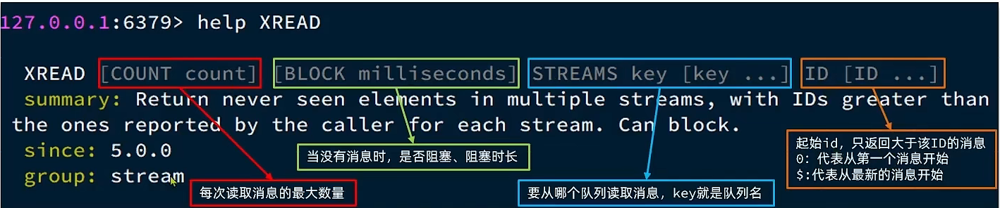

例如，使用XREAD读取第一个消息：


XREAD阻塞方式，读取最新的消息：


在业务开发中，我们可以循环的调用XREAD阻塞方式来查询最新消息，从而实现持续监听队列的效果，伪代码如下


注意：当我们指定起始ID为$时，代表读取最新的消息，如果我们处理一条消息的过程中，又有超过1条以上的消息到达队列，则下次获取时也只能获取到最新的一条，会出现漏读消息的问题

STREAM类型消息队列的XREAD命令特点：

* 消息可回溯
* 一个消息可以被多个消费者读取
* 可以阻塞读取
* 有消息漏读的风险


##### Redis消息队列-基于Stream的消息队列-消费者组

消费者组（Consumer Group）：将多个消费者划分到一个组中，监听同一个队列。具备下列特点：


创建消费者组：

key：队列名称
groupName：消费者组名称
ID：起始ID标示，$代表队列中最后一个消息，0则代表队列中第一个消息
MKSTREAM：队列不存在时自动创建队列
其它常见命令：

 **删除指定的消费者组**

```java
XGROUP DESTORY key groupName
```

 **==给指定的消费者组添加消费者==**

```java
XGROUP CREATECONSUMER key groupname consumername
```

 **删除消费者组中的指定消费者**

```java
XGROUP DELCONSUMER key groupname consumername
```

从消费者组读取消息：

```java
XREADGROUP GROUP group consumer [COUNT count] [BLOCK milliseconds] [NOACK] STREAMS key [key ...] ID [ID ...]
```

* group：消费组名称
* consumer：消费者名称，如果消费者不存在，会自动创建一个消费者
* count：本次查询的最大数量
* BLOCK milliseconds：当没有消息时最长等待时间
* NOACK：无需手动ACK，获取到消息后自动确认
* STREAMS key：指定队列名称
* ID：获取消息的起始ID：

">"：从下一个未消费的消息开始
其它：根据指定id从pending-list中获取已消费但未确认的消息，例如0，是从pending-list中的第一个消息开始

消费者监听消息的基本思路：

STREAM类型消息队列的XREADGROUP命令特点：

* 消息可回溯
* 可以多消费者争抢消息，加快消费速度
* 可以阻塞读取
* 没有消息漏读的风险
* 有消息确认机制，保证消息至少被消费一次

最后我们来个小对比


##### 基于Redis的Stream结构作为消息队列，实现异步秒杀下单

需求：

* 创建一个Stream类型的消息队列，名为stream.orders
* 修改之前的秒杀下单Lua脚本，在认定有抢购资格后，直接向stream.orders中添加消息，内容包含voucherId、userId、orderId
* 项目启动时，开启一个线程任务，尝试获取stream.orders中的消息，完成下单\

修改lua表达式,新增3.6 


VoucherOrderServiceImpl

```java
private class VoucherOrderHandler implements Runnable {

    @Override
    public void run() {
        while (true) {
            try {
                // 1.获取消息队列中的订单信息 XREADGROUP GROUP g1 c1 COUNT 1 BLOCK 2000 STREAMS s1 >
                List<MapRecord<String, Object, Object>> list = stringRedisTemplate.opsForStream().read(
                    Consumer.from("g1", "c1"),
                    StreamReadOptions.empty().count(1).block(Duration.ofSeconds(2)),
                    StreamOffset.create("stream.orders", ReadOffset.lastConsumed())
                );
                // 2.判断订单信息是否为空
                if (list == null || list.isEmpty()) {
                    // 如果为null，说明没有消息，继续下一次循环
                    continue;
                }
                // 解析数据
                MapRecord<String, Object, Object> record = list.get(0);
                Map<Object, Object> value = record.getValue();
                VoucherOrder voucherOrder = BeanUtil.fillBeanWithMap(value, new VoucherOrder(), true);
                // 3.创建订单
                createVoucherOrder(voucherOrder);
                // 4.确认消息 XACK
                stringRedisTemplate.opsForStream().acknowledge("s1", "g1", record.getId());
            } catch (Exception e) {
                log.error("处理订单异常", e);
                //处理异常消息
                handlePendingList();
            }
        }
    }

    private void handlePendingList() {
        while (true) {
            try {
                // 1.获取pending-list中的订单信息 XREADGROUP GROUP g1 c1 COUNT 1 BLOCK 2000 STREAMS s1 0
                List<MapRecord<String, Object, Object>> list = stringRedisTemplate.opsForStream().read(
                    Consumer.from("g1", "c1"),
                    StreamReadOptions.empty().count(1),
                    StreamOffset.create("stream.orders", ReadOffset.from("0"))
                );
                // 2.判断订单信息是否为空
                if (list == null || list.isEmpty()) {
                    // 如果为null，说明没有异常消息，结束循环
                    break;
                }
                // 解析数据
                MapRecord<String, Object, Object> record = list.get(0);
                Map<Object, Object> value = record.getValue();
                VoucherOrder voucherOrder = BeanUtil.fillBeanWithMap(value, new VoucherOrder(), true);
                // 3.创建订单
                createVoucherOrder(voucherOrder);
                // 4.确认消息 XACK
                stringRedisTemplate.opsForStream().acknowledge("s1", "g1", record.getId());
            } catch (Exception e) {
                log.error("处理pendding订单异常", e);
                try{
                    Thread.sleep(20);
                }catch(Exception e){
                    e.printStackTrace();
                }
            }
        }
    }
}

```

#### 8、达人探店

##### 8.1、达人探店-发布探店笔记

发布探店笔记

探店笔记类似点评网站的评价，往往是图文结合。对应的表有两个：
tb_blog：探店笔记表，包含笔记中的标题、文字、图片等
tb_blog_comments：其他用户对探店笔记的评价

**具体发布流程**


上传接口

```java
@Slf4j
@RestController
@RequestMapping("upload")
public class UploadController {

    @PostMapping("blog")
    public Result uploadImage(@RequestParam("file") MultipartFile image) {
        try {
            // 获取原始文件名称
            String originalFilename = image.getOriginalFilename();
            // 生成新文件名
            String fileName = createNewFileName(originalFilename);
            // 保存文件
            image.transferTo(new File(SystemConstants.IMAGE_UPLOAD_DIR, fileName));
            // 返回结果
            log.debug("文件上传成功，{}", fileName);
            return Result.ok(fileName);
        } catch (IOException e) {
            throw new RuntimeException("文件上传失败", e);
        }
    }

}
```

注意：同学们在操作时，需要修改SystemConstants.IMAGE_UPLOAD_DIR 自己图片所在的地址，在实际开发中图片一般会放在nginx上或者是云存储上。

BlogController

```java
@RestController
@RequestMapping("/blog")
public class BlogController {

    @Resource
    private IBlogService blogService;

    @PostMapping
    public Result saveBlog(@RequestBody Blog blog) {
        //获取登录用户
        UserDTO user = UserHolder.getUser();
        blog.setUpdateTime(user.getId());
        //保存探店博文
        blogService.saveBlog(blog);
        //返回id
        return Result.ok(blog.getId());
    }
}
```

##### 8.2 达人探店-查看探店笔记

实现查看发布探店笔记的接口


实现代码：

BlogServiceImpl

```java
@Override
public Result queryBlogById(Long id) {
    // 1.查询blog
    Blog blog = getById(id);
    if (blog == null) {
        return Result.fail("笔记不存在！");
    }
    // 2.查询blog有关的用户
    queryBlogUser(blog);
  
    return Result.ok(blog);
}
```

##### 8.3 达人探店-点赞功能

初始代码

```java
@GetMapping("/likes/{id}")
public Result queryBlogLikes(@PathVariable("id") Long id) {
    //修改点赞数量
    blogService.update().setSql("liked = liked +1 ").eq("id",id).update();
    return Result.ok();
}
```

问题分析：这种方式会导致一个用户无限点赞，明显是不合理的

造成这个问题的原因是，我们现在的逻辑，发起请求只是给数据库+1，所以才会出现这个问题


完善点赞功能

需求：

* 同一个用户只能点赞一次，再次点击则取消点赞
* 如果当前用户已经点赞，则点赞按钮高亮显示（前端已实现，判断字段Blog类的isLike属性）

实现步骤：

* 给Blog类中添加一个isLike字段，标示是否被当前用户点赞
* 修改点赞功能，利用Redis的set集合判断是否点赞过，未点赞过则点赞数+1，已点赞过则点赞数-1
* 修改根据id查询Blog的业务，判断当前登录用户是否点赞过，赋值给isLike字段
* 修改分页查询Blog业务，判断当前登录用户是否点赞过，赋值给isLike字段

为什么采用set集合：

因为我们的数据是不能重复的，当用户操作过之后，无论他怎么操作，都是

具体步骤：

1、在Blog 添加一个字段

```java
@TableField(exist = false)
private Boolean isLike;
```

2、修改代码

```java
 @Override
    public Result likeBlog(Long id){
        // 1.获取登录用户
        Long userId = UserHolder.getUser().getId();
        // 2.判断当前登录用户是否已经点赞
        String key = BLOG_LIKED_KEY + id;
        Boolean isMember = stringRedisTemplate.opsForSet().isMember(key, userId.toString());
        if(BooleanUtil.isFalse(isMember)){
             //3.如果未点赞，可以点赞
            //3.1 数据库点赞数+1
            boolean isSuccess = update().setSql("liked = liked + 1").eq("id", id).update();
            //3.2 保存用户到Redis的set集合
            if(isSuccess){
                stringRedisTemplate.opsForSet().add(key,userId.toString());
            }
        }else{
             //4.如果已点赞，取消点赞
            //4.1 数据库点赞数-1
            boolean isSuccess = update().setSql("liked = liked - 1").eq("id", id).update();
            //4.2 把用户从Redis的set集合移除
            if(isSuccess){
                stringRedisTemplate.opsForSet().remove(key,userId.toString());
            }
        }
```

##### 8.4 达人探店-点赞排行榜

在探店笔记的详情页面，应该把给该笔记点赞的人显示出来，比如最早点赞的TOP5，形成点赞排行榜：

之前的点赞是放到set集合，但是set集合是不能排序的，所以这个时候，咱们可以采用一个可以排序的set集合，就是咱们的sortedSet

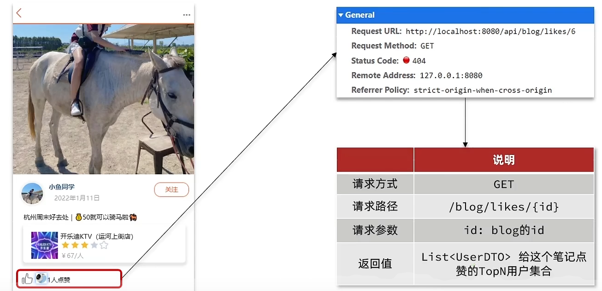

我们接下来来对比一下这些集合的区别是什么

所有点赞的人，需要是唯一的，所以我们应当使用set或者是sortedSet

其次我们需要排序，就可以直接锁定使用sortedSet啦


修改代码

BlogServiceImpl

点赞逻辑代码

```java
   @Override
    public Result likeBlog(Long id) {
        // 1.获取登录用户
        Long userId = UserHolder.getUser().getId();
        // 2.判断当前登录用户是否已经点赞
        String key = BLOG_LIKED_KEY + id;
        Double score = stringRedisTemplate.opsForZSet().score(key, userId.toString());
        if (score == null) {
            // 3.如果未点赞，可以点赞
            // 3.1.数据库点赞数 + 1
            boolean isSuccess = update().setSql("liked = liked + 1").eq("id", id).update();
            // 3.2.保存用户到Redis的set集合  zadd key value score
            if (isSuccess) {
                stringRedisTemplate.opsForZSet().add(key, userId.toString(), System.currentTimeMillis());
            }
        } else {
            // 4.如果已点赞，取消点赞
            // 4.1.数据库点赞数 -1
            boolean isSuccess = update().setSql("liked = liked - 1").eq("id", id).update();
            // 4.2.把用户从Redis的set集合移除
            if (isSuccess) {
                stringRedisTemplate.opsForZSet().remove(key, userId.toString());
            }
        }
        return Result.ok();
    }


    private void isBlogLiked(Blog blog) {
        // 1.获取登录用户
        UserDTO user = UserHolder.getUser();
        if (user == null) {
            // 用户未登录，无需查询是否点赞
            return;
        }
        Long userId = user.getId();
        // 2.判断当前登录用户是否已经点赞
        String key = "blog:liked:" + blog.getId();
        Double score = stringRedisTemplate.opsForZSet().score(key, userId.toString());
        blog.setIsLike(score != null);
    }
```

点赞列表查询列表

BlogController

```java
@GetMapping("/likes/{id}")
public Result queryBlogLikes(@PathVariable("id") Long id) {

    return blogService.queryBlogLikes(id);
}
```

BlogService

```java
@Override
public Result queryBlogLikes(Long id) {
    String key = BLOG_LIKED_KEY + id;
    // 1.查询top5的点赞用户 zrange key 0 4
    Set<String> top5 = stringRedisTemplate.opsForZSet().range(key, 0, 4);
    if (top5 == null || top5.isEmpty()) {
        return Result.ok(Collections.emptyList());
    }
    // 2.解析出其中的用户id
    List<Long> ids = top5.stream().map(Long::valueOf).collect(Collectors.toList());
    String idStr = StrUtil.join(",", ids);
    // 3.根据用户id查询用户 WHERE id IN ( 5 , 1 ) ORDER BY FIELD(id, 5, 1)
    List<UserDTO> userDTOS = userService.query()
            .in("id", ids).last("ORDER BY FIELD(id," + idStr + ")").list()
            .stream()
            .map(user -> BeanUtil.copyProperties(user, UserDTO.class))
            .collect(Collectors.toList());
    // 4.返回
    return Result.ok(userDTOS);
}
```

#### 9、好友关注

##### 9.1 好友关注-关注和取消关注

针对用户的操作：可以对用户进行关注和取消关注功能。

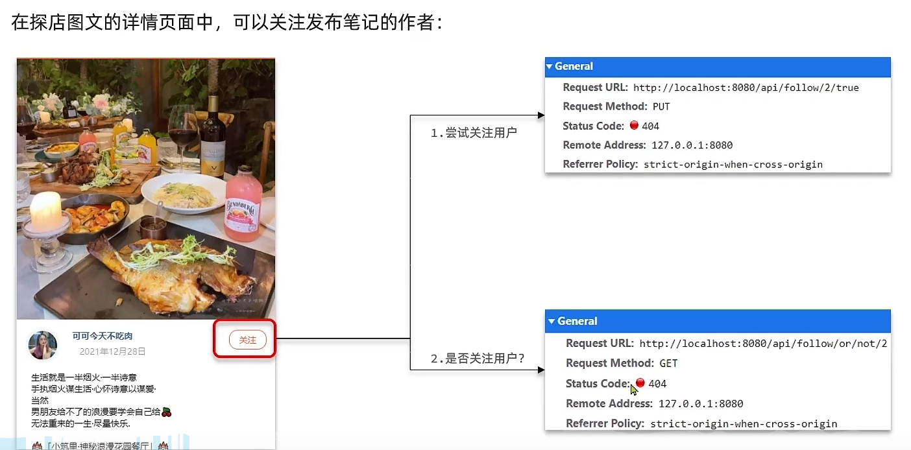

实现思路：

需求：基于该表数据结构，实现两个接口：

* 关注和取关接口
* 判断是否关注的接口

关注是User之间的关系，是博主与粉丝的关系，数据库中有一张tb_follow表来标示：


注意: 这里需要把主键修改为自增长，简化开发。

FollowController

```java
//关注
@PutMapping("/{id}/{isFollow}")
public Result follow(@PathVariable("id") Long followUserId, @PathVariable("isFollow") Boolean isFollow) {
    return followService.follow(followUserId, isFollow);
}
//取消关注
@GetMapping("/or/not/{id}")
public Result isFollow(@PathVariable("id") Long followUserId) {
      return followService.isFollow(followUserId);
}
```

FollowService

```java
取消关注service
@Override
public Result isFollow(Long followUserId) {
        // 1.获取登录用户
        Long userId = UserHolder.getUser().getId();
        // 2.查询是否关注 select count(*) from tb_follow where user_id = ? and follow_user_id = ?
        Integer count = query().eq("user_id", userId).eq("follow_user_id", followUserId).count();
        // 3.判断
        return Result.ok(count > 0);
    }

 关注service
 @Override
    public Result follow(Long followUserId, Boolean isFollow) {
        // 1.获取登录用户
        Long userId = UserHolder.getUser().getId();
        String key = "follows:" + userId;
        // 1.判断到底是关注还是取关
        if (isFollow) {
            // 2.关注，新增数据
            Follow follow = new Follow();
            follow.setUserId(userId);
            follow.setFollowUserId(followUserId);
            boolean isSuccess = save(follow);

        } else {
            // 3.取关，删除 delete from tb_follow where user_id = ? and follow_user_id = ?
            remove(new QueryWrapper<Follow>()
                    .eq("user_id", userId).eq("follow_user_id", followUserId));

        }
        return Result.ok();
    }
```

##### 9.2 好友关注-共同关注

想要去看共同关注的好友，需要首先进入到这个页面，这个页面会发起两个请求

1、去查询用户的详情

2、去查询用户的笔记

以上两个功能和共同关注没有什么关系，大家可以自行将笔记中的代码拷贝到idea中就可以实现这两个功能了，我们的重点在于共同关注功能。

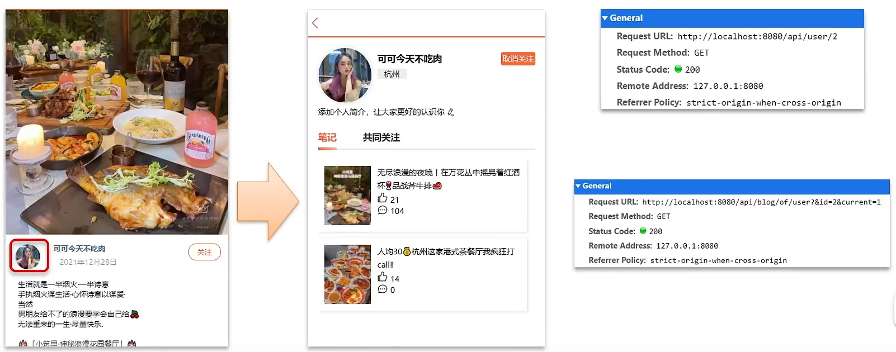

```java
// UserController 根据id查询用户
@GetMapping("/{id}")
public Result queryUserById(@PathVariable("id") Long userId){
	// 查询详情
	User user = userService.getById(userId);
	if (user == null) {
		return Result.ok();
	}
	UserDTO userDTO = BeanUtil.copyProperties(user, UserDTO.class);
	// 返回
	return Result.ok(userDTO);
}

// BlogController  根据id查询博主的探店笔记
@GetMapping("/of/user")
public Result queryBlogByUserId(
		@RequestParam(value = "current", defaultValue = "1") Integer current,
		@RequestParam("id") Long id) {
	// 根据用户查询
	Page<Blog> page = blogService.query()
			.eq("user_id", id).page(new Page<>(current, SystemConstants.MAX_PAGE_SIZE));
	// 获取当前页数据
	List<Blog> records = page.getRecords();
	return Result.ok(records);
}
```

接下来我们来看看共同关注如何实现：

需求：利用Redis中恰当的数据结构，实现共同关注功能。在博主个人页面展示出当前用户与博主的共同关注呢。

当然是使用我们之前学习过的set集合咯，在set集合中，有交集并集补集的api，我们可以把两人的关注的人分别放入到一个set集合中，然后再通过api去查看这两个set集合中的交集数据。


我们先来改造当前的关注列表

改造原因是因为我们需要在用户关注了某位用户后，需要将数据放入到set集合中，方便后续进行共同关注，同时当取消关注时，也需要从set集合中进行删除

FollowServiceImpl

```java
@Override
public Result follow(Long followUserId, Boolean isFollow) {
    // 1.获取登录用户
    Long userId = UserHolder.getUser().getId();
    String key = "follows:" + userId;
    // 1.判断到底是关注还是取关
    if (isFollow) {
        // 2.关注，新增数据
        Follow follow = new Follow();
        follow.setUserId(userId);
        follow.setFollowUserId(followUserId);
        boolean isSuccess = save(follow);
        if (isSuccess) {
            // 把关注用户的id，放入redis的set集合 sadd userId followerUserId
            stringRedisTemplate.opsForSet().add(key, followUserId.toString());
        }
    } else {
        // 3.取关，删除 delete from tb_follow where user_id = ? and follow_user_id = ?
        boolean isSuccess = remove(new QueryWrapper<Follow>()
                .eq("user_id", userId).eq("follow_user_id", followUserId));
        if (isSuccess) {
            // 把关注用户的id从Redis集合中移除
            stringRedisTemplate.opsForSet().remove(key, followUserId.toString());
        }
    }
    return Result.ok();
}
```

**具体的关注代码：**

FollowServiceImpl

```java
@Override
public Result followCommons(Long id) {
    // 1.获取当前用户
    Long userId = UserHolder.getUser().getId();
    String key = "follows:" + userId;
    // 2.求交集
    String key2 = "follows:" + id;
    Set<String> intersect = stringRedisTemplate.opsForSet().intersect(key, key2);
    if (intersect == null || intersect.isEmpty()) {
        // 无交集
        return Result.ok(Collections.emptyList());
    }
    // 3.解析id集合
    List<Long> ids = intersect.stream().map(Long::valueOf).collect(Collectors.toList());
    // 4.查询用户
    List<UserDTO> users = userService.listByIds(ids)
            .stream()
            .map(user -> BeanUtil.copyProperties(user, UserDTO.class))
            .collect(Collectors.toList());
    return Result.ok(users);
}
```

##### 9.3 好友关注-Feed流实现方案

当我们关注了用户后，这个用户发了动态，那么我们应该把这些数据推送给用户，这个需求，其实我们又把他叫做Feed流，关注推送也叫做Feed流，直译为投喂。为用户持续的提供“沉浸式”的体验，通过无限下拉刷新获取新的信息。

对于传统的模式的内容解锁：我们是需要用户去通过搜索引擎或者是其他的方式去解锁想要看的内容


对于新型的Feed流的的效果：不需要我们用户再去推送信息，而是系统分析用户到底想要什么，然后直接把内容推送给用户，从而使用户能够更加的节约时间，不用主动去寻找。


Feed流的实现有两种模式：

Feed流产品有两种常见模式：
Timeline：不做内容筛选，简单的按照内容发布时间排序，常用于好友或关注。例如朋友圈

* 优点：信息全面，不会有缺失。并且实现也相对简单
* 缺点：信息噪音较多，用户不一定感兴趣，内容获取效率低

智能排序：利用智能算法屏蔽掉违规的、用户不感兴趣的内容。推送用户感兴趣信息来吸引用户

* 优点：投喂用户感兴趣信息，用户粘度很高，容易沉迷
* 缺点：如果算法不精准，可能起到反作用
  本例中的个人页面，是基于关注的好友来做Feed流，因此采用Timeline的模式。该模式的实现方案有三种：

我们本次针对好友的操作，采用的就是Timeline的方式，只需要拿到我们关注用户的信息，然后按照时间排序即可

，因此采用Timeline的模式。该模式的实现方案有三种：

* 拉模式
* 推模式
* 推拉结合

**拉模式**：也叫做读扩散

该模式的核心含义就是：当张三和李四和王五发了消息后，都会保存在自己的邮箱中，假设赵六要读取信息，那么他会从读取他自己的收件箱，此时系统会从他关注的人群中，把他关注人的信息全部都进行拉取，然后在进行排序

优点：比较节约空间，因为赵六在读信息时，并没有重复读取，而且读取完之后可以把他的收件箱进行清楚。

缺点：比较延迟，当用户读取数据时才去关注的人里边去读取数据，假设用户关注了大量的用户，那么此时就会拉取海量的内容，对服务器压力巨大。

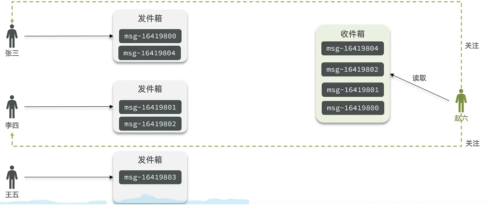


**推模式**：也叫做写扩散。

推模式是没有写邮箱的，当张三写了一个内容，此时会主动的把张三写的内容发送到他的粉丝收件箱中去，假设此时李四再来读取，就不用再去临时拉取了

优点：时效快，不用临时拉取

缺点：内存压力大，假设一个大V写信息，很多人关注他， 就会写很多分数据到粉丝那边去

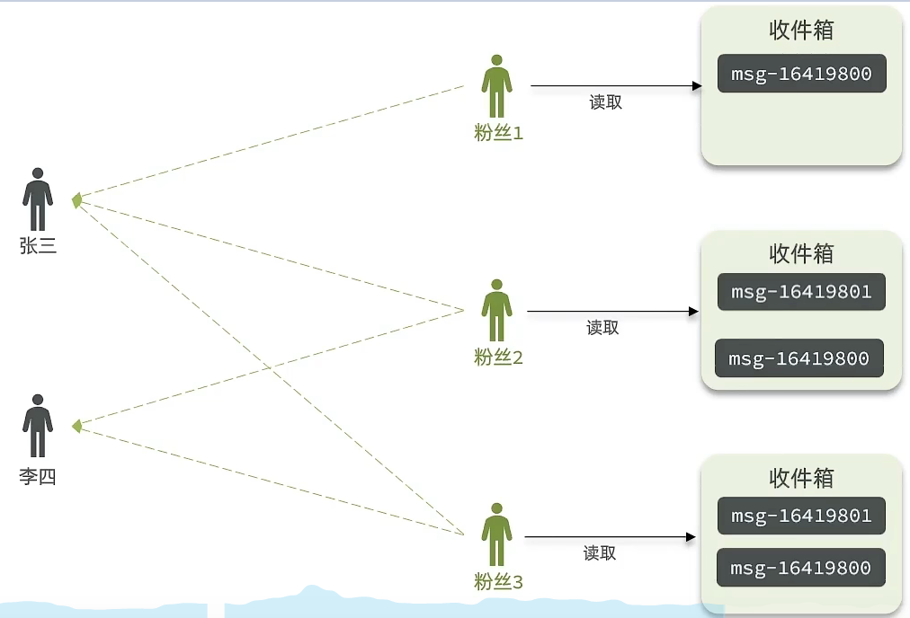

**推拉结合模式**：也叫做读写混合，兼具推和拉两种模式的优点。

推拉模式是一个折中的方案，站在发件人这一段，如果是个普通的人，那么我们采用写扩散的方式，直接把数据写入到他的粉丝中去，因为普通的人他的粉丝关注量比较小，所以这样做没有压力，如果是大V，那么他是直接将数据先写入到一份到发件箱里边去，然后再直接写一份到活跃粉丝收件箱里边去，现在站在收件人这端来看，如果是活跃粉丝，那么大V和普通的人发的都会直接写入到自己收件箱里边来，而如果是普通的粉丝，由于他们上线不是很频繁，所以等他们上线时，再从发件箱里边去拉信息。

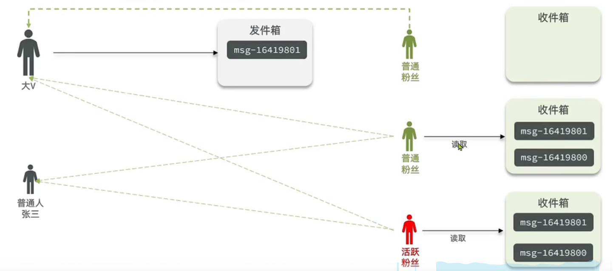

##### 9.4 好友关注-推送到粉丝收件箱

需求：

* 修改新增探店笔记的业务，在保存blog到数据库的同时，推送到粉丝的收件箱
* 收件箱满足可以根据时间戳排序，必须用Redis的数据结构实现
* 查询收件箱数据时，可以实现分页查询

Feed流中的数据会不断更新，所以数据的角标也在变化，因此不能采用传统的分页模式。

传统了分页在feed流是不适用的，因为我们的数据会随时发生变化

假设在t1 时刻，我们去读取第一页，此时page = 1 ，size = 5 ，那么我们拿到的就是10~6 这几条记录，假设现在t2时候又发布了一条记录，此时t3 时刻，我们来读取第二页，读取第二页传入的参数是page=2 ，size=5 ，那么此时读取到的第二页实际上是从6 开始，然后是6~2 ，那么我们就读取到了重复的数据，所以feed流的分页，不能采用原始方案来做。


Feed流的滚动分页

我们需要记录每次操作的最后一条，然后从这个位置开始去读取数据

举个例子：我们从t1时刻开始，拿第一页数据，拿到了10~6，然后记录下当前最后一次拿取的记录，就是6，t2时刻发布了新的记录，此时这个11放到最顶上，但是不会影响我们之前记录的6，此时t3时刻来拿第二页，第二页这个时候拿数据，还是从6后一点的5去拿，就拿到了5-1的记录。我们这个地方可以采用sortedSet来做，可以进行范围查询，并且还可以记录当前获取数据时间戳最小值，就可以实现滚动分页了


核心的意思：就是我们在保存完探店笔记后，获得到当前博主的粉丝，然后把数据推送到粉丝的redis中去。

```java
@Override
public Result saveBlog(Blog blog) {
    // 1.获取登录用户
    UserDTO user = UserHolder.getUser();
    blog.setUserId(user.getId());
    // 2.保存探店笔记
    boolean isSuccess = save(blog);
    if(!isSuccess){
        return Result.fail("新增笔记失败!");
    }
    // 3.查询笔记作者的所有粉丝 select * from tb_follow where follow_user_id = ?
    List<Follow> follows = followService.query().eq("follow_user_id", user.getId()).list();
    // 4.推送笔记id给所有粉丝
    for (Follow follow : follows) {
        // 4.1.获取粉丝id
        Long userId = follow.getUserId();
        // 4.2.推送
        String key = FEED_KEY + userId;
        stringRedisTemplate.opsForZSet().add(key, blog.getId().toString(), System.currentTimeMillis());
    }
    // 5.返回id
    return Result.ok(blog.getId());
}
```

##### 9.5好友关注-实现分页查询收邮箱

需求：在个人主页的“关注”卡片中，查询并展示推送的Blog信息：

具体操作如下：

1、每次查询完成后，我们要分析出查询出数据的最小时间戳，这个值会作为下一次查询的条件

2、我们需要找到与上一次查询相同的查询个数作为偏移量，下次查询时，跳过这些查询过的数据，拿到我们需要的数据

综上：我们的请求参数中就需要携带 lastId：上一次查询的最小时间戳 和偏移量这两个参数。

这两个参数第一次会由前端来指定，以后的查询就根据后台结果作为条件，再次传递到后台。


一、定义出来具体的返回值实体类

```java
@Data
public class ScrollResult {
    private List<?> list;
    private Long minTime;
    private Integer offset;
}
```

BlogController

注意：RequestParam 表示接受url地址栏传参的注解，当方法上参数的名称和url地址栏不相同时，可以通过RequestParam 来进行指定

```java
@GetMapping("/of/follow")
public Result queryBlogOfFollow(
    @RequestParam("lastId") Long max, @RequestParam(value = "offset", defaultValue = "0") Integer offset){
    return blogService.queryBlogOfFollow(max, offset);
}
```

BlogServiceImpl

```java
@Override
public Result queryBlogOfFollow(Long max, Integer offset) {
    // 1.获取当前用户
    Long userId = UserHolder.getUser().getId();
    // 2.查询收件箱 ZREVRANGEBYSCORE key Max Min LIMIT offset count
    String key = FEED_KEY + userId;
    Set<ZSetOperations.TypedTuple<String>> typedTuples = stringRedisTemplate.opsForZSet()
        .reverseRangeByScoreWithScores(key, 0, max, offset, 2);
    // 3.非空判断
    if (typedTuples == null || typedTuples.isEmpty()) {
        return Result.ok();
    }
    // 4.解析数据：blogId、minTime（时间戳）、offset
    List<Long> ids = new ArrayList<>(typedTuples.size());
    long minTime = 0; // 2
    int os = 1; // 2
    for (ZSetOperations.TypedTuple<String> tuple : typedTuples) { // 5 4 4 2 2
        // 4.1.获取id
        ids.add(Long.valueOf(tuple.getValue()));
        // 4.2.获取分数(时间戳）
        long time = tuple.getScore().longValue();
        if(time == minTime){
            os++;
        }else{
            minTime = time;
            os = 1;
        }
    }
	os = minTime == max ? os : os + offset;
    // 5.根据id查询blog
    String idStr = StrUtil.join(",", ids);
    List<Blog> blogs = query().in("id", ids).last("ORDER BY FIELD(id," + idStr + ")").list();

    for (Blog blog : blogs) {
        // 5.1.查询blog有关的用户
        queryBlogUser(blog);
        // 5.2.查询blog是否被点赞
        isBlogLiked(blog);
    }

    // 6.封装并返回
    ScrollResult r = new ScrollResult();
    r.setList(blogs);
    r.setOffset(os);
    r.setMinTime(minTime);

    return Result.ok(r);
}
```

#### 10、附近商户

##### 10.1、附近商户-GEO数据结构的基本用法

GEO就是Geolocation的简写形式，代表地理坐标。Redis在3.2版本中加入了对GEO的支持，允许存储地理坐标信息，帮助我们根据经纬度来检索数据。常见的命令有：

* GEOADD：添加一个地理空间信息，包含：经度（longitude）、纬度（latitude）、值（member）
* GEODIST：计算指定的两个点之间的距离并返回
* GEOHASH：将指定member的坐标转为hash字符串形式并返回
* GEOPOS：返回指定member的坐标
* GEORADIUS：指定圆心、半径，找到该圆内包含的所有member，并按照与圆心之间的距离排序后返回。6.以后已废弃
* GEOSEARCH：在指定范围内搜索member，并按照与指定点之间的距离排序后返回。范围可以是圆形或矩形。6.2.新功能
* GEOSEARCHSTORE：与GEOSEARCH功能一致，不过可以把结果存储到一个指定的key。 6.2.新功能

##### 10.2、 附近商户-导入店铺数据到GEO

具体场景说明：


当我们点击美食之后，会出现一系列的商家，商家中可以按照多种排序方式，我们此时关注的是距离，这个地方就需要使用到我们的GEO，向后台传入当前app收集的地址(我们此处是写死的) ，以当前坐标作为圆心，同时绑定相同的店家类型type，以及分页信息，把这几个条件传入后台，后台查询出对应的数据再返回。


我们要做的事情是：将数据库表中的数据导入到redis中去，redis中的GEO，GEO在redis中就一个menber和一个经纬度，我们把x和y轴传入到redis做的经纬度位置去，但我们不能把所有的数据都放入到menber中去，毕竟作为redis是一个内存级数据库，如果存海量数据，redis还是力不从心，所以我们在这个地方存储他的id即可。

但是这个时候还有一个问题，就是在redis中并没有存储type，所以我们无法根据type来对数据进行筛选，所以我们可以按照商户类型做分组，类型相同的商户作为同一组，以typeId为key存入同一个GEO集合中即可

代码

HmDianPingApplicationTests

```java
@Test
void loadShopData() {
    // 1.查询店铺信息
    List<Shop> list = shopService.list();
    // 2.把店铺分组，按照typeId分组，typeId一致的放到一个集合
    Map<Long, List<Shop>> map = list.stream().collect(Collectors.groupingBy(Shop::getTypeId));
    // 3.分批完成写入Redis
    for (Map.Entry<Long, List<Shop>> entry : map.entrySet()) {
        // 3.1.获取类型id
        Long typeId = entry.getKey();
        String key = SHOP_GEO_KEY + typeId;
        // 3.2.获取同类型的店铺的集合
        List<Shop> value = entry.getValue();
        List<RedisGeoCommands.GeoLocation<String>> locations = new ArrayList<>(value.size());
        // 3.3.写入redis GEOADD key 经度 纬度 member
        for (Shop shop : value) {
            // stringRedisTemplate.opsForGeo().add(key, new Point(shop.getX(), shop.getY()), shop.getId().toString());
            locations.add(new RedisGeoCommands.GeoLocation<>(
                    shop.getId().toString(),
                    new Point(shop.getX(), shop.getY())
            ));
        }
        stringRedisTemplate.opsForGeo().add(key, locations);
    }
}
```

##### 10.3 附近商户-实现附近商户功能

SpringDataRedis的2.3.9版本并不支持Redis 6.2提供的GEOSEARCH命令，因此我们需要提示其版本，修改自己的POM

第一步：导入pom

```java
<dependency>
    <groupId>org.springframework.boot</groupId>
    <artifactId>spring-boot-starter-data-redis</artifactId>
    <exclusions>
        <exclusion>
            <artifactId>spring-data-redis</artifactId>
            <groupId>org.springframework.data</groupId>
        </exclusion>
        <exclusion>
            <artifactId>lettuce-core</artifactId>
            <groupId>io.lettuce</groupId>
        </exclusion>
    </exclusions>
</dependency>
<dependency>
    <groupId>org.springframework.data</groupId>
    <artifactId>spring-data-redis</artifactId>
    <version>2.6.2</version>
</dependency>
<dependency>
    <groupId>io.lettuce</groupId>
    <artifactId>lettuce-core</artifactId>
    <version>6.1.6.RELEASE</version>
</dependency>
```

第二步：

ShopController

```java
@GetMapping("/of/type")
public Result queryShopByType(
        @RequestParam("typeId") Integer typeId,
        @RequestParam(value = "current", defaultValue = "1") Integer current,
        @RequestParam(value = "x", required = false) Double x,
        @RequestParam(value = "y", required = false) Double y
) {
   return shopService.queryShopByType(typeId, current, x, y);
}
```

ShopServiceImpl

```java
@Override
    public Result queryShopByType(Integer typeId, Integer current, Double x, Double y) {
        // 1.判断是否需要根据坐标查询
        if (x == null || y == null) {
            // 不需要坐标查询，按数据库查询
            Page<Shop> page = query()
                    .eq("type_id", typeId)
                    .page(new Page<>(current, SystemConstants.DEFAULT_PAGE_SIZE));
            // 返回数据
            return Result.ok(page.getRecords());
        }

        // 2.计算分页参数
        int from = (current - 1) * SystemConstants.DEFAULT_PAGE_SIZE;
        int end = current * SystemConstants.DEFAULT_PAGE_SIZE;

        // 3.查询redis、按照距离排序、分页。结果：shopId、distance
        String key = SHOP_GEO_KEY + typeId;
        GeoResults<RedisGeoCommands.GeoLocation<String>> results = stringRedisTemplate.opsForGeo() // GEOSEARCH key BYLONLAT x y BYRADIUS 10 WITHDISTANCE
                .search(
                        key,
                        GeoReference.fromCoordinate(x, y),
                        new Distance(5000),
                        RedisGeoCommands.GeoSearchCommandArgs.newGeoSearchArgs().includeDistance().limit(end)
                );
        // 4.解析出id
        if (results == null) {
            return Result.ok(Collections.emptyList());
        }
        List<GeoResult<RedisGeoCommands.GeoLocation<String>>> list = results.getContent();
        if (list.size() <= from) {
            // 没有下一页了，结束
            return Result.ok(Collections.emptyList());
        }
        // 4.1.截取 from ~ end的部分
        List<Long> ids = new ArrayList<>(list.size());
        Map<String, Distance> distanceMap = new HashMap<>(list.size());
        list.stream().skip(from).forEach(result -> {
            // 4.2.获取店铺id
            String shopIdStr = result.getContent().getName();
            ids.add(Long.valueOf(shopIdStr));
            // 4.3.获取距离
            Distance distance = result.getDistance();
            distanceMap.put(shopIdStr, distance);
        });
        // 5.根据id查询Shop
        String idStr = StrUtil.join(",", ids);
        List<Shop> shops = query().in("id", ids).last("ORDER BY FIELD(id," + idStr + ")").list();
        for (Shop shop : shops) {
            shop.setDistance(distanceMap.get(shop.getId().toString()).getValue());
        }
        // 6.返回
        return Result.ok(shops);
    }
```


#### 11、用户签到

##### 11.1、用户签到-BitMap功能演示

我们针对签到功能完全可以通过mysql来完成，比如说以下这张表


用户一次签到，就是一条记录，假如有1000万用户，平均每人每年签到次数为10次，则这张表一年的数据量为 1亿条

每签到一次需要使用（8 + 8 + 1 + 1 + 3 + 1）共22 字节的内存，一个月则最多需要600多字节

我们如何能够简化一点呢？其实可以考虑小时候一个挺常见的方案，就是小时候，咱们准备一张小小的卡片，你只要签到就打上一个勾，我最后判断你是否签到，其实只需要到小卡片上看一看就知道了

我们可以采用类似这样的方案来实现我们的签到需求。

我们按月来统计用户签到信息，签到记录为1，未签到则记录为0.

把每一个bit位对应当月的每一天，形成了映射关系。用0和1标示业务状态，这种思路就称为位图（BitMap）。这样我们就用极小的空间，来实现了大量数据的表示

Redis中是利用string类型数据结构实现BitMap，因此最大上限是512M，转换为bit则是 2^32个bit位。


BitMap的操作命令有：

* SETBIT：向指定位置（offset）存入一个0或1
* GETBIT ：获取指定位置（offset）的bit值
* BITCOUNT ：统计BitMap中值为1的bit位的数量
* BITFIELD ：操作（查询、修改、自增）BitMap中bit数组中的指定位置（offset）的值
* BITFIELD_RO ：获取BitMap中bit数组，并以十进制形式返回
* BITOP ：将多个BitMap的结果做位运算（与 、或、异或）
* BITPOS ：查找bit数组中指定范围内第一个0或1出现的位置

##### 11.2 、用户签到-实现签到功能

需求：实现签到接口，将当前用户当天签到信息保存到Redis中

思路：我们可以把年和月作为bitMap的key，然后保存到一个bitMap中，每次签到就到对应的位上把数字从0变成1，只要对应是1，就表明说明这一天已经签到了，反之则没有签到。

我们通过接口文档发现，此接口并没有传递任何的参数，没有参数怎么确实是哪一天签到呢？这个很容易，可以通过后台代码直接获取即可，然后到对应的地址上去修改bitMap。


**代码**

UserController

```java
 @PostMapping("/sign")
 public Result sign(){
    return userService.sign();
 }
```

UserServiceImpl

```java
@Override
public Result sign() {
    // 1.获取当前登录用户
    Long userId = UserHolder.getUser().getId();
    // 2.获取日期
    LocalDateTime now = LocalDateTime.now();
    // 3.拼接key
    String keySuffix = now.format(DateTimeFormatter.ofPattern(":yyyyMM"));
    String key = USER_SIGN_KEY + userId + keySuffix;
    // 4.获取今天是本月的第几天
    int dayOfMonth = now.getDayOfMonth();
    // 5.写入Redis SETBIT key offset 1
    stringRedisTemplate.opsForValue().setBit(key, dayOfMonth - 1, true);
    return Result.ok();
}
```

##### 11.3 用户签到-签到统计

**问题1：**什么叫做连续签到天数？
从最后一次签到开始向前统计，直到遇到第一次未签到为止，计算总的签到次数，就是连续签到天数。


Java逻辑代码：获得当前这个月的最后一次签到数据，定义一个计数器，然后不停的向前统计，直到获得第一个非0的数字即可，每得到一个非0的数字计数器+1，直到遍历完所有的数据，就可以获得当前月的签到总天数了

**问题2：**如何得到本月到今天为止的所有签到数据？

  BITFIELD key GET u[dayOfMonth] 0

假设今天是10号，那么我们就可以从当前月的第一天开始，获得到当前这一天的位数，是10号，那么就是10位，去拿这段时间的数据，就能拿到所有的数据了，那么这10天里边签到了多少次呢？统计有多少个1即可。

**问题3：如何从后向前遍历每个bit位？**

注意：bitMap返回的数据是10进制，哪假如说返回一个数字8，那么我哪儿知道到底哪些是0，哪些是1呢？我们只需要让得到的10进制数字和1做与运算就可以了，因为1只有遇见1 才是1，其他数字都是0 ，我们把签到结果和1进行与操作，每与一次，就把签到结果向右移动一位，依次内推，我们就能完成逐个遍历的效果了。

需求：实现下面接口，统计当前用户截止当前时间在本月的连续签到天数

有用户有时间我们就可以组织出对应的key，此时就能找到这个用户截止这天的所有签到记录，再根据这套算法，就能统计出来他连续签到的次数了


代码

**UserController**

```java
@GetMapping("/sign/count")
public Result signCount(){
    return userService.signCount();
}
```

**UserServiceImpl**

```java
@Override
public Result signCount() {
    // 1.获取当前登录用户
    Long userId = UserHolder.getUser().getId();
    // 2.获取日期
    LocalDateTime now = LocalDateTime.now();
    // 3.拼接key
    String keySuffix = now.format(DateTimeFormatter.ofPattern(":yyyyMM"));
    String key = USER_SIGN_KEY + userId + keySuffix;
    // 4.获取今天是本月的第几天
    int dayOfMonth = now.getDayOfMonth();
    // 5.获取本月截止今天为止的所有的签到记录，返回的是一个十进制的数字 BITFIELD sign:5:202203 GET u14 0
    List<Long> result = stringRedisTemplate.opsForValue().bitField(
            key,
            BitFieldSubCommands.create()
                    .get(BitFieldSubCommands.BitFieldType.unsigned(dayOfMonth)).valueAt(0)
    );
    if (result == null || result.isEmpty()) {
        // 没有任何签到结果
        return Result.ok(0);
    }
    Long num = result.get(0);
    if (num == null || num == 0) {
        return Result.ok(0);
    }
    // 6.循环遍历
    int count = 0;
    while (true) {
        // 6.1.让这个数字与1做与运算，得到数字的最后一个bit位  // 判断这个bit位是否为0
        if ((num & 1) == 0) {
            // 如果为0，说明未签到，结束
            break;
        }else {
            // 如果不为0，说明已签到，计数器+1
            count++;
        }
        // 把数字右移一位，抛弃最后一个bit位，继续下一个bit位
        num >>>= 1;
    }
    return Result.ok(count);
}
```

##### 11.4 额外加餐-关于使用bitmap来解决缓存穿透的方案

回顾**缓存穿透**：

发起了一个数据库不存在的，redis里边也不存在的数据，通常你可以把他看成一个攻击

解决方案：

* 判断id<0

* 如果数据库是空，那么就可以直接往redis里边把这个空数据缓存起来

第一种解决方案：遇到的问题是如果用户访问的是id不存在的数据，则此时就无法生效

第二种解决方案：遇到的问题是：如果是不同的id那就可以防止下次过来直击数据

所以我们如何解决呢？

我们可以将数据库的数据，所对应的id写入到一个list集合中，当用户过来访问的时候，我们直接去判断list中是否包含当前的要查询的数据，如果说用户要查询的id数据并不在list集合中，则直接返回，如果list中包含对应查询的id数据，则说明不是一次缓存穿透数据，则直接放行。

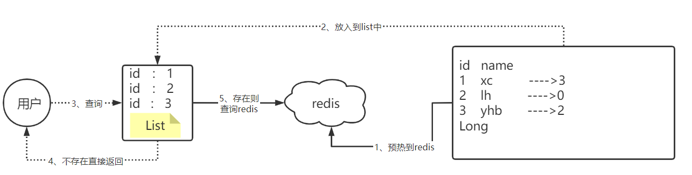

现在的问题是这个主键其实并没有那么短，而是很长的一个 主键

哪怕你单独去提取这个主键，但是在11年左右，淘宝的商品总量就已经超过10亿个

所以如果采用以上方案，这个list也会很大，所以我们可以使用bitmap来减少list的存储空间

我们可以把list数据抽象成一个非常大的bitmap，我们不再使用list，而是将db中的id数据利用哈希思想，比如：

id % bitmap.size  = 算出当前这个id对应应该落在bitmap的哪个索引上，然后将这个值从0变成1，然后当用户来查询数据时，此时已经没有了list，让用户用他查询的id去用相同的哈希算法， 算出来当前这个id应当落在bitmap的哪一位，然后判断这一位是0，还是1，如果是0则表明这一位上的数据一定不存在，  采用这种方式来处理，需要重点考虑一个事情，就是误差率，所谓的误差率就是指当发生哈希冲突的时候，产生的误差。


#### 12、UV统计

##### 12.1 、UV统计-HyperLogLog

首先我们搞懂两个概念：

* UV：全称Unique Visitor，也叫独立访客量，是指通过互联网访问、浏览这个网页的自然人。1天内同一个用户多次访问该网站，只记录1次。
* PV：全称Page View，也叫页面访问量或点击量，用户每访问网站的一个页面，记录1次PV，用户多次打开页面，则记录多次PV。往往用来衡量网站的流量。

通常来说UV会比PV大很多，所以衡量同一个网站的访问量，我们需要综合考虑很多因素，所以我们只是单纯的把这两个值作为一个参考值

UV统计在服务端做会比较麻烦，因为要判断该用户是否已经统计过了，需要将统计过的用户信息保存。但是如果每个访问的用户都保存到Redis中，数据量会非常恐怖，那怎么处理呢？

Hyperloglog(HLL)是从Loglog算法派生的概率算法，用于确定非常大的集合的基数，而不需要存储其所有值。相关算法原理大家可以参考：https://juejin.cn/post/6844903785744056333#heading-0
Redis中的HLL是基于string结构实现的，单个HLL的内存**永远小于16kb**，**内存占用低**的令人发指！作为代价，其测量结果是概率性的，**有小于0.81％的误差**。不过对于UV统计来说，这完全可以忽略。


##### 12.2 UV统计-测试百万数据的统计

测试思路：我们直接利用单元测试，向HyperLogLog中添加100万条数据，看看内存占用和统计效果如何


经过测试：我们会发生他的误差是在允许范围内，**并且内存占用极小**


### 3.分布式缓存

#### 1.Redis持久化

Redis有两种持久化方案：

##### 1.RDB持久化

RDB全称Redis Database Backup file（Redis数据备份文件），也被叫做Redis数据快照。简单来说就是把内存中的所有数据都记录到磁盘中。当Redis实例故障重启后，从磁盘读取快照文件，恢复数据。快照文件称为RDB文件，默认是保存在当前运行目录。

执行时机

RDB持久化在四种情况下会执行：

**1）save命令**

执行下面的命令，可以立即执行一次RDB：


save命令会导致主进程执行RDB，这个过程中其它所有命令都会被阻塞。只有在数据迁移时可能用到。

**2）bgsave命令**

下面的命令可以异步执行RDB：


这个命令执行后会开启独立进程完成RDB，主进程可以持续处理用户请求，不受影响。

**3）停机时**

Redis停机时会执行一次save命令，实现RDB持久化。

**4）触发RDB条件**

Redis内部有触发RDB的机制，可以在redis.conf文件中找到，格式如下：

```properties
# 900秒内，如果至少有1个key被修改，则执行bgsave ， 如果是save "" 则表示禁用RDB
save 900 1  
save 300 10  
save 60 10000 
```

RDB的其它配置也以在redis.conf文件中设置：

```properties
# 是否压缩 ,建议不开启，压缩也会消耗cpu，磁盘的话不值钱
rdbcompression yes

# RDB文件名称
dbfilename dump.rdb  

# 文件保存的路径目录
dir ./ 
```

1.1.2.RDB原理

bgsave开始时会fork主进程得到子进程，子进程共享主进程的内存数据。完成fork后读取内存数据并写入 RDB 文件。

fork采用的是copy-on-write技术：

- 当主进程执行读操作时，访问共享内存；
- 当主进程执行写操作时，则会拷贝一份数据，执行写操作。


1.1.3.小结

RDB方式bgsave的基本流程？

- fork主进程得到一个子进程，共享内存空间
- 子进程读取内存数据并写入新的RDB文件
- 用新RDB文件替换旧的RDB文件

RDB会在什么时候执行？save 60 1000代表什么含义？

- 默认是服务停止时
- 代表60秒内至少执行1000次修改则触发RDB

RDB的缺点？

- RDB执行间隔时间长，两次RDB之间写入数据有丢失的风险
- fork子进程、压缩、写出RDB文件都比较耗时

##### 2.AOF持久化

**1）AOF原理**

AOF全称为Append Only File（追加文件）。Redis处理的每一个写命令都会记录在AOF文件，可以看做是命令日志文件。


**2）AOF配置**

AOF默认是关闭的，需要修改redis.conf配置文件来开启AOF：

```properties
# 是否开启AOF功能，默认是no
appendonly yes
# AOF文件的名称
appendfilename "appendonly.aof"
```

AOF的命令记录的频率也可以通过redis.conf文件来配：

```properties
# 表示每执行一次写命令，立即记录到AOF文件
appendfsync always 
# 写命令执行完先放入AOF缓冲区，然后表示每隔1秒将缓冲区数据写到AOF文件，是默认方案
appendfsync everysec 
# 写命令执行完先放入AOF缓冲区，由操作系统决定何时将缓冲区内容写回磁盘
appendfsync no
```

三种策略对比：


**3）AOF文件重写**

因为是记录命令，AOF文件会比RDB文件大的多。而且AOF会记录对同一个key的多次写操作，但只有最后一次写操作才有意义。通过执行bgrewriteaof命令，可以让AOF文件执行重写功能，用最少的命令达到相同效果。


如图，AOF原本有三个命令，但是`set num 123 和 set num 666`都是对num的操作，第二次会覆盖第一次的值，因此第一个命令记录下来没有意义。

所以重写命令后，AOF文件内容就是：`mset name jack num 666`

Redis也会在触发阈值时自动去重写AOF文件。阈值也可以在redis.conf中配置：

```properties
# AOF文件比上次文件 增长超过多少百分比则触发重写
auto-aof-rewrite-percentage 100
# AOF文件体积最小多大以上才触发重写 
auto-aof-rewrite-min-size 64mb 
```

##### 3.RDB与AOF对比

RDB和AOF各有自己的优缺点，如果对数据安全性要求较高，在实际开发中往往会**结合**两者来使用。


#### 2.主从集群


#### 3.哨兵集群


#### 4.分片集群


### 4.多级缓存

1.JVM缓存

2.lua语法

3.


## MySQL

### 1.SQL语言的分类

#### DQL、DML、DDL、DCL的概念与区别

SQL(Structure Query Language)语言是数据库的核心语言。SQL的发展是从1974年开始的，其发展过程如下：
1974年-----由Boyce和Chamberlin提出，当时称SEQUEL。
1976年-----IBM公司的Sanjase研究所在研制RDBMS SYSTEM R时改为SQL。
1979年-----ORACLE公司发表第一个基于SQL的商业化RDBMS产品。
1982年-----IBM公司出版第一个RDBMS语言SQL/DS。
1985年-----IBM公司出版第一个RDBMS语言DB2。
1986年-----美国国家标准化组织ANSI宣布SQL作为数据库工业标准。

SQL是一个标准的数据库语言，是面向集合的描述性非过程化语言。它功能强，效率高，简单易学易维护。然而SQL语言由于以上优点，同时也出现了这样一个问题：它是非过程性语言，即大多数语句都是独立执行的，与上下文无关，而绝大部分应用都是一个完整的过程，显然用SQL完全实现这些功能是很困难的。

#### 4种SQL语言具体作用

SQL语言共分为四大类：数据查询语言**DQL**，数据操纵语言**DML**，数据定义语言**DDL**，数据控制语言**DCL**。

#### **数据查询语言DQL**

数据查询语言DQL基本结构是由SELECT子句，FROM子句，WHERE子句组成的查询块：SELECT <字段名表>FROM <表或视图名>WHERE <查询条件>

#### **数据操纵语言DML**

数据操纵语言DML主要有三种形式：

1) 插入：INSERT
2) 更新：UPDATE
3) 删除：DELETE

#### **数据定义语言DDL**

数据定义语言DDL用来创建数据库中的各种对象-----表、视图、索引、同义词、聚簇等如：CREATE TABLE / VIEW / INDEX / SYN / CLUSTER| 表 视图 索引 同义词 簇。DDL操作是隐性提交的！不能rollback

#### **数据控制语言D==C==L**

数据控制语言DCL用来授予或回收访问数据库的某种特权，并控制数据库操纵事务发生的时间及效果，对数据库实行监视等。如：

1) GRANT：授权。
2) ROLLBACK [WORK] TO [SAVEPOINT]：回退到某一点。回滚---ROLLBACK回滚命令使数据库状态回到上次最后提交的状态。其格式为：SQL>ROLLBACK;
3) COMMIT [WORK]：提交。在数据库的插入、删除和修改操作时，只有当事务在提交到数据库时才算完成。在事务提交前，只有操作数据库的这个人才能有权看到所做的事情，别人只有在最后提交完成后才可以看到。提交数据有三种类型：显式提交、隐式提交及自动提交。下面分别说明这三种类型。

(1) 显式提交
用COMMIT命令直接完成的提交为显式提交。其格式为：SQL>COMMIT；

(2) 隐式提交
用SQL命令间接完成的提交为隐式提交。这些命令是：ALTER，AUDIT，COMMENT，CONNECT，CREATE，DISCONNECT，DROP，EXIT，GRANT，NOAUDIT，QUIT，REVOKE，RENAME。

(3) 自动提交
若把AUTOCOMMIT设置为ON，则在插入、修改、删除语句执行后，系统将自动进行提交，这就是自动提交。其格式为：SQL>SET AUTOCOMMIT ON；

### 2.MySQL数据库操作指令

#### 数据库操作命令【了解】

```mysql
-- 单行注释
# 单行注释
/*
	多行注释
*/
-- 数据操作命令

-- 连接数据库
-- mysql -u用户名 -p用户密码 -h主机ip地址
mysql -uroot -p123456

-- 断开连接
quit;

-- 查看所有数据库
show databases;

-- 创键数据库
-- create database 数据库名
create database db001;
-- create database 数据库名 character set 编码名称
create database db002 character set gbk;
-- create database if not exists 数据库名
create database if not exists db001;

-- 查看数据库的创建信息
-- show create database 数据库名
show create database db001;

-- 删除数据库
-- drop database 数据库名;
drop database db001;
-- drop database if exists 数据库名
drop database if exists db001;

-- 修改数据库
-- alter database 数据库名 character set 新的编码
alter database db002 character set utf8; 

-- 查看当前使用的数据库
select database();

-- 使用数据库
-- use 数据库名
use db002;
```

### 3.数据查询【重要】

#### 数据库表的基本结构

> 关系结构数据库是以表格（Table）进行数据存储，表格由“行”和“列”组成
>
> [经验：执行查询语句返回的结果集是一张虚拟表]()。

#### 基本查询

> 语法：[SELECT  列名 FROM 表名]()

```sql
-- 基本查询

-- 查询 select 列名,...| * from 表名

-- 1、查询员工姓名和工资
select last_name,salary from t_employees;
-- 2、查询员工的所有信息    *表示所有的列(在实际开发中不能使用*)
select * from t_employees;


-- 在基本查询中可以进行四则运算
-- 1、查询所有员工的年薪(月薪*12)
select last_name,salary*12 from t_employees;
-- 2、查询所有员工的月薪(扣除社保-800)
select last_name,salary-800 from t_employees
-- 3、查询所有员工的月薪(扣除社保-800+绩效)
-- ifnull(判断的字段值,如果为null的结果)
select last_name,salary*IFNULL(commission_pct,0)+salary-800 from t_employees
-- 4、查询所有的员工的时薪
select last_name,salary/22/8 from t_employees;

-- 注意：mysql中%有别的含义，不能在四则中使用
```

#### 别名查询

```mysql
-- 别名查询    
-- 一般用于列名和表名。1、当列名过长或者多表的字段名重复  2、表名使用别名进行区分
-- 语法： select 列名 as 别名,..... from 表名;   as是可以省略不写
select first_name as '名',last_name as '姓' from t_employees;
select first_name fn,last_name ln from t_employees;

select last_name,salary*IFNULL(commission_pct,0)+salary-800 salary from t_employees

select * from t_employees emp;
```

#### 去重查询

```sql
-- 去重查询 
-- distinct关键字会对其后面的所有去重字段产生作用，而不是某一个字段
-- 如果出现两个字段，那么就会将两个字段的不同排列组合的结果进行去重
-- 语法：select distinct 去重字段 from 表名
-- 查询所有的部门   （按照一个字段进行去重）

select distinct department_id from t_employees; 
-- 按照工资、部门、职位 （按照多个字段进行去重）

select DISTINCT salary,department_id,job_id  from t_employees; 
```

#### 排序查询

```mysql
-- 排序查询
-- 语法：select 列名,....|* from 表名 order by 排序字段 排序的规则
-- 语法：select 列名,....|* from 表名 order by 排序字段 排序的规则,排序字段 排序的规则,...
-- 排序规则： asc 升序(默认) desc 降序

-- 1、按照员工工资进行降序排序
select last_name,salary from t_employees order by salary desc;
select last_name,salary from t_employees order by salary;

-- 2、按照员工工资进行降序排序,如果工资相等按照入职日期升序排序
select last_name,salary,hire_date from t_employees order by salary desc, hire_date;
```

#### 条件查询

> [语法： select * from  表名  where   查询条件]()

NOT的特殊性：

- 他不能单独使用
- 他用来否定where后面的任何条件

> 1、where NOT (条件) = where (否定条件)
>
> 2、in (A,B,C)等价与 not in (D,E,F)
>
> 3、where username is not null = where not username is null

```mysql
-- 条件查询
-- 语法： select 列名,...|* from 表名 where 过滤条件
/*
	关系条件：
		> < >= <= = != <>
  逻辑条件：
		and or not
  区间条件：  （包含起始值和结束值）
	   between  起始值  and   结束值
  枚举条件
		 in(值1,值2,...)   他可以使用not代替
		 not in(值1,值2,...)
   
	非空条件  （sql中null的不能使用=或者!=进行判断）
		 is null      is not null

  模糊条件
     like       not like
		 占位符：
					%: 表示0个或者多个字符  
					_：表示一个字符
*/
```

```sql
-- 1、查询工资大于10000的员工信息
select * from t_employees where salary > 10000
-- 2、查询不是销售的员工信息
select * from t_employees where job_id <> "sa_man"
-- 3、查询steven的员工信息
select * from t_employees where first_name = 'steven';

-- 4、查询1998年以后入职，且工资大于8000的员工信息
select * from t_employees where hire_date > '1998-01-01' and salary > 8000;

-- 5、查询不是30部门的员工信息
select * from t_employees where not department_id = 30

-- 6、查询50、60、90部门的员工信息
select * from t_employees where department_id = 50 or department_id = 60 or department_id = 90

-- 7、查询工资在8000到12000的员工信息
select * from t_employees where salary between 8000 and 12000;
select * from t_employees where salary >= 8000 and salary <= 12000;

-- 8、查询30、40、70部门的员工信息
select * from t_employees where department_id in(30,40,70)

-- 9、查询没有绩效的员工信息
select * from t_employees where commission_pct = null;
select * from t_employees where commission_pct is null;

select * from t_employees where not commission_pct is not null;

-- 10、查询有绩效的员工信息
select * from t_employees where commission_pct is not null;

-- 11、查询last_name名字中带'en'的员工
select * from t_employees where last_name like '%en%'

-- 12、查询last_name中以'La'的员工信息
select * from t_employees where last_name like 'la%'

-- 13、查询last_name中第二个和第三个字符为'in'的员工信息
select * from t_employees where last_name like '_in%'


-- 14、查询last_name中带's'且名称长度大于6
select * from t_employees where last_name like '%s%' and last_name like '%_______%'
```

#### 分支查询

```sql
-- 分支结构查询
/*
	case
		when 条件1 then 结果1
		when 条件2 then 结果2
		when 条件3 then 结果3
		else 结果4	
	end
*/
-- 15、查询员工工资，按照工资分等级，A、B、C、D、E
select 
		salary,
		case 
			when salary > 12000 then 'A类'
			when salary > 8000  then 'B类'
			when salary > 5000  then 'C类'
			when salary > 3000  then 'D类'
			else 'E类'	
    end
from t_employees
```

#### 时间函数

> 语法：SELECT [时间函数([参数列表]) ]()
>
> [经验：执行时间函数查询，会自动生成一张虚表（一行一列）]()

| 时间函数              | 描述                                   |
| --------------------- | :------------------------------------- |
| SYSDATE()             | 当前系统时间（日、月、年、时、分、秒） |
| CURDATE()             | 获取当前日期                           |
| CURTIME()             | 获取当前时间                           |
| WEEK(DATE)            | 获取指定日期为一年中的第几周           |
| YEAR(DATE)            | 获取指定日期的年份                     |
| HOUR(TIME)            | 获取指定时间的小时值                   |
| MINUTE(TIME)          | 获取时间的分钟值                       |
| DATEDIFF(DATE1,DATE2) | 获取DATE1 和 DATE2 之间相隔的天数      |
| adddate(DATE,N)       | 计算DATE 加上 N 天后的日期             |
| addtime(data,n)       | n的取值：100为一分钟                   |

```mysql
-- 日期函数
-- 获取系统当前日期
select sysdate();
-- 获取系统当前日期
select now();

-- 获取系统当前日期(不包含时间)
select curdate();
-- 获取系统当前时间
select curtime();

-- 获取指定日期中的年份
select year('2021-09-15');

-- 计算两个日期相隔天数
select datediff('2021-09-15','2021-06-10');

-- 在指定的日期基础上添加指定的天数
select ADDDATE(now(),10);
```

#### 字符串函数

> 语法： SELECT [字符串函数 ([参数列表])]()

| 字符串函数                 | 说明                                                  |
| -------------------------- | ----------------------------------------------------- |
| concat(str1,str2,str....)  | 将 多个字符串连接                                     |
| insert(str,pos,len,newStr) | 将str 中指定 pos 位置开始 len 长度的内容替换为 newStr |
| lower(str)                 | 将指定字符串转换为小写                                |
| upper(str)                 | 将指定字符串转换为大写                                |
| ltrim(s)                   | 去掉字符串开头的空格                                  |
| rtrim(s)                   | 去掉字符串结尾的空格                                  |
| substring(str,num,len)     | 将str 字符串指定num位置开始截取 len 个内容            |
| reverse(abc)               | 将字符串翻转                                          |
| strcmp(s1,s2)              | 比较s1,s2是否相等                                     |
| position(k in s1)          | 获取k在s1中的位置                                     |
| locate(k,s1)               | 获取k在s1中的位置                                     |
| left(s1)                   | 返回字符串左边的内容                                  |
| right(s1)                  | 返回字符串右边的内容                                  |


```mysql
-- 字符串函数
select 'hello' + 'world'; -- 错误
-- concat 函数拼接字符串
select concat('hello','world');
select concat('%','手机','%');
-- separator 拼接的分隔符
select concat_ws(separator, str1, str2, ...)

-- 字符串替换函数 参数1：原始字符串  参数2：起始位置(从1开始) 参数3：替换的长度 参数4：替换的内容
select insert('helloworld',6,5,'mysql')

select lower('HELLO');
select upper('hello');
 
-- 字符串截取函数   参数1：原始字符串，参数2：起始位置 参数3：截取的长度
select substring('hello,java123',7,4);

```

#### 聚合函数

> 语法：SELECT [聚合函数(列名)]() FROM 表名;
>
> [经验：对多条数据的单列进行统计，返回统计后的一行结果。]()


| 聚合函数 | 说明                                            |
| -------- | ----------------------------------------------- |
| SUM()    | 求所有行中单列结果的总和  (忽略值为null的行)    |
| AVG()    | 平均值  (他会忽略null)                          |
| MAX()    | 最大值                                          |
| MIN()    | 最小值                                          |
| COUNT()  | 求总行数  (加列名就会忽略null，使用*就不会忽略) |

```mysql
-- 聚合函数
-- sum函数求和
select sum(salary+salary*ifnull(commission_pct,0)) from t_employees;
-- max函数求最大值
select max(salary) from t_employees;
-- min函数求最小值
select min(salary) from t_employees;
-- avg函数求平均值
select avg(salary) from t_employees;
-- count函数求个数  *表示所有列  count函数只会统计不为null的数据
select count(*) from t_employees;
select count(1) from t_employees;
select count(commission_pct) from t_employees;
```

#### 分组查询

> [语法：SELECT 列名 FROM 表名 WHERE 条件  GROUP BY 分组字段 [having 分组过滤条件];]()

```mysql
-- 分组查询
-- 语法：select 列名,..|* from 表名  group by 分组字段
-- 语法：select 列名,..|* from 表名  group by 分组字段 having 分组过滤条件

-- 分组查询之后只能查询分组字符和使用聚合函数，即不能查询分组字段之外的字段

-- 1、查询每个部门的平均工资
select department_id,avg(salary) from t_employees group by department_id;

-- 2、查询平均工资大于9000的部门信息
-- select department_id,avg(salary) from t_employees where avg(salary) >9000 group by department_id;


select department_id,avg(salary) from t_employees group by department_id having avg(salary) >9000;

-- 3、查询工资大于9000的员工部门的平均工资
select department_id,avg(salary) from t_employees where salary >9000 group by department_id;
```

> [注意：分组查询之后只能查询分组字符和使用聚合函数，即:不能查询分组字段之外的字段(没有意义)]()

> [where 和 having 的区别]()
>
> - [都是用于条件过滤]()
> - [1、where中不能使用聚合函数，而having中可以]()
> - [2、where是在分组之前过滤，而having分组之后过滤]()
> - [3、where可以单独使用，having必须要在分组从句中使用]()

#### 分页查询

> [SELECT 列名 FROM 表名 LIMIT 起始行，查询行数]()

```mysql
-- 限定查询
-- 语法：select 列名,..|* from 表名 limit m       m:表示查询的条数(默认从第一条数据开始)
-- 语法：select 列名,..|* from 表名 limit n,m     n:表示起始位置(从0开始)       m:表示查询的条数 

-- 查询前5条数据
select * from t_employees limit 5;
select * from t_employees limit 0,5;  -- 1

-- 查询6~10条数据
select * from t_employees limit 5,5;  -- 2

-- 查询11~15条数据
select * from t_employees limit 10,5; -- 3

```

> [分页公式：当前页 curPage   每页条数  pageSize]()
>
> [分页公式：select * from 表名 limit (curPage-1)*pageSize,pageSize;]()

#### 基础查询总结

```sql
/*
	基本查询总结：
    	SQL编写顺序            	SQL执行顺序
		select                  ⑤select
    	from                    ①from
    	where                   ②where
		group by              	③group by
    	hvaing                  ④hvaing
    	order by                ⑥order by
    	limit                   ⑦limit
*/
```

> [注意：]()
>
> - [mysql中不区分大小写。不区分单双引号]()
> - [mysql日期类型可以使用'yyyy-MM-dd'表示]()
> - [mysql数值类型和字符串类型是可以自动转换]()

### 4.子查询【重要】

> - 子查询将查询结果放在where 从句 和  from 从句后使用
> - 他总是从内到外处理子句
> - 子查询只能查询单个列，他只能将单个列的结果传给上层的查询语句

#### 子查询作为where条件

> SELECT 列名 FROM 表名  [Where 条件 (子查询结果)]()

```mysql
-- 1、查询工资大于bruce的员工信息
-- 第一步：查询bruce的工资
select salary from t_employees where first_name = 'bruce';
-- 第二步：查询大于上面结果的员工信息
select * from t_employees where salary > 6000;
-- 子查询写法
select * from t_employees where salary > ( select salary from t_employees where first_name = 'bruce')

-- 2、查询与bruce同一个部门的员工信息(单个)

-- 3、查询与king同一个部门的员工信息(多个)
-- 第一步：查询king所在的部门
select department_id from t_employees where last_name = 'king';
-- 第二步：查询80、90部门的员工信息
select * from t_employees where department_id in (80,90)
-- 子查询写法
select * from t_employees where department_id in (select department_id from t_employees where last_name = 'king')

-- 4、查询工资高于60部门所有员工的员工信息(高于最高)
select salary from t_employees where department_id = 60
select * from t_employees where salary >all (select salary from t_employees where department_id = 60)

-- 5、查询工资高于60部门员工的员工信息(高于最低)
select * from t_employees where salary >any (select salary from t_employees where department_id = 60)
```

#### 子查询作为from查询

> SELECT 列名 FROM[（子查询的结果集）]()WHERE 条件;

```mysql
-- 6、查询工资前五的员工信息
select * from t_employees order by salary desc
-- 子查询写法
select * from (select * from t_employees order by salary desc) temp limit 0,5

```

> 总结：
>
> - 子查询可用在from从句或者where从句后面使用
>     - 单行单列结果：一般用于where后面，直接做判断
>     - 多行单列结果：一般用于where后面，in、>all、>any
>     - 多行多列结果：一般用于from后面       [ 注意：必须要给子查询取别名]()

### 5.连接查询【重要】

> [当需要查询的字段在不同的表中，那么需要进行连接查询]()
>
> - 连接查询分类：	
>     - 内连接
>     - 外连接
>     - 全连接(mysql不支持)
>
> [注意：如果对表直接进行连接查询，会产生笛卡尔积]()

```mysql
/*
   当查询数据不在同一张表中，那么需要使用连表查询
		1、确定关联表
		2、确定表的关系(消除笛卡尔积)
  注意：多表连接查询的时候，会产生笛卡尔积(多张表的数据的乘积)

 等值连接
  连表查询
	 内连接
		 只有左表和右表中的数据之间互相的关联的数据才会被查询出来
		 语法1： select 列名,..... from 左表,右表  where 左表.关联字段 = 右表.关联字段
		 语法2： select 列名,..... from 左表 [inner] join 右表 on  左表.关联字段 = 右表.关联字段
	 外连接
		 左外连接
			 左表中所有的数据都会被查询出来
			 左表如果没有与右表与之关联，也会被查询出来，右表的数据使用null填充
			 语法：select 列名,..... from 左表 left join 右表 on 左表.关联字段 = 右表.关联字段
        右外连接
			 右表中所有的数据都会被查询出来
			 右表如果没有与左表与之关联，也会被查询出来，左表的数据使用null填充
			 语法：select 列名,..... from 左表 right join 右表 on 左表.关联字段 = 右表.关联字段
	----左外连接和右外连接是一致的
    全连接(mysql不支持)
		合并查询：
		   union：将多个查询结果进行合并，并且去重
		   union all：将多个查询结果进行合并
             使用合并查询注意的地方:
					1、两个结果集合并，要保证列数一致
					2、两个结果集合并，类型要兼容
    非等值连接
    自连接	
*/
```

#### 内连接

```mysql
-- 查询员工的姓名、工资、入职日期、部门名称、部门位置、
-- 内连接查询
select ename,sal,hiredate,dname,location from emp,dept where emp.deptno = dept.dept	no
select ename,sal,hiredate,dname,location from emp join dept on emp.deptno = dept.deptno
```

#### 左外连接

```mysql
-- 左外连接查询
select ename,sal,hiredate,dname,location from emp left join dept on emp.deptno = dept.deptno
```

#### 右外连接

```mysql
-- 右外连接查询
select ename,sal,hiredate,dname,location from emp right join dept on emp.deptno = dept.deptno
```

#### 全连接(不支持)

#### 合并查询

```mysql
-- 合并查询
select ename,sal,hiredate,dname,location from emp left join dept on emp.deptno = dept.deptno
union 
select ename,sal,hiredate,dname,location from emp right join dept on emp.deptno = dept.deptno
```

> - Union作用
>     - union 合并两个查询子集，且会去重
>     - union all   合并两个查询子集，不会去重
> - [注意：合并的要保证列数相同，类型兼容]()

#### 非等值连接

```mysql
-- 非等值连接
-- 查询员工姓名、职位、工资等级 
select ename,job,grade from emp left join salgrade on sal >= losal and sal <= hisal
```

#### 表的自自连接

```mysql
-- 自连接
-- 查询员工姓名，以及经理的姓名
select e1.ename,e2.ename from emp e1 left join emp e2 on e1.mgr = e2.empno
```

### 6.DML 操作【重要】

#### 1.新增

在被外键约束的子表中，如果父表没有相应的数据，那么子表的数据是无法添加的

> - [语法1：insert into 表名 (字段名1,...) values (值1,...)]()
> - [语法2：insert into 表名 values(值1,值2,...);]()
>     - [`要求：每一个字段都必须给值，且顺序要与表中的顺序一致`]()
> - [语法3：insert into 表名 (字段名1,...) values (值1,...),(值1,...),(值1,...),....]()

```mysql
-- 增加
-- 语法1：insert into 表名 (字段名1,...) values (值1,...)
-- 增加一个员工
insert into emp (empno,ename,job,sal) values (7778,'尼古拉斯','php开发',10000);
-- 语法2：insert into 表名 values(值1,...)   
-- 要求：每一个字段都必须给值，且顺序要与表中的顺序一致
-- 增加一个员工
insert into emp values (7779,'尼古拉斯','php开发',7777,now(),10000,200,20);
-- 语法3：insert into 表名 (字段名1,...) values (值1,...),(值1,...),(值1,...),....
-- 添加3个员工
insert into emp (empno,ename,job,sal) values 
(8881,'李雷','英语',8000),(8882,'韩梅梅','数学',8000),(8883,'马冬梅','体育',6000)
```

#### 2.修改

> - [语法：update 表名 set 要修改的字段1=修改的值1,要修改的字段2=修改的值2,.. [where 过滤条件]]()
>     - [`注意：如果不写where条件那么就是全表更新(谨慎操作！！！)`]()

```mysql
-- 修改
-- 语法：update 表名 set 要修改的字段1=修改的值1,要修改的字段2=修改的值2,.. [where 过滤条件]
-- 注意：如果不写where条件那么就是全表更新(谨慎操作！！！)

-- 修改编号为8883员工姓名为马什么梅,工资改为7000,入职日期改为今天
update emp set ename='马什么梅',sal = 7000,hiredate = now() where empno = 8883
update emp set ename='马什么梅',sal = 7000,hiredate = now()
-- 将公司的每一个员工的工资上调100元 
update emp set sal = sal +100
```

#### 3.删除

> - [语法：delete from 表名 [where 过滤条件]]()
>     - [`注意：如果不写where条件那么就是全表删除(谨慎操作！！！)`]()

```mysql
-- 删除(逻辑删除)
-- 语法：delete from 表名 [where 过滤条件]
-- 注意：如果不写where条件那么就是全表删除(谨慎操作！！！)
-- 删除编号为7778的员工信息
delete from emp where empno = 7778;

-- 批量删除8881 8882 8883 8884
delete from emp where empno in(8881,8882,8883,8884);

delete from emp -- 删除全表

```

### 7.数据类型 【了解】

#### 1.数值类型

| 类型             | 大小                              | 范围（有符号）                                  | 范围（无符号）              | 用途           |
| ---------------- | --------------------------------- | ----------------------------------------------- | --------------------------- | -------------- |
| [INT]()          | 4 字节                            | (-2 147 483 648，2 147 483 647)                 | (0，4 294 967 295)          | 大整数值       |
| DOUBLE           | 8 字节                            | （-1.797E+308,-2.22E-308）                      | (0,2.22E-308,1.797E+308)    | 双精度浮点数值 |
| [DOUBLE(M,D)]()  | 8个字节，M表示长度，D表示小数位数 | 同上，受M和D的约束   DOUBLE(5,2) -999.99-999.99 | 同上，受M和D的约束          | 双精度浮点数值 |
| [DECIMAL(M,D)]() | DECIMAL(M,D)                      | 依赖于M和D的值，M最大值为65                     | 依赖于M和D的值，M最大值为65 | 小数值         |

#### 2.日期类型

| 类型         | 大小 | 范围                                                         | 格式                | 用途                     |
| ------------ | :--- | ------------------------------------------------------------ | ------------------- | ------------------------ |
| [DATE]()     | 3    | 1000-01-01/9999-12-31                                        | YYYY-MM-DD          | 日期值                   |
| TIME         | 3    | '-838:59:59'/'838:59:59'                                     | HH:MM:SS            | 时间值或持续时间         |
| YEAR         | 1    | 1901/2155                                                    | YYYY                | 年份值                   |
| [DATETIME]() | 8    | 1000-01-01 00:00:00/9999-12-31 23:59:59                      | YYYY-MM-DD HH:MM:SS | 混合日期和时间值         |
| TIMESTAMP    | 4    | 1970-01-01 00:00:00/2038 结束时间是第 **2147483647** 秒北京时间 **2038-1-19 11:14:07**，格林尼治时间 2038年1月19日 凌晨 03:14:07 | YYYYMMDD HHMMSS     | 混合日期和时间值，时间戳 |

#### 3.字符串类型

| 类型                            | 大小         | 用途                              |
| ------------------------------- | ------------ | --------------------------------- |
| [CHAR]()                        | 0-255字符    | 定长字符串  char(10) 10个字符     |
| [VARCHAR]()                     | 0-65535 字节 | 变长字符串  varchar(10)  10个字符 |
| [BLOB]()（binary large object） | 0-65535字节  | 二进制形式的长文本数据            |
| [TEXT]()                        | 0-65535字节  | 长文本数据                        |

```mysql
/*
	数值类型
		整数型
			 int  long
        浮点型
			 float double

			 double(n,m) 可以表示数字的位数
					 n：表示总位数(整数位数+小数位数)
                     m：表示小数位数
			 举例：double(7,2)
       		dicmal(n,m)

  字符串类型
		 char   
					定长字符串  char(5) 最大只能储存5个字节，不满5个字节占5个字节空间
					最大范围：0~255个字节
         varchar
					可变长字符串  varchar(10) 最大只能储存10个字节,不满10个字节占实际字节数的空间
					最大范围：0~65535个字节
		 text
					大型文本，最大范围：0~65535个字节
         blob
				  以二进制的形式存储  最大范围：0~65535个字节
		 在以后的开发：视频、音频、图片 只在数据库存地址
  日期时间类型
			date 
					表示日期
			time
					表示时间
			datetime
					表示日期时间
			timestamp
					表示日期时间(时间戳)
*/
```

### 8.表的操作

#### 1.查看表

```sql
-- 查看当前数据库下所有的表
show tables;
-- 查看表结构
-- desc 表名
desc emp
```

#### 表的创建 【重要】

> [CREATE TABLE 表名(]()
>
> ​	[列名 数据类型 [约束] ,]()
>
> ​	[列名 数据类型 [约束] ,]()
>
> ​	....
>
> ​	[列名 数据类型 [约束]]()        
>

```mysql
-- 建表
create table user(
    username varchar(50),
    password varchar(50),
    age int,
    phone_num varchar(20),
    birthday date,
    money double
)
```

#### 删除表

> [drop table 表名;删除表]() 

```sql
-- 删除表
-- drop table 表名;
-- drop table if exists 表名;
drop table if exists user;
```

#### 修改表【了解】

> [添加列]()
>
> - alter table 表名  add  添加的字段  数据类型;

```mysql
-- 在user表中添加一个address字段
alter table user add address varchar(100);
```

> [修改列的数据类型]()
>
> - alter table 表名 modify 修改的字段 数据类型;

```mysql
-- 在user表中修改birthday字段的类型为datetime类型
alter table user modify birthday datetime;
```

> [删除列]()
>
> - alter table 表名 drop 字段名;

```mysql
-- 在user表中删除一个phone_num字段
alter table user drop phone_num;
```

> [修改列名]()
>
> - alter table 表名 change 旧列名 新列名 数据类型;

```mysql
-- 在user表中将username改为name
alter table user change username name varchar(50)
```

### 9.表的约束【理解】

#### 约束

> 约束：
>
> - 用于限制加入到表中的数据的类型和规范

#### 约束的分类

> - 实体完整性
> - 域完整性
> - 引用完整性

##### 实体完整性

```mysql
/*
	约束：
		实体完整性约束
			主键约束
				主键：指的是一行数据唯一标识的那一列
					自然主键：主键字段就是这个表的某个属性
					代理主键：使用一个与表无关字段来作为表的主键
				主键的特点：非空+唯一
                主键的语法：字段名 数据类型 primary key

            唯一约束
				 唯一特点：某个字段在一列数据中是唯一的
                  唯一语法：字段名 数据类型 unique

            自增长约束
				 自增长特点：一般与主键一起使用，每添加一条数据，主键自动生成，在原有的基础上加1		
				 自增长语法： 字段名 数据类型 primary key auto_increment

             联合主键约束
				联合主键特点：与主键的作用含义一样，只不过由多个字段一起组成主键
                应用场景：中间表
				自增长语法： primary key(字段1,字段2)
*/
```

```mysql
drop table if exists user;
create table user(
  id int primary key,
  name varchar(20),
  age int
)
insert into user values(1,'jack',30); 
insert into user (name,age) values('jack',30); -- 错误，违反主键约束
insert into user values(null,'jack',30); -- 错误，违反主键约束(非空)
insert into user values(1,'rose',30); -- 错误，违反主键约束(唯一)

drop table if exists user;
create table user(
  id int primary key,
  name varchar(20) unique,
  age int
)
insert into user values(1,'jack',30);

insert into user values(2,'jack',31);  -- 错误，违反唯一约束
insert into user values(3,null,33); 
insert into user values(4,null,34); 

drop table if exists user;
create table user(
  id int primary key auto_increment,
  name varchar(20) unique,
  age int
)

insert into user (name,age) values ('jack',33);
insert into user (name,age) values ('rose',33);
insert into user  values (null,'马冬梅',34);

drop table if exists user;
create table user(
  name varchar(20),
  age int,
	primary key(name,age)
)
insert into user values('jack',30);
insert into user values('jack',31);
insert into user values('rose',31);
insert into user values('jack',30); -- 错误，违反联合主键约束
```

##### 域完整性

```mysql
/*
    域完整性约束
			数据类型约束(必填)

			非空约束
				 非空特点：添加数据的时候，不能为null
				 非空语法：字段名 数据类型 not null

			默认值约束
				 默认值特点：这一列数据如果不添加，则默认值生效
				 默认值语法： 字段名 数据类型 default '默认值'
*/
```

```mysql
drop table if exists user;
create table user(
	id int primary key auto_increment,
  name varchar(20) not null,
  age int
)
insert into user (name,age) values (null,33); -- 错误，违反非空约束
drop table if exists user;
create table user(
	id int primary key auto_increment,
  name varchar(20) default '宋小宝',
  age int
) 
insert into user (name,age) values (null,33); -- 注意：默认值不生效
insert into user (age) values (33); -- 默认值生效
```

##### 引用完整性

```mysql
/*
	引用完整性约束(在实际开发，如果能够不使用外键约束就不使用，我们可以使用逻辑外键)
		引用完整性约束：指的是多张表之间的引用约束
		主表(dept:主键)    从表(emp：外键)
        外键约束
			 特点：
				 1、主表中有的从表中可以没有，但是主表没有的从表一定不能有
				 2、删除主表中的数据的时候，要保证从表没有与之关联的数据
				 3、修改从表中数据的时候。要保证主表中存在	
            语法：
				constraint 外键约束的名称 foreign key(外键字段) references 关联表(关联字段)
				额外添加外检约束：
					alter table 表名 add constraint 外键约束的名称 foreign key(外键字段) references 关联表(关联字段)
			删除外键：
				alter table 表名 drop foreign_key 外键名称 
*/
```

```mysql
drop table if exists tb_dept;
create table tb_dept(
	deptno int primary key,
  dname varchar(30),
  location varchar(30)
);

drop table if exists tb_emp;
create table tb_emp(
	empno int primary key,
  ename varchar(30),
  job varchar(30),
	deptno int,
  constraint fk_dept_emp foreign key(deptno) references tb_dept(deptno)
)
insert into tb_dept values(100,'开发部','金融港');
insert into tb_dept values(101,'人事部','光谷广场');
insert into tb_emp values(6666, 'jack','java开发',20000); -- 错误，违反了外键约束

insert into tb_emp values(6666, 'jack','java开发',100);
delete from tb_dept where deptno = 100; -- 错误，违反了外键约束
update tb_emp set deptno = 102 where empno = 6666;

```

### 10.权限管理【了解】

```sql
-- 创建用户
create user 'cxk' identified by '123456';
-- 授权
-- grant all(select、delete、update、select、create、drop..) on *.* to 用户
grant select on java2108.emp to 'cxk'
-- 回收权限
-- revoke all on *.* from 用户
revoke select on java2108.emp from 'cxk';
-- 删除
-- drop user if exists 用户
drop user if exists 'cxk'

```

### 11.事务【理解】

#### 事务的概念

> 事务是一个原子操作。是一个最小执行单元。可以由一个或多个SQL语句组成，在同一个事务当中，所有的SQL语句都成功执行时，整个事务成功，有一个SQL语句执行失败，整个事务都执行失败。

#### 事务的边界

> - 开始：连接到数据库，执行一条==**DML语句**==。 上一个事务结束后，又输入了一条DML语句，即事务的开始
>
>
> - 结束：
>
>     ​	1).	提交：
>
>     ​			a.	显示提交：[commit]();
>
>     ​			b.	隐式提交：一条创建、删除的语句，正常退出（客户端退出连接）;
>
>     ​	2).	回滚：
>
>     ​			a.	显示回滚：[rollback]();
>
>     ​			b.	隐式回滚：非正常退出（断电、宕机），执行了创建、删除的语句，但是失败了，会为这个无效的语句执行回滚。

#### 事务的原理

> 数据库会为每一个客户端都维护一个空间独立的缓存区(回滚段)，一个事务中所有的增删改语句的执行结果都会缓存在回滚段中，只有当事务中所有SQL	语句均正常结束（commit），才会将回滚段中的数据同步到数据库。否则无论因为哪种原因失败，整个事务将回滚（rollback）。

#### 事务的特性

> - [Atomicity(原子性)]()
>
> 　　　　一个事务不可分割，要么一起执行成功，要么一起失败
>
> - [Consistency(一致性)]()
>
> 　　　　事务操作的前后要保证的数据的一致
>
> - [Isolation(隔离性)]()
>
> 　　　　一个事务的操作不能影响到另一个事务的执行
>
> - [Durability(持久性)]()
>
> 　　　　一个事务操作完成对数据库的影响是永久

#### 事务的并发问题

> - 1、脏读：事务A读到事务B没有提交的数据
>
> - 2、不可重复读：事务A在同一个事务中，因为事务B修改了数据并提交，造成两次读取到的数据不一致
>
> - 3、幻读：事务A在同一个事务中，因为事务B新增了数据并提交，如果事务A修改数据，会出现多修改了一条数据，出现幻觉
>
>     *事务A在查询的时候，没有这个数据，此时事务B提交了一个新数据，由于隔离级别为==可重复读（repeatable-read）==，导致事务A查询的结果还是没有这个数据，但是当事务A插入这个数据的时候就会报错，提示此数据已存在，不可插入！*

##### 如何解决事务并发问题

> 通过设置事务隔离级别可以解决以上问题

| 事务隔离级别                 | 脏读 | 不可重复读 | 幻读 |
| ---------------------------- | ---- | ---------- | ---- |
| 读未提交（read-uncommitted） | 是   | 是         | 是   |
| 不可重复读（read-committed） | 否   | 是         | 是   |
| 可重复读（repeatable-read）  | 否   | 否         | 是   |
| 串行化（serializable）       | 否   | 否         | 否   |

##### 演示问题

> - 查看当前数据库的隔离级别
>     - [select @@tx_isolation;]()
> - 修改当前数据库的隔离级别
>     - [set session transaction isolation level 【隔离级别】]()

### 12.索引

##### 没有索引的缺点：

当一个表没有索引的情况下，我们查询一个数据必须进行全表扫描，就算是在某个地方查到了所需的数据，他也会进行全表扫描以确保没有数据的遗漏。


### 13.SQL优化


### 14..视图【了解】

#### 概念

> 视图，虚拟表，从一个表或多个表中查询出来的表，作用和真实表一样，包含一系列带有行和列的数据。视图中，用户可以使用SELECT语句查询数据，也可以使用INSERT，UPDATE，DELETE修改记录，视图可以使用户操作方便，并保障数据库系统安全。

#### 视图特点

> - 优点
>     - 简单化，数据所见即所得。
>     - 安全性，用户只能查询或修改他们所能见到得到的数据。
>     - 逻辑独立性，可以屏蔽真实表结构变化带来的影响。
>
> - 缺点
>     - 性能相对较差，简单的查询也会变得稍显复杂。
>     - 修改不方便，特变是复杂的聚合视图基本无法修改。

#### 视图的创建及使用

> 语法：[CREATE VIEW 视图名 AS]() 查询数据源表语句;

```MYSQL
-- 创建视图
create view myView as (select empno,ename,job,mgr,hiredate,deptno from emp)
```

```mysql
-- 查询视图
select * from myView;
```

#### 视图的修改

> - 方式一：[CREATE OR REPLACE VIEW]() 视图名 AS 查询语句
>
> - 方式二：[ALTER VIEW]() 视图名 AS 查询语句

```MYSQL
-- 修改视图
-- 方式1：
create or replace view myView as((select empno,ename,job,hiredate,deptno from emp))
-- 方式2：
alter view myView as ((select empno,ename,hiredate,deptno from emp))
```

#### 视图的删除

> [DROP VIEW]()  视图名

```mysql
-- 删除视图
drop view if exists myView;
```

- [注意：删除视图不会影响原表]()

#### 视图的注意事项

> - 注意：
>     - 视图不会独立存储数据，原表发生改变，视图也发生改变。没有优化任何查询性能。
>     - 如果视图包含以下结构中的一种，则视图不可更新
>         - 聚合函数的结果
>         - DISTINCT 去重后的结果
>         - GROUP BY 分组后的结果
>         - HAVING 筛选过滤后的结果
>         - UNION、UNION ALL 联合后的结果


### 15.存储过程


### 16.触发器


### 17.锁


### 18.InnoDB引擎分析


### 19.日志


### 20.主从复制


### 21.分库分表


### 22.读写分离


## Java中间件

### 1.RabbitMQ


### 2.ES


### 3.Git


### 4.SpringSecurity


### 5.Zookeeper


## SpringCloud

### 1.nacos


## JVM


## 数据结构与算法


## 计算机网络

### TCP/IP网络模型

#### 1. 应用层 

*==Application layer==*

- 应用层只关心为用户提供服务，不关心数据是如何传输的

- 应用层是工作在操作系统的用户态，而传输层则是在操作系统的核心态

#### 2. 传输层

*==Transport layer==*


- 传输层是为应用层提供网络支撑的

- 传输层有两个传输协议

    - TCP:**传输层控制协议（**Transmission Control Protocol**）**

        他可以实现流量控制、超时重传、拥塞控制

    - UDP：只负责发放数据包，不保证数据是否抵达

> 应用层如果需要传输的数据量非常大的时候，直接传输就不好控制，当数据大小超过MSS(TCP最大报文长度)，就会将数据进行切片，称之为TCP段。
>
> 当数据丢失的时候，我们也只需要传输这一个TCP段


> 当设备上同时有多个应用层在接收数据的时候，我们就需要将切割的数据使用一个编号进行分类，这个编号就是==端口号==

#### 3. 网络层

*==Internet layer==*

- 由于传输层并不负责将数据传输到另一个设备上，同时我们也不希望传输层处理太多复杂的路径和节点的选择任务，他只需要服务好应用即可
- 实际的传输功能我们交给下一层：网络层！


> 网络层最常使用的是IP协议，他会在传输层的数据头上加上IP包，组成IP报文。IP报文大小如果超过了MTU大小(1500字节)就会再次进行分片


> 在错综复杂的网络世界中，我们需要有区分设备的编号，我们一般用IP地址给设备进行编号，但是寻址非常的复杂，如果没有特殊的手段，我们就只能逐个匹配，这显然是不可能的。
>
> 因此需要将IP地址分成两种意义：
>
> 1. 网络号：负责标识该IP地址是属于哪一个子网下的
> 2. 主机号：标志同一个子网下的不同主机
>
> **那我们该怎么去将IP地址进行两种意义的分类呢？**
>
> - 子网掩码！！！
> - 先找相同的网络号，再匹配主机

 IP 协议还有另⼀个重要的能力就是**路由**

- IP寻址是告诉我们下一步该怎么走
- 而路由的作用是根据IP给出的下一个地址选择路径

#### 4. 数据链路层

*==Data Link layer==*

- 在实际网络中，我们主要的是进行跨网络传输

- 那么我们就需要一个设备在两个网络当中充当中介，这个设备一般是**路由器**

> 那么路由器是怎么知道IP是哪个设备的呢？
>
> - 每台设备的网卡都有一个**MAC地址**，他是用来唯一标识设备的。
> - 路由器计算出了IP地址之后，再通过ARP协议找到MAC地址，就知道了目标设备的所在地了。

#### 5. 物理层

*==Physical layer==*

他主要为数据链路层提供二进制的信号传输。


### HTTP

*==超文本传输协议==*


#### 1. Http的基本概念

1. 基本解释：超文本传输协议

- 在网络的两点之间进行**相互的**传输文字、图片、视频等**超文本**数据的一种规范


2. 状态码：


3. 常见字段：

- Host

> Host:www.baidu.com
>
> 客户端发送请求时，用它来指定域名，有了Host字段，就可以访问同一台服务器上的不同网站

- Content-Length

> 服务器在返回数据的时候，会携带content-length字段，用来表明数据的长度

- Connection

> 用于客户端要求服务器使用TCP持久连接，以便其他请求复用,指定客户端或者服务器主动关闭连接
>
> 他需要指定首部字段值为：Keep-alive

- Content-Type

> 用于服务器回应时，告诉客户端本次返回的数据是什么格式的
>
> 客户端请求的时候，可以使用Accept: * / *告诉服务器，我可以接受任何格式的数据

- Content-Encoding

> 服务器需要告知客户端本次数据采用了什么压缩格式
>
> 客户端请求的时候，可以使用:Content-Encoding: xxx 告诉服务器，我可以接受任何格式的压缩

#### 2. Http的特性

1. 优点：简单、灵活、易于拓展，应用广泛、跨平台
2. 缺点：明文、无状态、不安全

> 无状态的分析：
>
> - 他可以减去服务器的负担
> - 当有一些连贯性的操作的时候，就没法保存状态，导致每次都要请求身份

**解决方式：Cookie 技术**

流程：

1、服务器在客户端第一次访问的时候生成一个Cookie信息----->

2、任何随着服务器的响应将cookie带给客户端----->

3、客户端随后的每次访问都会携带cookie----->

4、服务器会进行校验确认身份

> 明文传输的分析：
>
> - 方便，可阅读
> - 但是在浏览器的控制台，或者抓包都可以获取数据，导致数据的泄露


**最大的问题就是不安全：**==后续会通过HTTPS去解决！！！==

- **通信明文**
- **不验证双方身份**
- **无法证明报文的完整性**

#### 3. Http1.0与Http1.1的性能比较

- http基于TCP/IP通信协议，并且使用的是【请求---应答】的通信模式
- 性能的关键就在于：==长连接、管道传输==

> 长连接：
>
> - 早期的1.0 每一次请求都要建立一次TCP连接，进行三次握手，而且是串行请求，极大的增加了通信开销
> - 1.1提出了长连接的通信方式，也就是持久连接，只要一方没有提出明确的断开连接，就有一直保持通信


> 管道网络传输：
>
> - 1.1用于采用了长连接的方式，使得管道传输得以实现
> - 在同一个TCP连接上，可以发送多个请求，不需要等待前一个请求的响应
> - 但是服务器还是安装请求顺序做出响应，这就导致了一个很大的问题！！！**【队头堵塞】**

#### 4. Http1.1的优化

###### 1、如何避免发送http请求：***==缓存==***


流程分析：

> 第一次访问：
>
> - 客户端有一个请求url-1
> - 服务器会返回响应，并且携带客户端需要的资源、摘要(**指纹**)和资源过期时间
> - 客户端将资源存储到本地缓存中
>
> 第二次访问：
>
> - 客户端会先访问本地缓存，如果资源没有过期，那么就不会访问服务器，大大的减少了服务器的压力
> - 如果资源已经过期，那么客户端就会携带资源的摘要和服务器上的数据进行对比
>     - 1、服务器确认资源已经过期。那么就返回最新数据给客户端即可
>     - 2、服务器比较摘要发现资源没有过期，那么就返回一个响应码**304**给客户端，说明资源没有过期，客户端就继续使用缓存中的资源

###### 2、 如何减少http请求的次数

1. 减少重定向的次数

- 当资源从一个服务器转移到另一个服务器上的时候，就会发生url的变更，但是我们的客户端是不知情的，因此会导致先向之前的url-1发送请求，然后服务器响应给客户端一个url变更的消息和url-2
- 客户端收到url-2之后就会再次发送请求，这就导致了请求的重复

> 解决办法：
>
> 在服务器端，往往会有一个代理服务器充当中介，我们可以让代理服务器来根据==url重定向规则==来进行url的重定向工作，代理服务器只需要将资源响应给客户端即可。
>
> 客户端不需要关注资源迁移


**302响应码是一般最常见的响应码！！！**

> 301和308响应码是告诉客户端，可以将重定向响应缓存到本地，之后客户端就可以自动使用url-2替换url-1


2. 合并请求

> 将访问多个小文件的请求合并成一个大文件的请求
>
> 但是这会带来一个问题：当其中某一个小文件发发生变化，客户端就必须重新下载整个大文件
>
> 解决方案：==延迟发送！！！==

3. 延迟发送

> 一般HTML中会包含多个url资源，这时我们可以通过按需获取的方式，第一时间减少http的请求次数 
>
> 现在许多网页都采用这种方式，当用户将页面向下滑动的时候，才会将资源进行下载

###### 3. 如何减少http响应的数据大小

- 无损压缩

> 无损压缩主要适用于文本文件、程序可执行文件和源代码文件
>
> gzip就是常见的无损压缩，但是Google推出的br算法压缩效率更好

- 有损压缩

> 解压的数据会和原始数据非常接近，但是不相同
>
> 主要是用于音频、视频等多媒体文件
>
> 我们可以通过请求头Accept携带==q质量因子==告诉服务器，我们需要的数据质量

#### 5. Http2.0和Http3.0

###### 1. http1.1性能瓶颈：

- 头部未压缩
- 头部冗余
- 队头堵塞
- 服务器只能被动响应

###### 2. http2.0的解决方案：

1、利用HPACK算法，服务器和客户端同时维护一张头部信息表，将所有的字段都存储下来，生成一个索引号，当头部相同的时候，只会发送索引号

2、将报文转换成二进制文件，这样减轻了服务器的压力，它可以不用解析头部报文

3、http2.0将数据包称之为数据流，每一个流都做一个特殊的**编号**，客户端的编号都是奇数，服务器的编号为偶数

4、多路复用，他解决了队头堵塞的问题，如果一个请求发送了堵塞，那么就将这个请求搁置，先处理后面的请求

5、服务器推送，当客户端访问HTML页面的时候，就主动的将CSS、JS等静态资源发给客户端，减少延时等待

###### 3. http3.0 重点解决了多路复用中的数据丢包问题

- 当同一个TCP连接中出现某一个http请求或者响应丢包的话，就会触发TCP的重传机制，这就会导致同一个TCP连接中的http处于等待状态

​	*基于TCP传输层的问题，http3.0将传输层的协议改成了UDP协议！！！*

- 但是UDP是不可靠传输协议，因此我们必须加入==QUIC协议==实现可靠传输

> QUIC协议：
>
> - 当数据丢包时，只会阻塞这一个流，其他的流不受影响
>
> - HTTPS要建立一个连接，必须经过TCP的三次握手和**TLS/1.3的三次握手**。QUIC将握手次数减少到了三次
>
> 拓展：
>
> SSL/TLS1.3针对之前的SSL/TLS做了优化，减少了一次RTT往返时延


#### 4. Https

1. 在TCP与HTTP之间加入了SSL/TLS协议，有效的解决了HTTP的三个问题。

> 通过混合加密算法保证信息的机密性
>
> - 在会话前采用非对称加密方式交换会话秘钥
> - 通信过程中，全部使用对称加密方式进行沟通

非对称加密**DH算法**：

- 客户端A和服务器B各自有不能公开的一个秘钥A和秘钥B
- 并且有一个公开的公钥G
- 通过各自的秘钥加上公钥G生成两个公钥AG BG进行交换
- 客户端A拥有了公钥BG,服务器B拥有了公钥AG
- 再双方都得到了私钥ABG，就可以进行接下来的通信了

> 摘要算法:可以为数据生成独一无二的指纹，防止数据被篡改

当客户端向服务器索要公钥BG的时候，我们如何防止公钥被篡改？

> 服务器会先向CA权威机构申请证书，将服务器公钥加密到证书当中，只要证书是真实可信的，那么公钥就是真实可信的。
>
> ==并且数字证书极难被篡改！！！==

2. Https的通信流程

- Client Hello

> 客户端向服务器发送：协议版本、加密套件以及第一个随机数Random-1

- Server Hello

> 服务器向客户端发送：协议版本，确认加密套件列表以及第二个随机数Random-2

- Server Certificate

> 服务器向客户端发送数字证书(**里面包含了公钥**)

- Server Hello Done

> 服务器向客户端发送：hello 完成

- Client key exchange

> 客户端从证书中取出公钥，然后将第三个随机数Random-3加密，发送给服务器

> 服务器利用自己的私钥解密出第三个随机数Random-3,将Random-1,2,3 合并生成会话秘钥key

> 客户端也将Random-1,2,3合并生成会话秘钥key

#### 5. Https的优化


1. **协议优化**

- 密钥交换算法应该使用ECDHE算法，他具备向前安全性，并且他在第四次握手的阶段就会**==抢跑==**，减少了一次时延

- ECDHE算法使用了椭圆曲线，我们应该选择性能更好的椭圆曲线去生成密钥
- TLS升级到1.3版本

2. **证书优化**

- 减小证书的体积，椭圆曲线证书相比于RSA证书更小，更安全
- OCSP Stapling 证书验证方式，服务器定期向CA机构查询证书的信息，并且在和客户端TLS握手阶段就将证书信息加密传输给客户端，这样防止证书被篡改

3. **会话复用**

- Session ID 客户端和服务器在进行首次握手之后，双方就会将会话密钥和Session ID以Key-value的形式进行存储，并且为了安全，他会设置有效时间

    > 如果客户非常多，就会增加服务器的压力
    >
    > 服务器往往都是多台，通过负载均衡的形式运行，客户端无法保证下一次能访问到同一台服务器

- Session Ticket 服务器和客户端在第一次通信的时候，就传输一个Ticket给客户端保存，当下一次客户端访问服务器的时候，就携带Ticket给服务器验证

> 但是他无法应对重放攻击

**重放攻击：**如果攻击者截取了客户端的sessionID或者Ticket，他就可以不断向服务器发送报文，改变数据

### TCP


#### 1. TCP的基本认识

TCP是一对一的、可靠的、面向**字节流**的通信协议

> 字节流：流式传输，数据大小是没有边界的，并且数据是按照顺序进行传输的


1. TCP头部分析：

- TCP报文长度必须是4的倍数，而且头部是20字节/byte

- 源端口号和目标端口号(4B)：告诉TCP应该将数据传给哪一个进程
- 序列号(4B)：由计算机随机生成，代表数据包的序号。随着SYN传送给接收端，接下来每发送一次就+1
- 确认应答号(4B)：由接收方发送给发送端，期望下一次接收数据的序列号是什么，并且发送端解析之后可以知道数据是否丢包
- 数据偏移量/首部长度(4Bit)：原来确认数据是从哪里开始的
- ACK=1：表示确认应答有效
- RST=1：连接异常，强制断开
- SYN=1：希望建立连接
- FIN=1：一方希望断开连接

#### 2. TCP的三次握手


> 流程：
>
> 1、客户端A生成一个序列号Client-A,向服务器发送SYN-1以及序列号，表明**希望**和服务器B进行连接
>
> 2、服务器B收到连接请求之后就生成一个自己的序列号Server-B，并且返回ACK=1,SYN=1,Server-B,==Clinet-A+1==,表明服务器B已确认收到了客户端A的请求(Clinet-A+1)，也希望和客户端A进行连接，而且同意了连接请求
>
> 3、客户端收到服务器的信息之后，再次应答返回一个ACK=1，==Server-B+1==，表明确认收到了服务器B的信息同意连接

**注意：第三次握手阶段，客户端是可以向服务器传输数据的**

> 为什么握手次数必须是三次？？？

- 避免历史连接的干扰

    三次连接，客户端可以判断服务器发送的连接请求是不是历史连接，如果是，那么客户端发送**RST=1**给服务器终止这次连接，但是两次连接的话，客户端是无法发送RST=1

- 同步双方初始序列号

​	只有三次握手，才能同步双方的序列号，两次的话，服务器的初始序列号客户端是无法进行回应的

- 避免资源浪费

​	当缺少第三次握手之后，服务器


#### 3. TCP的四次挥手


四次挥手的流程：

> 客户端提出断开连接之后，就会向服务器发送一个FIN=1的报文，然后进入**Fin-wait-1**状态
>
> 服务器收到报文之后，就会做出应答ACK=1，然后进入**close-wait**状态
>
> 之后服务器会再次向客户端发送FIN=1报文，表示我也希望断开连接，之后服务器进入**last-ack**状态
>
> 客户端接收到服务器的断开连接请求之后，就会返回一个ACK=1表示同意，客户端就进入*==Time-wait==*状态
>
> **等待2MSL之后，就断开连接**

注意：

- ==主动关闭连接的才有Time-wait状态==
- 为什么挥手需要四次？
    - 当服务器接收到客户端的断开请求之后，就会应答一个ACK=1，而此时服务器还有可能有数据没有处理完，他不能同时发送FIN=1给客户端
    - 必须等到服务器处理完数据之后，才能发送FIN=1给客户端，这就是四次挥手的原因

- 为什么需要time-wait状态？
    - 防止旧数据被接收
    - 保证被迫关闭的一方能正确关闭连接

#### 4. TCP的重传、滑动窗口、流量控制、拥塞控制

> 由于TCP是可靠传输，因此他必须通过一系列的机制去控制数据的破坏、丢包、重复、顺序混乱等问题


###### 1. 重传机制


### IP

#### 1. IP分类


主机数：

> 必须减去2
>
> 在IP地址中，主机号全为0和1的是比较特殊的
>
> - 主机号全为1  表示为某个网络下的所有主机  **(广播)**
> - 主机号全为0  某个网络
>
> 当全为1的时候，转换成十进制就是255

###### 2. IP分类的缺点

- 同一网络下没有地址层次，缺少地址的灵活性
- 不能很好地与现实要求匹配

> C类下的主机数太少，而B类太多

**这就引出了CIDR无分类地址的概念**

###### 3. CIDR

- 这种方式不再死板的划分地址，而是利用/X的方式将32bit划分为两部分【网络号+主机号】

> 10.100.122.2/**24** 这表示前面24位都是网络号，后面8位是主机号

###### 4. 子网掩码

- 掩盖主机号，将IP地址和子网掩码进行按位与计算就可以掩盖主机号，只暴露网络号


- 子网划分

> 将*==主机地址==*划分两部分：子网网络地址和子网主机地址


> 当子网网络地址为2个比特位时，那就可以划分出四个子网：**00、01、10、11**


> 每一个子网都有一个主机范围地址：1-62、65-126 ...
>
> **中间夹杂着网络地址和广播地址**

###### 5. IP分片与重组

以太网的MTU是1500个字节

当一个数据量大于1500的数据通过IP进行传输的时候，就会被分片，但是路由器是不会进行重组的，只能由目标主机进行重组，这就导致了一个问题

- 一旦中间的数据发送丢失，就无法完成重组，导致整个数据被破坏
- 因此TCP引入了MSS分片策略，将分片工作交给TCP，数据丢失只会触发某一个数据的重传机制

###### 6. DNS


## 操作系统

### 一、 进程

#### 1. 进程

> 什么是进程：
>
> - 运行中的程序
>
> 什么是并发：
>
> - 当多个进程交替运行，**同一时间只有一个进程执行**

**进程的状态分析**


- 当进程处于阻塞态的时候，为了不占据内存空间，我们会将进程进行==挂起==

> 挂起的两种状态：
>
> - 阻塞挂起
>
>     进程在外存等待另一个事件的出现，当事件出现之后，他会进入就绪状态
>
> - 就绪挂起
>
>     他也是在外存等待，但是只要已进入内存就会立刻执行

#### 2. 进程的控制结构

==PCB==

- PCB是进程存在的唯一标识

- PCB包含了当前进程的所有信息

> 我们将PCB通过链表进行组织在一起，这样就将进程的不同状态进行了分类：就绪队列、阻塞队列

#### 3. 线程

> 什么是线程：
>
> 同一个进程内多个线程之间可以共享代码段、数据段、打开的文件等资源，但每个线程各自都有⼀套独立
>
> 的寄存器和栈，这样可以确保线程的控制流是相对独立的。

线程的优缺点：

- 一个进程可以有多个线程，增加了并发度
- 各个线程之间可以共享地址空间和数据资源

进程与线程的比较：

- 进程是资源的分配单位，而线程是CPU调度的基本单位
- 进程拥有完整的资源，同类的多个线程共享进程的**堆**和**方法区**资源，但每个线程有自己的**程序计数器**、**虚拟机栈**和**本地方法栈**

- ==线程能减少并发的资源开销==

#### 4.线程的上下文切换
